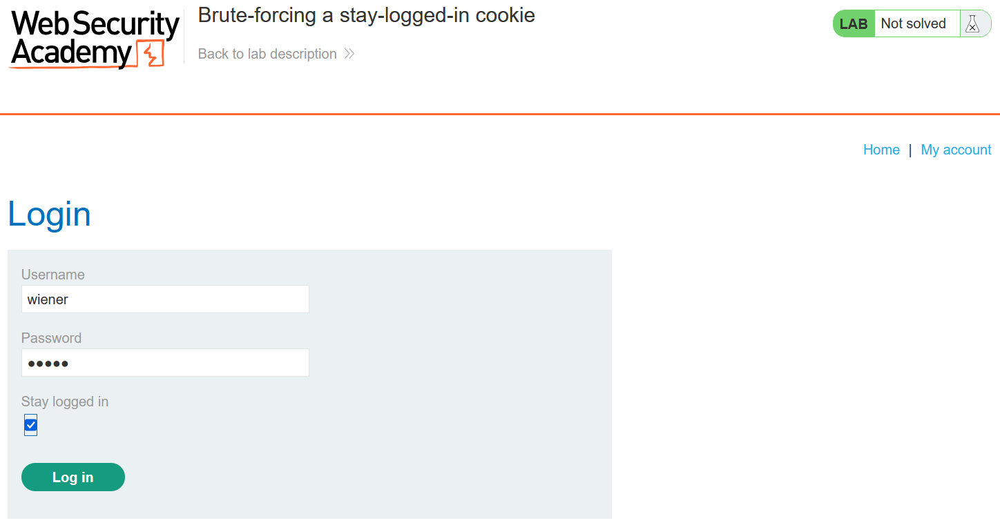
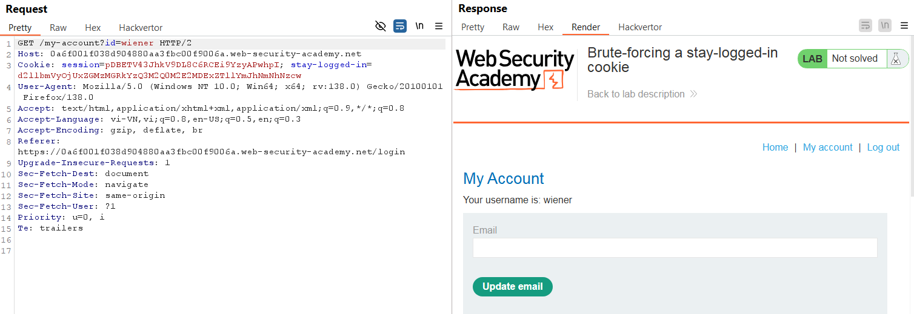
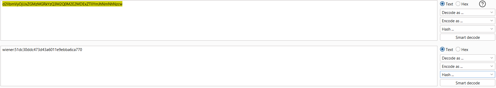
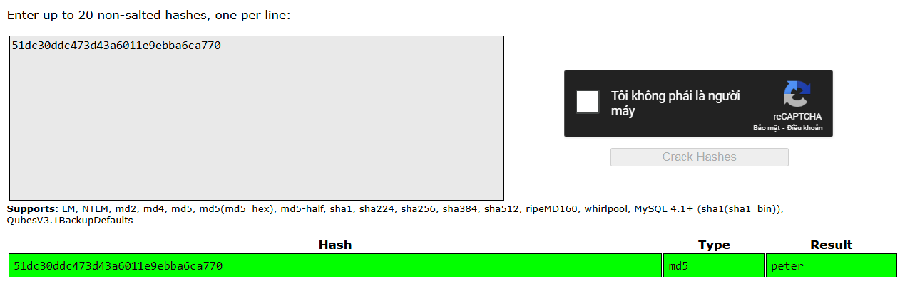
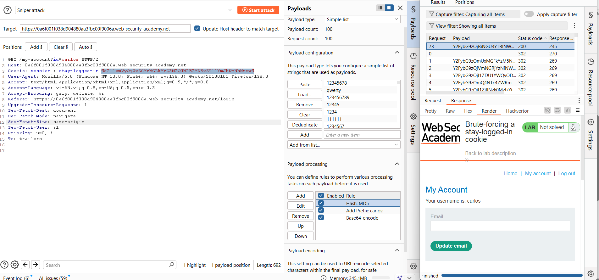
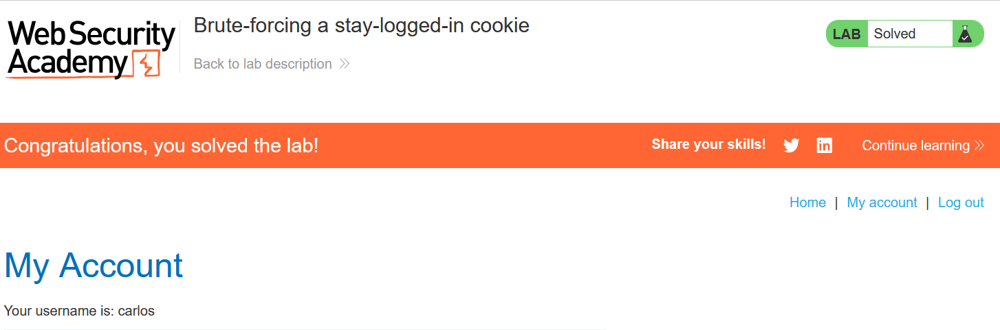

# Write-up: Brute-forcing a stay-logged-in cookie

### Tổng quan
Khai thác lỗ hổng trong cookie stay-logged-in bằng cách brute-force hash MD5 của mật khẩu carlos, tạo cookie hợp lệ để đăng nhập và truy cập trang "My account" của anh ta.

### Mục tiêu
- Brute-force cookie `stay-logged-in` của `carlos`.
- Đăng nhập vào tài khoản `carlos` và truy cập trang "My account".

### Thông tin đăng nhập
- Tài khoản đăng nhập `wiener`:`peter`
- Tài khoản nạn nhân `carlos`

### Công cụ sử dụng
- Burp Suite Community
- Firefox Browser

### Quy trình khai thác
1. **Thu thập thông tin (Recon)**
- Đăng nhập vào tài khoản wiener:peter, chọn tùy chọn "Stay logged in".
    
- Kiểm tra cookie `stay-logged-in`: 
    
    `d2llbmVyOjUxZGMzMGRkYzQ3M2Q0M2E2MDExZTllYmJhNmNhNzcw` 

- Giải mã cookie:
    - Decode base64: `d2llbmVyOjUxZGMzMGRkYzQ3M2Q0M2E2MDExZTllYmJhNmNhNzcw` → `wiener:51dc30ddc473d43a6011e9ebba6ca770.`
        
    - Phân tích: Chuỗi có dạng `username:hash`. Hash `51dc30ddc473d43a6011e9ebba6ca770` là MD5 của peter
        

- **Kết luận**: Cookie `stay-logged-in` được tạo theo quy luật `base64(username:md5(password))`. Có thể brute-force cookie của `carlos` bằng cách tạo hash MD5 từ danh sách mật khẩu.

2. **Brute-force Cookie**
- Cấu hình Burp Intruder để brute-force cookie `stay-logged-in` cho `carlos`:
    - Gửi yêu cầu GET /my-account với cookie stay-logged-in=§payload§ và session=NULL (để web tạo phiên mới với mỗi cookie).
    - Payload processing:
        - Lấy danh sách [Candidate passwords](https://portswigger.net/web-security/authentication/auth-lab-passwords).
        - Rule 1: Hash MD5 cho mỗi mật khẩu.
        - Rule 2: Thêm prefix `carlos:` trước hash → `carlos:<md5_hash>`.
        - Rule 3: Mã hóa base64 chuỗi `carlos:<md5_hash>`.
        
    - Kiểm tra phản hồi: Phản hồi chứa trang "My account" (hoặc mã trạng thái 200) chỉ ra cookie hợp lệ.
    - **Kết quả**: Tìm được cookie hợp lệ, đăng nhập thành công vào tài khoản `carlos`
        

### Bài học rút ra
- Hiểu cách khai thác cookie `stay-logged-in` bằng brute-force hash MD5.
- Nhận thức tầm quan trọng của việc sử dụng thuật toán mã hóa mạnh hơn MD5 và bảo vệ cookie session.
- Rèn luyện kỹ năng dùng Burp Intruder để tự động hóa brute-force cookie.

### Tài liệu tham khảo
- PortSwigger: Authentication vulnerabilities

### Kết luận
Lab này giúp tôi nắm rõ cách brute-force cookie stay-logged-in bằng cách tạo hash MD5 và mã hóa base64, sử dụng Burp Intruder để đăng nhập vào tài khoản carlos.  Xem portfolio đầy đủ tại https://github.com/Furu2805/Lab_PortSwigger 

*Viết bởi Toàn Lương, Tháng 5/2025*.