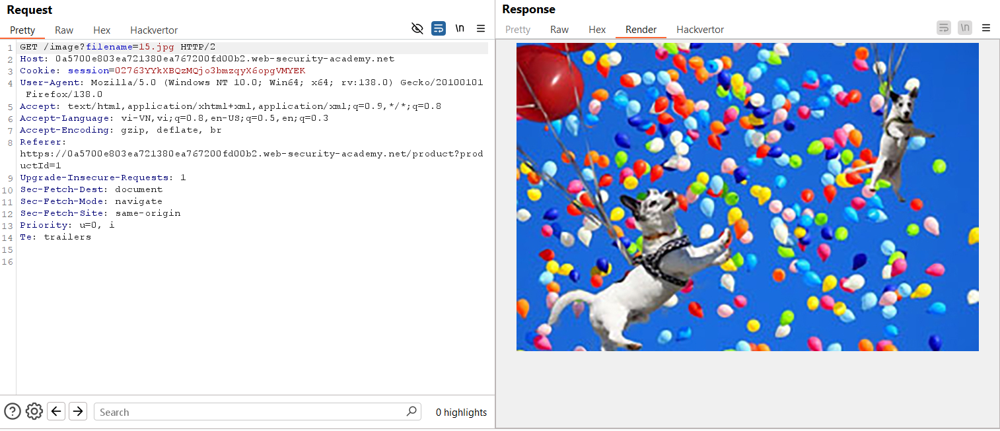
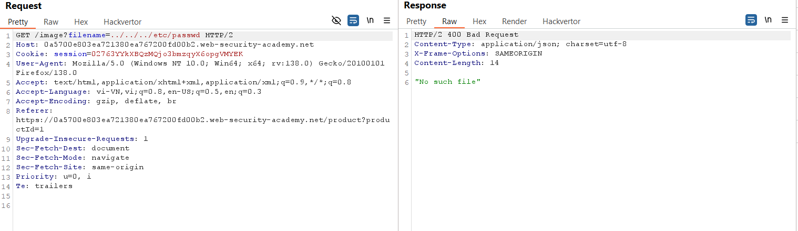
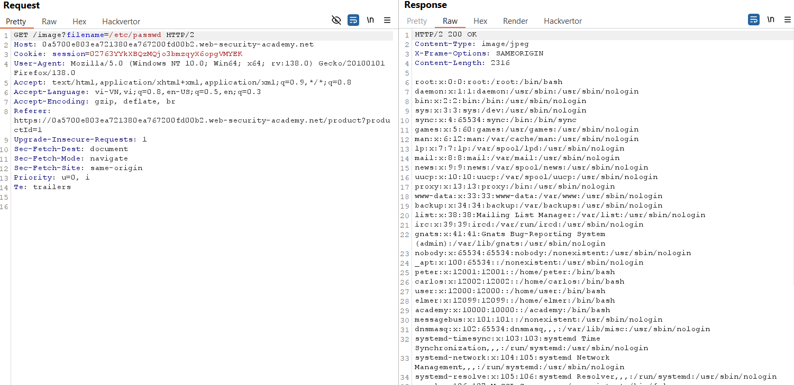

# Write-up: File path traversal, traversal sequences blocked with absolute path bypass

### Tổng quan
Khai thác lỗ hổng file path traversal trong chức năng hiển thị hình ảnh, bypass cơ chế chặn traversal sequences bằng cách sử dụng đường dẫn tuyệt đối để lấy nội dung tệp /etc/passwd.

### Mục tiêu
- Lấy nội dung tệp `/etc/passwd` bằng cách thao túng tham số `filename` với đường dẫn tuyệt đối.

### Công cụ sử dụng
- Burp Suite Community
- Firefox Browser

### Quy trình khai thác
1. **Thu thập thông tin (Reconnaissance)**
- Click chuột phải vào hình ảnh sản phẩm, chọn **Open image in new tab**.

- Nhận đường dẫn: `https://lab-id.web-security-academy.net/image?filename=15.jpg`
    

- Trong Burp Proxy HTTP History, gửi yêu cầu `GET /image?filename=15.jpg` tới Repeater.
- Sửa tham số `filename=../../../etc/passwd` và gửi:
- Nhận thông báo lỗi: `No such file`
    

- **Phân tích**: Ứng dụng chặn traversal sequences (như ../), nhưng có thể cho phép đường dẫn tuyệt đối.

2. **Khai thác (Exploitation)**
- Trong Repeater, sửa tham số `filename` thành đường dẫn tuyệt đối `/etc/passwd`:
- Gửi yêu cầu, nhận phản hồi chứa nội dung tệp /etc/passwd.
    

- **Kết quả**: Lấy được nội dung `/etc/passwd`, hoàn thành lab:
    

### Bài học rút ra
- Hiểu cách khai thác file path traversal bằng đường dẫn tuyệt đối để bypass cơ chế chặn traversal sequences.
- Nhận thức tầm quan trọng của việc kiểm tra và lọc đầy đủ dữ liệu đầu vào trong chức năng truy cập tệp.

### Tài liệu tham khảo
- PortSwigger: File path traversal

### Kết luận
Lab này giúp tôi nắm rõ cách bypass cơ chế chặn traversal sequences bằng đường dẫn tuyệt đối, sử dụng Burp Suite để lấy nội dung tệp `/etc/passwd`.  Xem portfolio đầy đủ tại https://github.com/Furu2805/Lab_PortSwigger.

*Viết bởi Toàn Lương, Tháng 5/2025.*