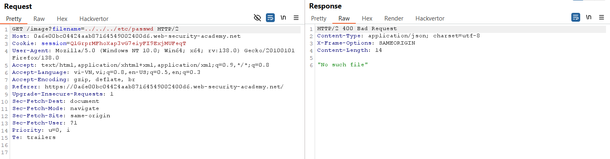
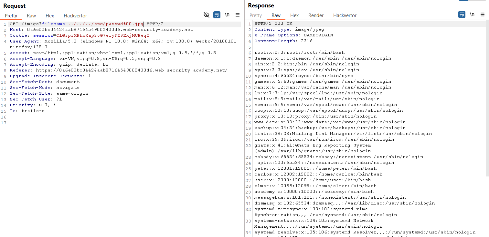

# Write-up: File path traversal, validation of file extension with null byte bypass

### Tổng quan
Khai thác lỗ hổng file path traversal trong chức năng hiển thị hình ảnh, vượt qua cơ chế kiểm tra đuôi tệp bằng kỹ thuật null byte (`%00`) để truy xuất nội dung tệp `/etc/passwd`.

### Mục tiêu
- Truy xuất nội dung tệp `/etc/passwd` bằng cách thao túng tham số filename để bypass kiểm tra đuôi `.jpg`.

### Công cụ sử dụng
- Burp Suite Community
- Firefox Browser

### Quy trình khai thác
1. **Thu thập thông tin (Reconnaissance)**
- Click chuột phải vào hình ảnh sản phẩm, chọn **Open image in new tab**.
    - Nhận đường dẫn: `https://lab-id.web-security-academy.net/image?filename=36.jpg`

- Trong Burp Proxy HTTP History, gửi yêu cầu `GET /image?filename=/var/www/images/36.jpg` tới Repeater.
- Sửa tham số `filename=../../../etc/passwd` và gửi:
    - **Kết quả**: nhận phản hồi `No such file`
        

- **Phân tích**: Ứng dụng yêu cầu tên tệp phải kết thúc bằng đuôi `.jpg`, dẫn đến từ chối đường dẫn không có đuôi này.

2. **Khai thác (Exploitation)**
- Thêm null byte (`%00`) và đuôi `.jpg` để bypass kiểm tra:  
    ```
    filename=../../../etc/passwd.jpg
    ```
- Gửi yêu cầu trong Repeater:
    - **Kết quả**: Null byte (`%00`) cắt bỏ phần `.jpg` trong xử lý backend, để lại `../../../etc/passwd`, trả về nội dung tệp `/etc/passwd`, hoàn thành lab:
        
        

### Bài học rút ra
- Hiểu cách sử dụng kỹ thuật null byte để vượt qua kiểm tra đuôi tệp trong lỗ hổng file path traversal.
- Nhận thức tầm quan trọng của việc lọc và xác thực đầy đủ các tham số đường dẫn, bao gồm xử lý ký tự đặc biệt như null byte.

### Tài liệu tham khảo
- PortSwigger: File path traversal

### Kết luận
Lab này cung cấp kinh nghiệm thực tiễn trong việc khai thác lỗ hổng file path traversal bằng kỹ thuật null byte để vượt qua kiểm tra đuôi tệp, sử dụng Burp Suite để truy xuất nội dung tệp `/etc/passwd`. Xem portfolio đầy đủ tại https://github.com/Furu2805/Lab_PortSwigger.

*Viết bởi Toàn Lương, Tháng 5/2025.*