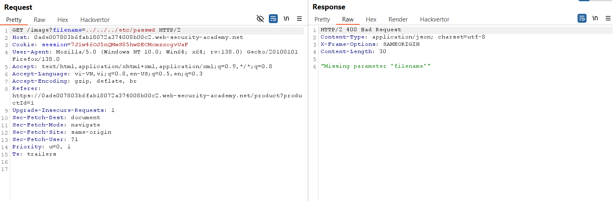
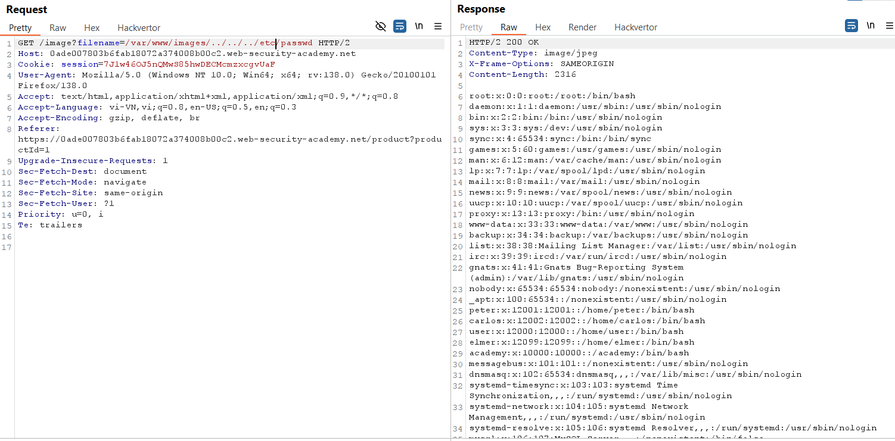
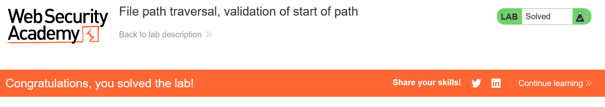

# Write-up: File path traversal, validation of start of path

### Tổng quan
Khai thác lỗ hổng file path traversal trong chức năng hiển thị hình ảnh, bypass cơ chế kiểm tra prefix đường dẫn bằng cách giữ thư mục cơ sở hợp lệ và nối traversal sequences để lấy nội dung tệp `/etc/passwd`.

### Mục tiêu
- Lấy nội dung tệp `/etc/passwd` bằng cách thao túng tham số filename mà vẫn thỏa mãn kiểm tra prefix.

### Công cụ sử dụng
- Burp Suite Community
- Firefox Browser

### Quy trình khai thác
1. **Thu thập thông tin (Reconnaissance)**
- Click chuột phải vào hình ảnh sản phẩm, chọn **Open image in new tab**.
    - Nhận đường dẫn: `https://lab-id.web-security-academy.net/image?filename=/var/www/images/73.jpg`

- Trong Burp Proxy HTTP History, gửi yêu cầu `GET /image?filename=/var/www/images/73.jpg` tới Repeater.
- Sửa tham số `filename=../../../etc/passwd` và gửi:
    - **Kết quả**: nhận phản hồi `Missing parameter 'filename'`
        

- **Phân tích**: Web yêu cầu đường dẫn bắt đầu bằng thư mục cơ sở `/var/www/images/`. Nếu không có prefix này, yêu cầu bị từ chối.

2. **Khai thác (Exploitation)**
- Bypass bằng cách giữ prefix hợp lệ `/var/www/images/` và nối `../../../etc/passwd`:   
    ```
    filename=/var/www/images/../../../etc/passwd
    ```
- Gửi yêu cầu trong Repeater:
    - **Kết quả**: Yêu cầu vượt qua kiểm tra prefix, traversal sequences `../../../` đưa đường dẫn về `/etc/passwd`, trả về nội dung tệp, hoàn thành lab:
        
        

### Bài học rút ra
- Hiểu cách bypass kiểm tra prefix đường dẫn bằng cách giữ thư mục cơ sở hợp lệ và thêm traversal sequences.
- Nhận thức tầm quan trọng của việc kiểm tra toàn bộ đường dẫn, không chỉ phần đầu.

### Tài liệu tham khảo
- PortSwigger: File path traversal

### Kết luận
Lab này cung cấp kinh nghiệm thực tiễn trong việc khai thác lỗ hổng file path traversal bằng cách vượt qua kiểm tra prefix, sử dụng Burp Suite để truy xuất nội dung tệp `/etc/passwd`. Xem portfolio đầy đủ tại https://github.com/Furu2805/Lab_PortSwigger.

*Viết bởi Toàn Lương, Tháng 5/2025.*