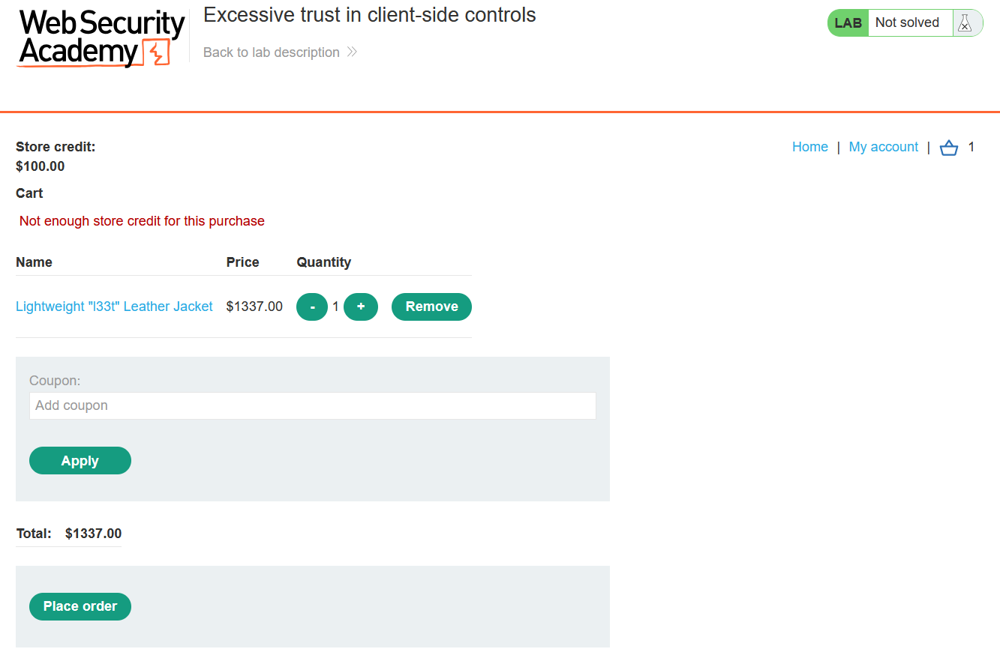
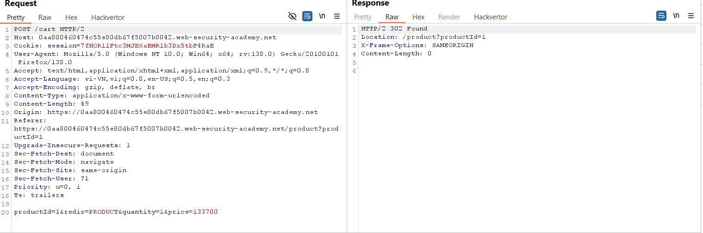
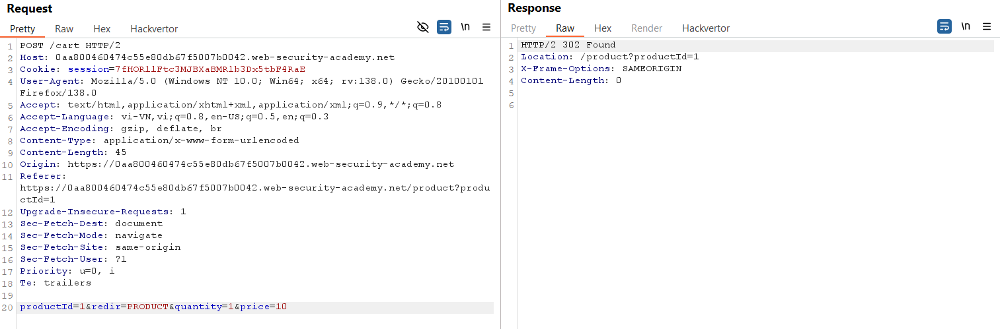
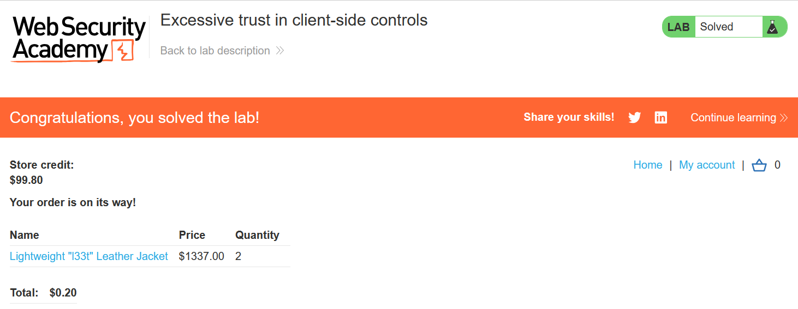

# Write-up: Excessive trust in client-side controls

### Tổng quan
Khai thác lỗ hổng tin tưởng quá mức vào kiểm tra phía client trong quy trình mua hàng, sửa giá sản phẩm trong yêu cầu POST để mua Lightweight l33t leather jacket với giá thấp hơn.

### Mục tiêu
- Mua sản phẩm Lightweight l33t leather jacket bằng cách sửa giá trong giỏ hàng.

### Công cụ sử dụng
- Burp Suite Community
- Firefox Browser

### Quy trình khai thác
1. **Thu thập thông tin (Reconnaissance)**
- Đăng nhập vào tài khoản `wiener`:`peter`.
- Chọn sản phẩm "Lightweight l33t leather jacket" và thêm vào giỏ hàng.
- Mở giỏ hàng, thấy credit chỉ có 100$, không đủ để mua sản phẩm.
    
- Kiểm tra Burp Proxy HTTP History, xác định yêu cầu POST /cart HTTP/2 khi thêm sản phẩm vào giỏ hàng
    
- Gửi yêu cầu này tới Repeater để thử nghiệm.

2. **Khai thác (Exploitation)**
- Trong Repeater, sửa tham số `price` thành `10` và gửi yêu cầu
    

- Truy cập lại giỏ hàng trên web, thấy giá sản phẩm đã giảm xuống 0.1$, chọn Place order để thanh toán và hoàn thành lab:
    

### Bài học rút ra
- Hiểu cách khai thác lỗ hổng tin tưởng quá mức vào kiểm tra phía client trong quy trình mua hàng.
- Nhận thức tầm quan trọng của việc kiểm tra dữ liệu đầu vào phía server để ngăn chặn sửa đổi giá.

### Tài liệu tham khảo
- PortSwigger: Business logic vulnerabilities

### Kết luận
Lab này cung cấp kinh nghiệm thực tiễn trong việc khai thác lỗ hổng logic, sử dụng Burp Suite để sửa giá sản phẩm và mua hàng thành công. Xem portfolio đầy đủ tại https://github.com/Furu2805/Lab_PortSwigger.

*Viết bởi Toàn Lương, Tháng 5/2025.*