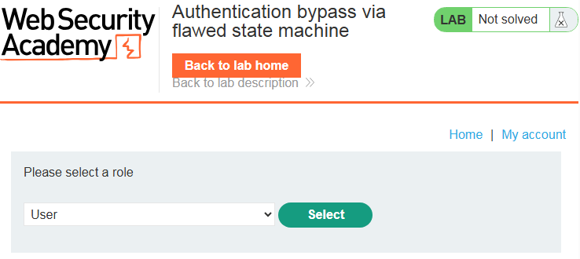
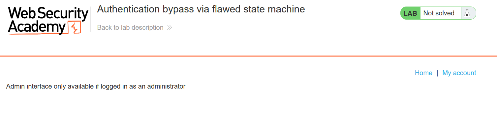
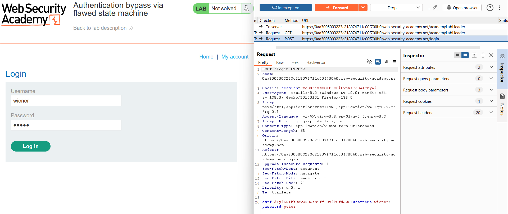
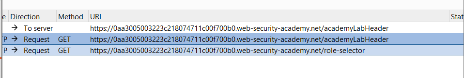
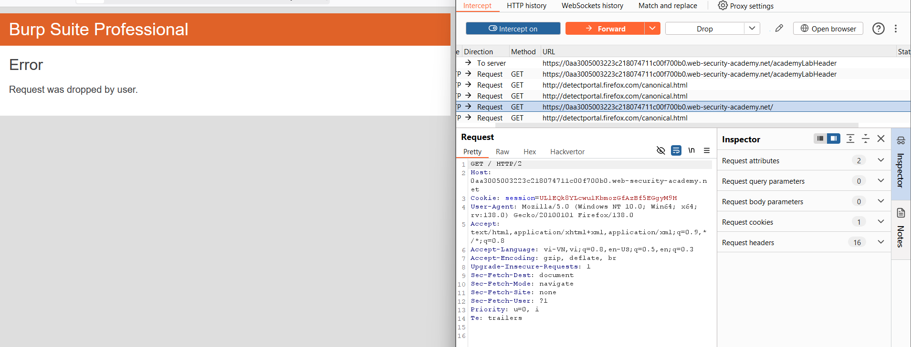
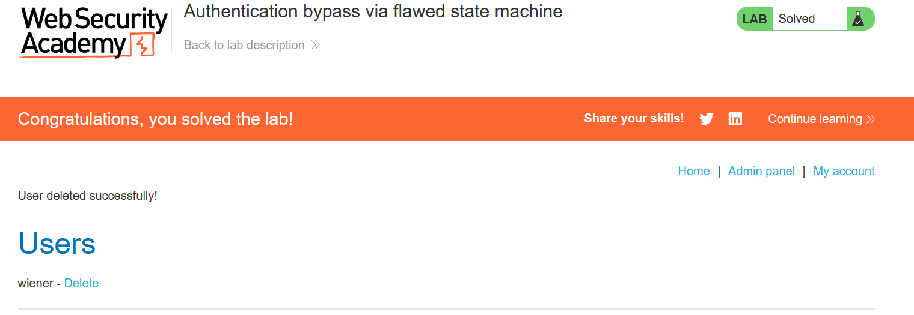

# Write-up: Authentication bypass via flawed state machine

### Tổng quan
Khai thác lỗ hổng logic trong quy trình đăng nhập bằng cách bỏ qua bước chọn vai trò, từ đó mặc định nhận quyền admin, truy cập admin panel và xóa tài khoản `carlos`.

### Mục tiêu
- Bỏ qua xác thực để truy cập `admin panel` và xóa tài khoản `carlos`.

### Công cụ sử dụng
- Burp Suite Community
- Firefox Browser

### Quy trình khai thác
1. **Thu thập thông tin (Reconnaissance)**
- Đăng nhập vào tài khoản `wiener`:`peter` qua /login:
    - Sau khi đăng nhập, nhận thấy cần chọn vai trò tại trang `/role-selector` trước khi vào trang chủ:
        

- Kiểm tra đường dẫn `/admin`
    - Chỉ dành cho tài khoản @dontwannacry.com
    

- Sử dụng công cụ content discovery trong Burp để tìm đường dẫn `/admin`.
- Thử truy cập `/admin` trực tiếp từ trang chọn vai trò, nhưng bị chặn:
    

2. **Khai thác (Exploitation)**
- Đăng xuất, quay lại trang đăng nhập `/login`.
- Bật chế độ chặn (intercept) trong Burp Proxy, đăng nhập lại với `wiener`:`peter`:
    - Gửi yêu cầu `POST /login`:
        
    - Yêu cầu tiếp theo là `GET /role-selector`:
        
    - Chặn và bỏ (drop) yêu cầu `GET /role-selector`
        

- Truy cập trực tiếp trang chủ (`/`):
    - **Giải thích**: Ứng dụng không kiểm tra trạng thái chọn vai trò, gán vai trò `admin` mặc định khi bỏ qua `/role-selector`.
    - **Kết quả**: Tài khoản nhận vai trò admin, admin panel tại /admin xuất hiện:
    
    
- Truy cập vào trang `Admin panel` và xóa tài khoản `carlos`
    - **Kết quả**: Tài khoản carlos bị xóa, hoàn thành lab:
        

### Bài học rút ra
- Hiểu cách khai thác lỗ hổng logic khi ứng dụng không kiểm tra đầy đủ thứ tự bước trong quy trình xác thực.
- Nhận thức tầm quan trọng của việc xác thực trạng thái và vai trò người dùng phía server.

### Tài liệu tham khảo
- PortSwigger: Business logic vulnerabilities

### Kết luận
Lab này cung cấp kinh nghiệm thực tiễn trong việc khai thác lỗ hổng logic, lợi dụng trạng thái mặc định để truy cập admin panel và xóa tài khoản. Xem portfolio đầy đủ tại https://github.com/Furu2805/Lab_PortSwigger.

*Viết bởi Toàn Lương, Tháng 5/2025.*