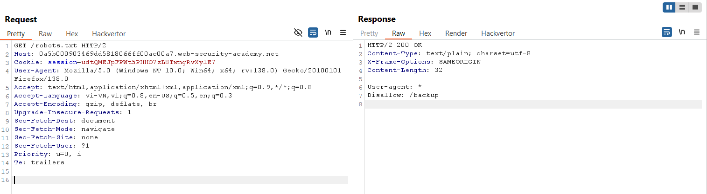

# Write-up: Source code disclosure via backup files

### Tổng quan
Khai thác lỗ hổng rò rỉ mã nguồn bằng cách kiểm tra đường dẫn `/robots.txt` sau đó lấy mật khẩu database để hoàn thành lab.

### Mục tiêu
- Xác định và submit mật khẩu database trong mã nguồn bị rò rỉ.

### Công cụ sử dụng
- Burp Suite Pro
- Firefox Browser

### Quy trình khai thác
1. **Thu thập thông tin (Reconnaissance)**
- Truy cập `/robots.txt` để kiểm tra các quy tắc crawl của web:
    - Nội dung file tiết lộ thư mục bị chặn: `/backup`
         

- Truy cập đường dẫn `/backup`:
    - Tìm thấy đường dẫn `ProductTemplate.java.bak`
        

- Truy cập vào đường dẫn `/ProductTemplate.java.bak`
    - Kiểm tra nội dung file, tìm thấy mật khẩu database được hard-coded : `m91o597bh4gykrhra059146dpsvr8qm2`
        
    - **Giải thích**: File backup chứa mã nguồn Java, để lộ mật khẩu database do không được bảo vệ hoặc xóa khỏi môi trường production.

2. **Khai thác (Exploitation)**
- Submit `password` và hoàn thành lab
    

### Bài học rút ra
- Hiểu cách khai thác rò rỉ mã nguồn từ file backup trong các thư mục ẩn.
- Nhận thức tầm quan trọng của việc xóa hoặc bảo vệ file backup và thông tin nhạy cảm trong môi trường production.

### Tài liệu tham khảo
PortSwigger: Information disclosure

### Kết luận
Lab này cung cấp kinh nghiệm thực tiễn trong việc tìm kiếm và khai thác rò rỉ mã nguồn từ file backup, thu thập mật khẩu database và hoàn thành mục tiêu. Xem portfolio đầy đủ tại https://github.com/Furu2805/Lab_PortSwigger.

*Viết bởi Toàn Lương, Tháng 5/2025.*