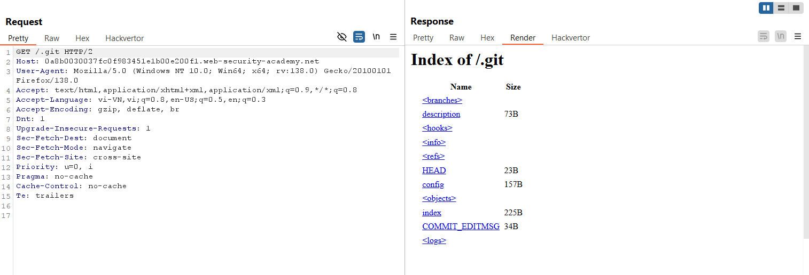
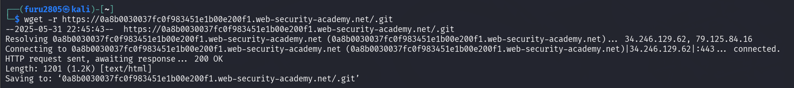
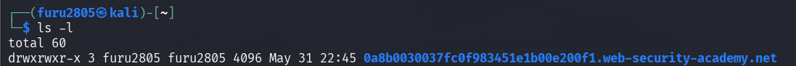
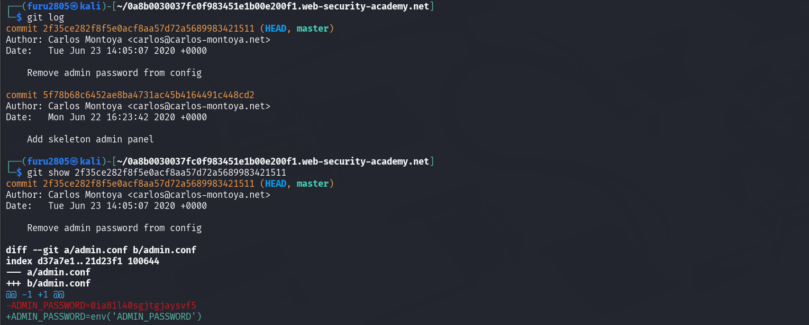
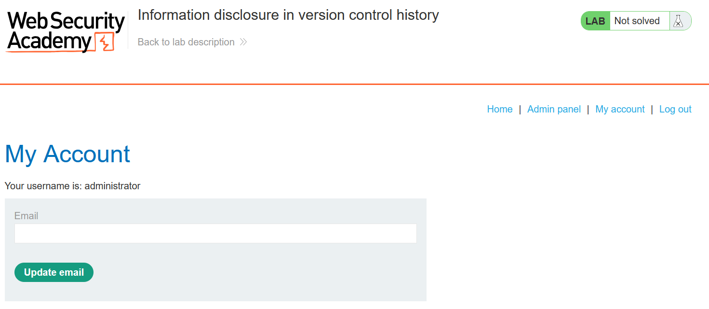
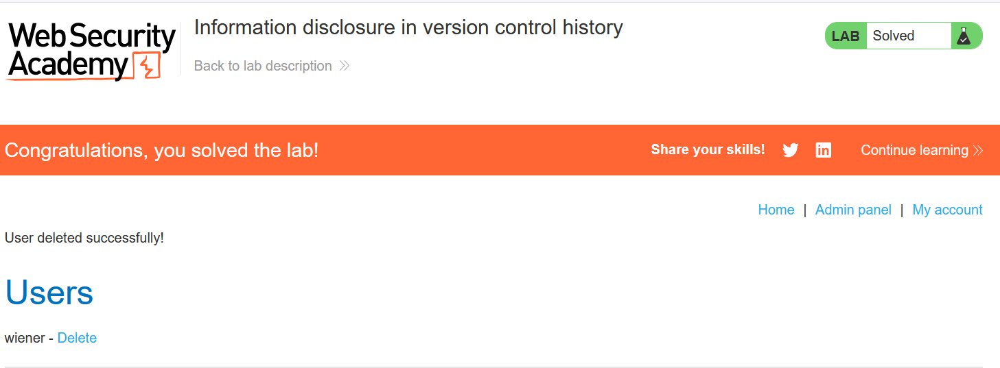

# Write-up: Information Disclosure in Version Control History

### Tổng quan
Khai thác lỗ hổng rò rỉ thông tin trong lịch sử version control, tải thư mục /.git để kiểm tra commit, tìm mật khẩu admin trong diff của file admin.conf, đăng nhập tài khoản administrator và xóa tài khoản carlos.

### Mục tiêu
- Thu thập mật khẩu admin và xóa tài khoản carlos.

### Công cụ sử dụng
- Burp Suite Community
- Firefox Browser
- Git
- wget (Linux)

### Quy trình khai thác
1. **Thu thập thông tin (Reconnaissance)**
- Truy cập `/.git` để kiểm tra dữ liệu version control:
    - Xác nhận thư mục `/.git` có thể truy cập, tiết lộ lịch sử Git
    

- Tải toàn bộ thư mục /.git bằng lệnh:
    ```
    wget -r https://0a8b0030037fc0f983451e1b00e200f1.web-security-academy.net/.git/
    ```
    

- Mở thư mục tải về trong terminal và dùng Git để khám phá lịch sử
    
    - Tìm commit với message: `Remove admin password from config` và xem chi tiết diff của commit đó
        
    - Kết quả: Lấy được mật khẩu `admin`:`0ia81l40sgjtgjaysvf5` 

2. **Khai thác (Exploitation)**
- Đăng nhập vào tài khoản `administrator`:`0ia81l40sgjtgjaysvf5` 
    
- Xóa tài khoản carlos và hoàn thành lab
    

### Bài học rút ra
- Hiểu cách khai thác thông tin nhạy cảm từ lịch sử version control trong thư mục /.git.
- Nhận thức tầm quan trọng của việc bảo vệ hoặc xóa thư mục /.git trong môi trường production.

### Tài liệu tham khảo
PortSwigger: Information disclosure

### Kết luận
Nhận thức tầm quan trọng của việc bảo vệ hoặc xóa thư mục /.git trong môi trường production. Xem portfolio đầy đủ tại https://github.com/Furu2805/Lab_PortSwigger.

*Viết bởi Toàn Lương, Tháng 5/2025.*