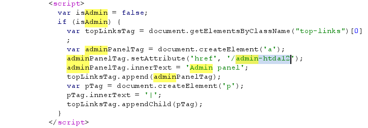
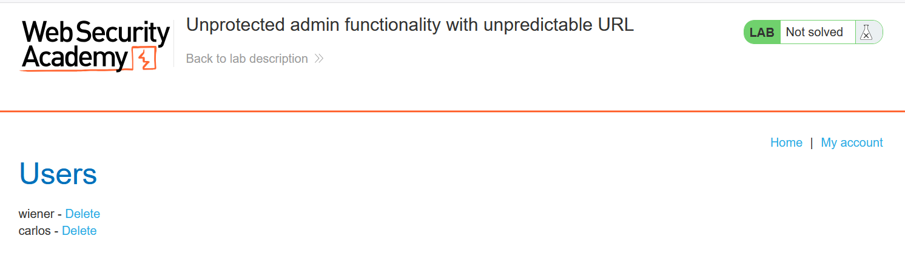
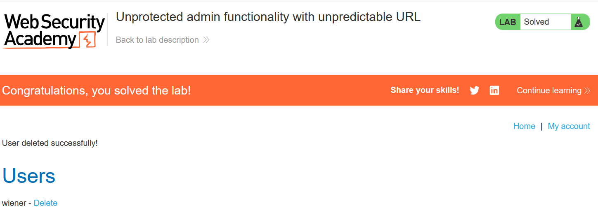

# Write-up: Unprotected admin functionality with unpredictable URL

### Tổng quan
Khai thác lỗ hổng admin panel không được bảo vệ, phát hiện đường dẫn `/admin-htda12` qua mã JavaScript trong mã nguồn web, truy cập panel và xóa tài khoản `carlos` để hoàn thành lab.

### Mục tiêu
- Xóa tài khoản `carlos` bằng cách truy cập `admin panel`.

### Công cụ sử dụng
- Burp Suite Community
- Firefox Browser

### Quy trình khai thác
1. **Thu thập thông tin (Reconnaissance)**
- Truy cập trang web và kiểm tra mã nguồn bằng Burp Suite (hoặc trình duyệt):
    - Phát hiện script trong mã nguồn tiết lộ đường dẫn admin panel:
        

- **Giải thích**: Script chứa đường dẫn `/admin-htda12`, nhưng không hiển thị liên kết do `isAdmin = false`. Tuy nhiên, đường dẫn vẫn có thể truy cập trực tiếp.

2. **Khai thác (Exploitation)**
- Truy cập đường dẫn `/admin-htda12`:
    - **Kết quả**: Truy cập thành công admin panel mà không yêu cầu xác thực:
        

- Trong admin panel, tìm chức năng xóa người dùng và xóa tài khoản `carlos`
    - **Kết quả**: Tài khoản carlos bị xóa, hoàn thành lab:
        

### Bài học rút ra
- Hiểu cách khai thác admin panel không được bảo vệ do rò rỉ đường dẫn qua mã nguồn JavaScript.
- Nhận thức tầm quan trọng của việc bảo vệ chức năng admin bằng xác thực và tránh để lộ đường dẫn nhạy cảm trong mã nguồn.

### Tài liệu tham khảo
- PortSwigger: Access control vulnerabilities

### Kết luận
Lab này cung cấp kinh nghiệm thực tiễn trong việc tìm kiếm và khai thác chức năng admin không được bảo vệ, sử dụng mã nguồn để phát hiện đường dẫn ẩn và xóa tài khoản mục tiêu. Xem portfolio đầy đủ tại https://github.com/Furu2805/Lab_PortSwigger.

*Viết bởi Toàn Lương, Tháng 6/2025.*