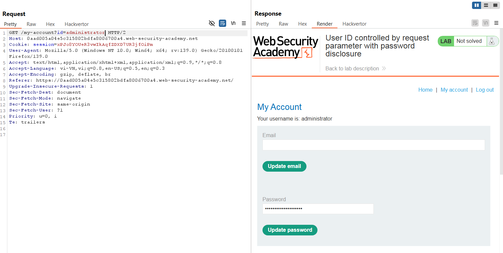
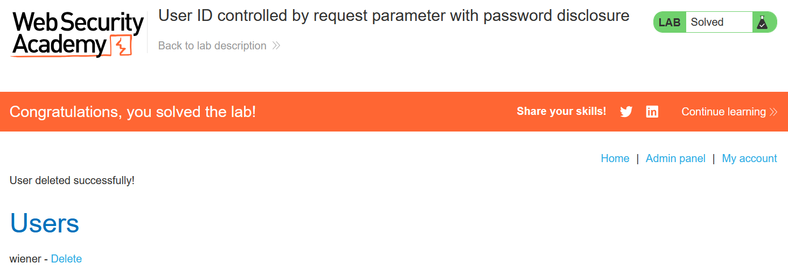

# Write-up: User ID controlled by request parameter with password disclosure

### Tổng quan
Khai thác lỗ hổng leo thang đặc quyền dọc trên trang tài khoản người dùng, sửa tham số `id` trong URL để truy cập thông tin tài khoản `administrator`, lấy mật khẩu admin, đăng nhập và xóa tài khoản `carlos` qua admin panel.

### Mục tiêu
- Thu thập mật khẩu của tài khoản `administrator` và xóa tài khoản `carlos`.

### Công cụ sử dụng
- Burp Suite Community
- Firefox Browser

### Quy trình khai thác
1. **Thu thập thông tin (Reconnaissance)**
- Đăng nhập với tài khoản `wiener`:`peter`
- Truy cập trang tài khoản người dùng, quan sát URL chứa tham số `id=wiener`:
- Trong Burp Repeater, sửa tham số `id=wiener` thành `id=administrator`:
    - Phản hồi hiển thị thông tin tài khoản `administrator`, bao gồm mật khẩu: `h2clqw6vcvk8j3mgolyf`  (trong script)
        

- **Giải thích**: Ứng dụng không kiểm tra quyền truy cập khi thay đổi tham số `id`, dẫn đến lỗ hổng leo thang đặc quyền dọc, cho phép `wiener` xem mật khẩu của `administrator`.

2. **Khai thác (Exploitation)**
- Ghi lại mật khẩu `administrator`:`h2clqw6vcvk8j3mgolyf`.
- Đăng nhập vào tài khoản `administrator`, xóa tài khoản `carlos` và hoàn thành lab
    

### Bài học rút ra
- Hiểu cách khai thác lỗ hổng leo thang đặc quyền dọc do thiếu kiểm tra quyền trên tham số `id`.
- Nhận thức tầm quan trọng của việc xác thực quyền truy cập người dùng phía server và bảo vệ thông tin nhạy cảm như mật khẩu.

### Tài liệu tham khảo
- PortSwigger: Access control vulnerabilities

### Kết luận
Lab này cung cấp kinh nghiệm thực tiễn trong việc khai thác lỗ hổng kiểm soát quyền truy cập và rò rỉ mật khẩu qua tham số URL, sử dụng Burp Repeater để nâng quyền admin và xóa tài khoản mục tiêu. Xem portfolio đầy đủ tại https://github.com/Furu2805/Lab_PortSwigger.

*Viết bởi Toàn Lương, Tháng 6/2025.*