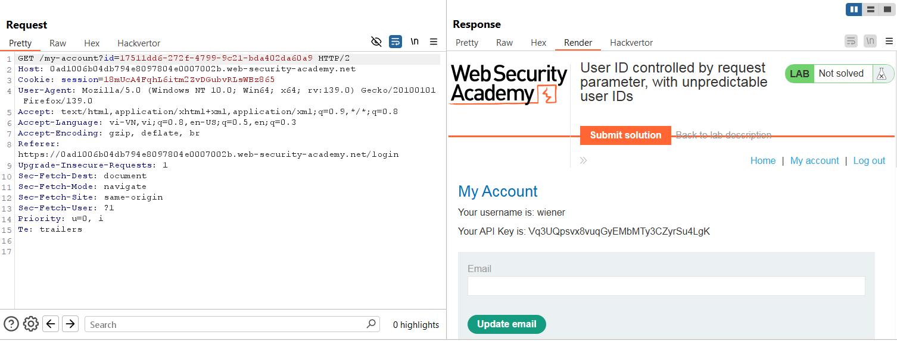
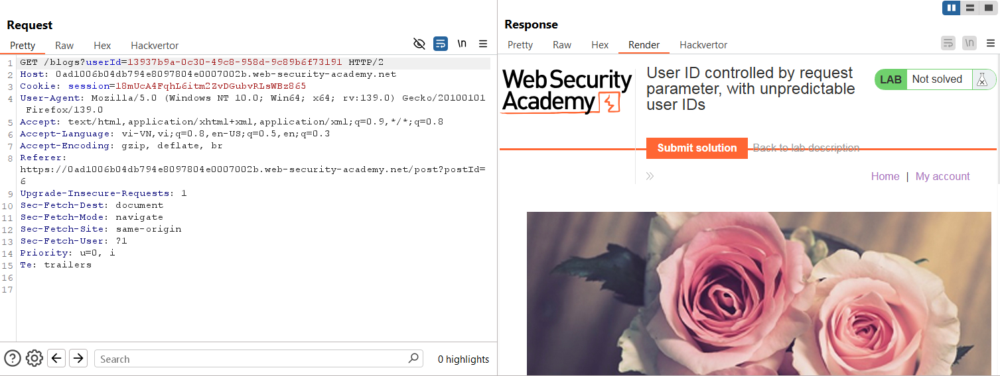
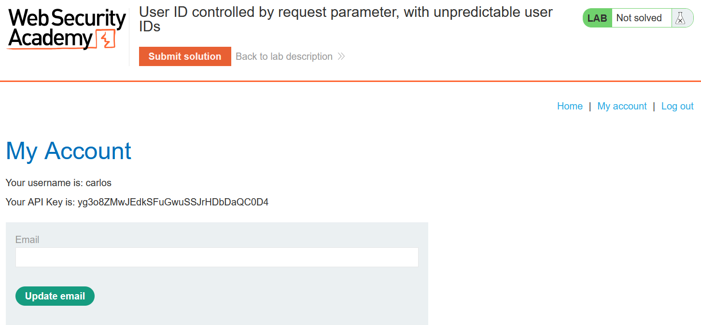

# Write-up: User ID controlled by request parameter, with unpredictable user IDs

### Tổng quan
Khai thác lỗ hổng leo thang đặc quyền ngang trên trang tài khoản người dùng, tìm GUID của `carlos` qua bài post, sửa tham số `id` trên URL để truy cập thông tin tài khoản `carlos`, lấy API key và submit để hoàn thành lab.

### Mục tiêu
- Thu thập API key của tài khoản `carlos` và submit giải pháp.

### Công cụ sử dụng
- Burp Suite Community
- Firefox Browser

### Quy trình khai thác
1. **Thu thập thông tin (Reconnaissance)**
- Đăng nhập với tài khoản `wiener`:`peter`
- Truy cập trang tài khoản người dùng, quan sát URL chứa tham số `id` là GUID của `wiener`:
    

- Duyệt trang web để tìm bài post của `carlos` (ví dụ: trên trang blog hoặc comment), phát hiện URL chứa GUID của `carlos`:
    

- **Giải thích**: GUID `13937b9a-0c30-49c8-958d-9c89b6f73191` được dùng để xác định tài khoản carlos.

2. **Khai thác (Exploitation)**
- Sửa tham số id trên URL trang tài khoản từ `17511dd6-272f-4799-9c21-bda402da60a9` thành `13937b9a-0c30-49c8-958d-9c89b6f73191`:
    - **Kết quả**: Lấy được API của carlos: `yg3o8ZMwJEdkSFuGwuSSJrHDbDaQC0D4`
        
    - **Giải thích**: Ứng dụng không kiểm tra quyền truy cập khi thay đổi tham số id, dẫn đến lỗ hổng leo thang đặc quyền ngang.

- **Kết quả**: Submit solution và hoàn thành lab
    

### Bài học rút ra
- Hiểu cách khai thác lỗ hổng leo thang đặc quyền ngang do thiếu kiểm tra quyền trên tham số id dạng GUID.
- Nhận thức tầm quan trọng của việc xác thực quyền truy cập người dùng phía server, ngay cả với ID khó đoán.

### Tài liệu tham khảo
- PortSwigger: Access control vulnerabilities

### Kết luận
Lab này cung cấp kinh nghiệm thực tiễn trong việc khai thác lỗ hổng kiểm soát quyền truy cập qua tham số URL, tìm GUID của người dùng và lấy API key để hoàn thành mục tiêu. Xem portfolio đầy đủ tại https://github.com/Furu2805/Lab_PortSwigger.

*Viết bởi Toàn Lương, Tháng 6/2025.*