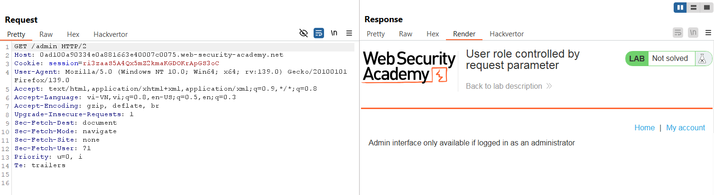
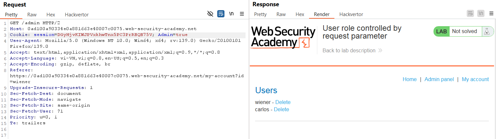
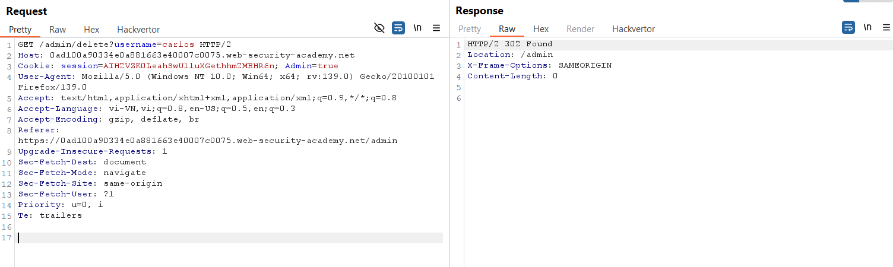
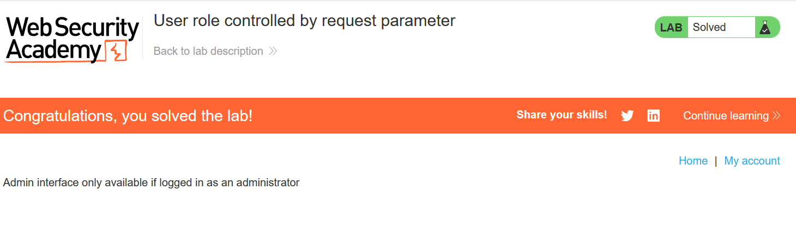

# Write-up: User role controlled by request parameter

### Tổng quan
Khai thác lỗ hổng kiểm soát quyền truy cập dựa trên tham số cookie `Admin`, giả mạo giá trị `Admin=tru`e để truy cập admin panel tại `/admin` và xóa tài khoản `carlos`.

### Mục tiêu
- Xóa tài khoản `carlos` bằng cách truy cập `admin panel`.

### Công cụ sử dụng
- Burp Suite Community
- Firefox Browser

### Quy trình khai thác
1. **Thu thập thông tin (Reconnaissance)**
- Đăng nhập với tài khoản `wiener`:`peter`, kiểm tra header Cookie trong HTTP request bằng Burp Suite:
    - Phát hiện tham số `Admin=false`, gợi ý ứng dụng sử dụng cookie `Admin` để kiểm soát quyền truy cập admin panel:
        

2. **Khai thác (Exploitation)**
- Trong Burp Repeater, sửa cookie `Admin=false` thành `Admin=true` và gửi lại yêu cầu:
    - **Kết quả**: Truy cập thành công admin panel
        

- Trong admin panel, tìm chức năng xóa người dùng, nhưng yêu cầu xác nhận quyền admin. Gửi yêu cầu xóa `carlos` với `Admin=true`:
    

- **Kết quả**: Tài khoản carlos bị xóa, hoàn thành lab.
    

- **Giải thích**: Ứng dụng tin tưởng giá trị cookie `Admin` mà không xác thực phía server, cho phép giả mạo quyền `admin`.

### Bài học rút ra
- Hiểu cách khai thác lỗ hổng kiểm soát quyền truy cập dựa trên tham số cookie có thể giả mạo.
- Nhận thức tầm quan trọng của việc xác thực quyền admin phía server thay vì dựa vào tham số client-side.

### Tài liệu tham khảo
- PortSwigger: Access control vulnerabilities

### Kết luận
Lab này cung cấp kinh nghiệm thực tiễn trong việc khai thác lỗ hổng kiểm soát quyền dựa trên cookie, sử dụng Burp Repeater để giả mạo quyền admin và xóa tài khoản mục tiêu. Xem portfolio đầy đủ tại https://github.com/Furu2805/Lab_PortSwigger.

*Viết bởi Toàn Lương, Tháng 6/2025.*