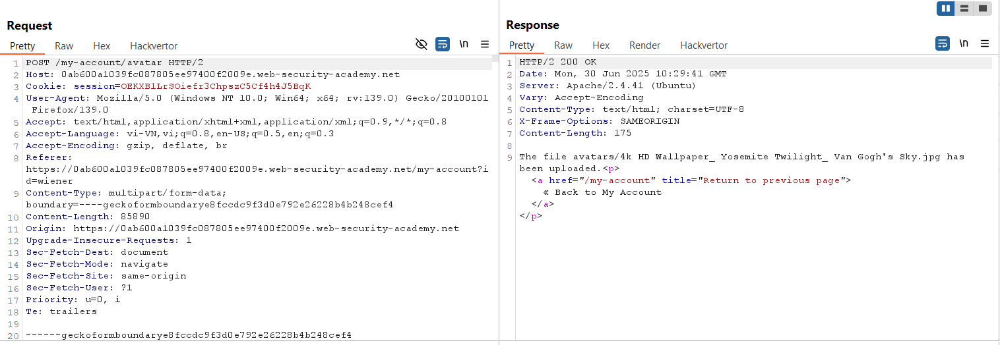
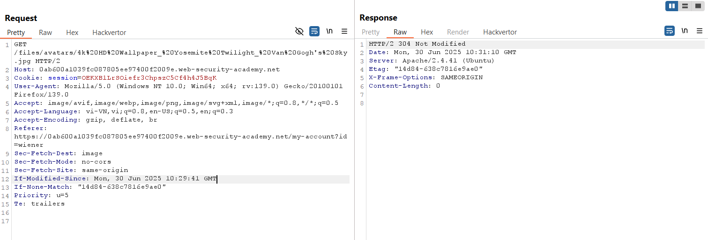
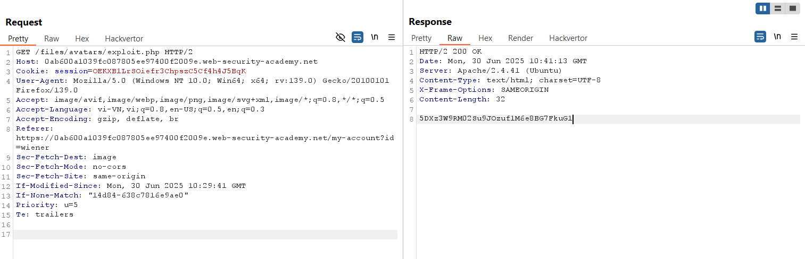
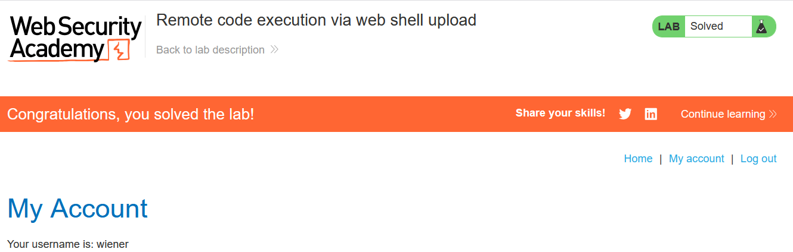

# Write-up: Remote code execution via web shell upload

### Tổng quan
Khai thác lỗ hổng trong chức năng upload file avatar, upload file web shell PHP mà không bị kiểm tra, thực thi mã để đọc nội dung file `/home/carlos/secret` và submit secret để hoàn thành lab.

### Mục tiêu
- Upload web shell PHP, đọc nội dung file `/home/carlos/secret`, và submit secret.

### Công cụ sử dụng
- Burp Suite Community
- Firefox Browser

### Quy trình khai thác 
1. **Thu thập thông tin (Reconnaissance)**
- Đăng nhập với tài khoản `wiener`:`peter`:
- Truy cập chức năng upload avatar, upload một file ảnh hợp lệ (ví dụ: `4k HD Wallpaper_Yosemite Twilight_Van Gogh's Sky.jpg`)
    
    - Xem ảnh tại `/files/avatars/4k%20HD%20Wallpaper_%20Yosemite%20Twilight_%20Van%20Gogh's%20Sky.jpg:`
    

- Thử upload file web shell `exploit.php` với nội dung:
    
    - **Phản hồi**: Server cho phép upload file mà không kiểm tra nội dung:

2. **Khai thác (Exploitation)**
- Trong Burp Repeater, gửi yêu cầu để truy cập file ảnh:
    - Sửa yêu cầu thành truy cập file web shell:
        - Phản hồi trả về nội dung file `/home/carlos/secret`:
            ```        
            5DXz3W9RM02Su9JOzuf1M6e8BG7FkuG1
            ```
        

- Submit secret và hoàn thành lab
    

### Bài học rút ra
- Hiểu cách khai thác lỗ hổng upload file do thiếu kiểm tra nội dung và loại file.
- Nhận thức tầm quan trọng của việc xác thực nội dung file upload và vô hiệu hóa thực thi mã trên server để ngăn chặn RCE.

### Tài liệu tham khảo
- PortSwigger: File upload vulnerabilities

### Kết luận
Lab này cung cấp kinh nghiệm thực tiễn trong việc khai thác lỗ hổng upload file, sử dụng Burp Repeater để upload và thực thi web shell PHP, đọc file bí mật và hoàn thành mục tiêu. Xem portfolio đầy đủ tại https://github.com/Furu2805/Lab_PortSwigger.

*Viết bởi Toàn Lương, Tháng 7/2025.*