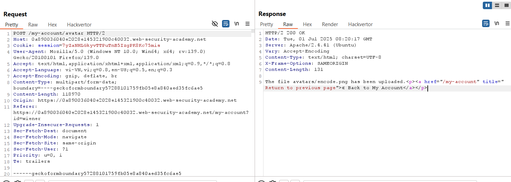
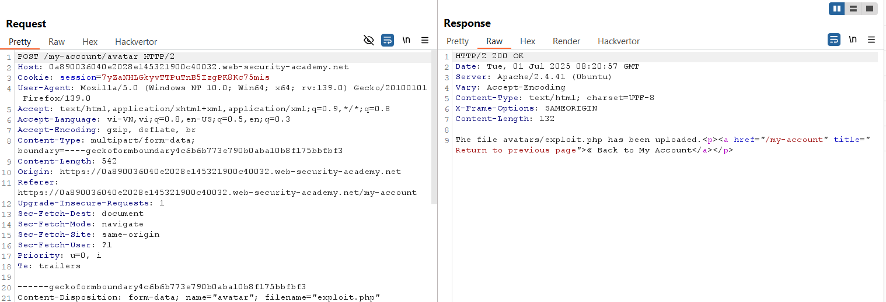
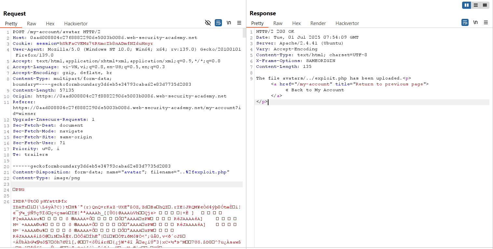
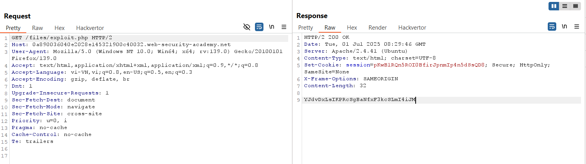
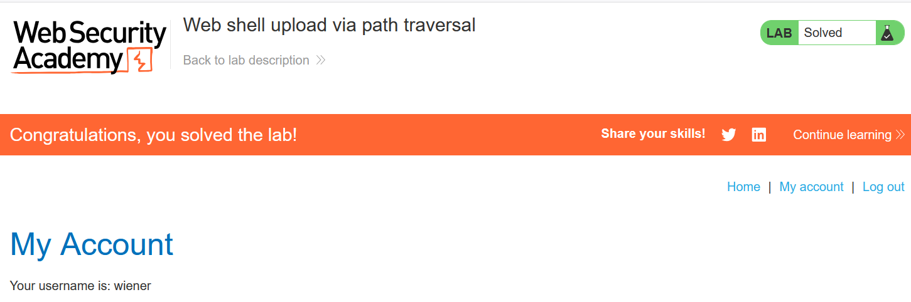

# Write-up: Web shell upload via path traversal

### Tổng quan
Khai thác lỗ hổng path traversal trong chức năng upload file avatar, bypass cơ chế ngăn thực thi file PHP bằng cách upload web shell `exploit.php` ra ngoài thư mục `avatars`, thực thi mã để đọc nội dung file `/home/carlos/secret` và submit secret để hoàn thành lab.

### Mục tiêu
- Upload web shell PHP qua path traversal, đọc nội dung file `/home/carlos/secret`, và submit secret.

### Công cụ sử dụng
- Burp Suite Community
- Firefox Browser

### Quy trình khai thác 
1. **Thu thập thông tin (Reconnaissance)**
- Đăng nhập với tài khoản `wiener`:`peter`
- Truy cập chức năng upload avatar, upload file ảnh hợp lệ (ví dụ: encode.png):
    
    - Xem ảnh tại /files/avatars/encode.png:

- Thử upload file web shell `exploit.php` với nội dung:
    
    - **Phản hồi**: File được upload, nhưng truy cập `/files/avatars/exploit.php` không thực thi mã:
        
    - **Quan sát**: Server chặn thực thi file PHP trong thư mục avatars.

2. **Khai thác (Exploitation)**
- Trong Burp Repeater, sửa `filename` thành `..%2fexploit.php` (URL encoded) để upload file ra ngoài thư mục `avatars`:
    - Phản hồi: `The file avatars/../exploit.php has been uploaded.`
        

- Truy cập file web shell:
    - Phản hồi trả về nội dung file `/home/carlos/secret`:
        `YJdvDxLsIKPRcSgBaNfxF3kcSLmI4iJM`
      

- Submit secret và hoàn thành lab
    

### Bài học rút ra
- Hiểu cách khai thác lỗ hổng path traversal để bypass cơ chế chặn thực thi file trong thư mục upload.
- Nhận thức tầm quan trọng của việc kiểm tra và vệ sinh đầu vào `filename` để ngăn chặn path traversal và RCE.

### Tài liệu tham khảo
- PortSwigger: File upload vulnerabilities
- PortSwigger: Path traversal

### Kết luận
Lab này cung cấp kinh nghiệm thực tiễn trong việc khai thác lỗ hổng path traversal, sử dụng Burp Repeater để upload web shell PHP ra ngoài thư mục bị chặn, thực thi mã và đọc file bí mật. Xem portfolio đầy đủ tại https://github.com/Furu2805/Lab_PortSwigger.

*Viết bởi Toàn Lương, Tháng 7/2025.*