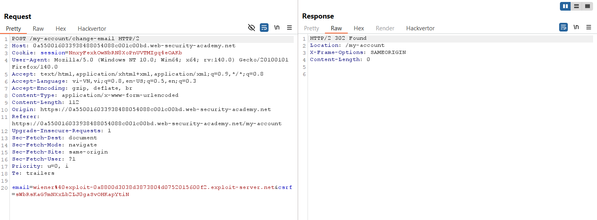
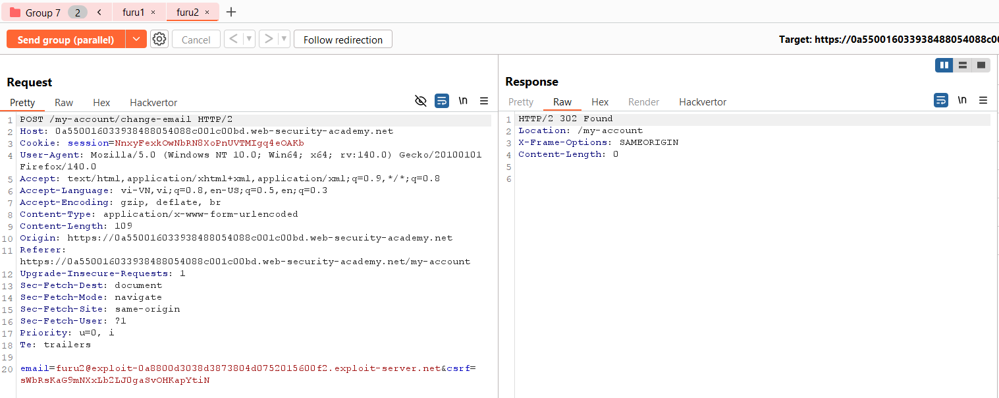
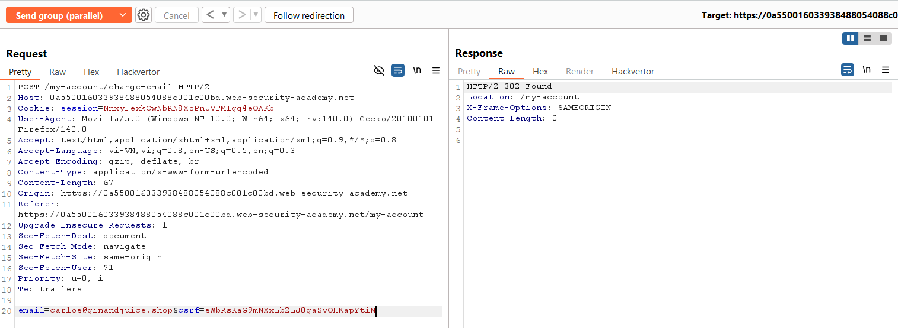
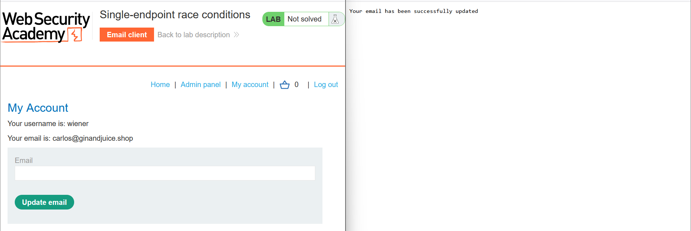

# Write-up: Single-endpoint race conditions

### Tổng quan
Khai thác lỗ hổng race condition trong chức năng thay đổi email, gửi đồng thời nhiều yêu cầu thay đổi email qua một endpoint để thao túng quá trình xác minh, cập nhật email tài khoản thành `carlos@ginandjuice.shop`, nhận quyền admin, và xóa tài khoản `carlos` để hoàn thành lab.

### Mục tiêu
- Khai thác race condition để thay đổi email thành `carlos@ginandjuice.shop`, nhận quyền admin, và xóa tài khoản carlos.

### Công cụ sử dụng
- Burp Suite Community
- Firefox Browser

### Quy trình khai thác
1. **Thu thập thông tin (Reconnaissance)**
- Đăng nhập với tài khoản `wiener`:`peter`:
- Sử dụng chức năng thay đổi email (`/my-account/change-email`)
    - **Phản hồi**: Nhận email chứa link xác minh tại email client, nhấp vào link để cập nhật email thành công:
        
        
    - **Quan sát**: Có khoảng thời gian ngắn giữa yêu cầu thay đổi email và gửi token xác minh, gợi ý lỗ hổng race condition

2. **Kiểm chứng (Predict)**
- Trong Burp Repeater, chuẩn bị 2 yêu cầu thay đổi email:
    - Yêu cầu 1: Thay đổi email thành `furu1@exploit-<YOUR-EXPLOIT-SERVER-ID>.exploit-server.net`:

    - Yêu cầu 2: Thay đổi email thành `furu2@exploit-<YOUR-EXPLOIT-SERVER-ID>.exploit-server.net:`

- Nhóm 2 yêu cầu, chọn `Send group in parallel (single-packet attack)` để gửi đồng thời:
    - **Phản hồi**: Cả 2 yêu cầu được xử lý thành công. Trong email client, nhận được 2 email xác minh cho furu1 và furu2. Trên trình duyệt, tài khoản hiển thị trạng thái chờ xác thực cho furu2.
        
        
        

- Nhấp vào link xác minh cho furu1 trong email client:
    - **Phản hồi**: `"Your email has been successfully updated`". Trên trình duyệt, email tài khoản được cập nhật thành furu2:
        

3. **Khai thác (Prove)**
- Trong Burp Repeater, chuẩn bị lại 2 yêu cầu:
    - Yêu cầu 1: Thay đổi email thành `furu1@exploit-<YOUR-EXPLOIT-SERVER-ID>.exploit-server.net`:
    - Yêu cầu 2: Thay đổi email thành `carlos@ginandjuice.shop`:
        

- Nhóm 2 yêu cầu, chọn `Send group in parallel (single-packet attack)`
- **Phản hồi**: Trình duyệt hiển thị trạng thái chờ xác thực cho carlos@ginandjuice.shop. Trong email client, nhận email xác minh cho furu1. Nhấp vào link xác minh furu1:
        
    - **Phản hồi**: "Your email has been successfully updated". Trên trình duyệt, email tài khoản được cập nhật thành carlos@ginandjuice.shop, cấp quyền admin:
        

- Truy cập vào trang admin panel, xóa tài khoản carlos và hoàn thành lab
    

### Bài học rút ra
- Hiểu cách khai thác lỗ hổng race condition trong chức năng thay đổi email để thao túng quá trình xác minh, cấp quyền truy cập không mong muốn.
- Nhận thức tầm quan trọng của việc đồng bộ hóa xử lý yêu cầu và quản lý token xác minh để ngăn chặn race condition.

### Tài liệu tham khảo
- PortSwigger: Race conditions
- PortSwigger: Authentication vulnerabilities

### Kết luận
Lab này cung cấp kinh nghiệm thực tiễn trong việc khai thác lỗ hổng race condition qua một endpoint, sử dụng Burp Repeater để gửi yêu cầu song song, thao túng email xác minh, nhận quyền admin, và xóa tài khoản mục tiêu. Xem portfolio đầy đủ tại https://github.com/Furu2805/Lab_PortSwigger.

*Viết bởi Toàn Lương, Tháng 7/2025.*