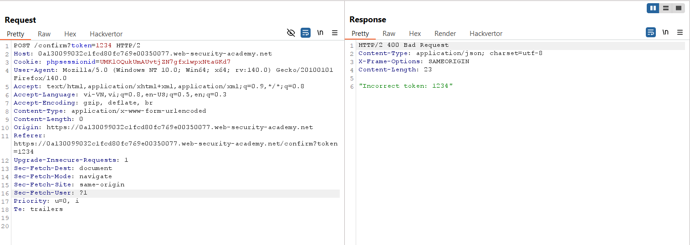
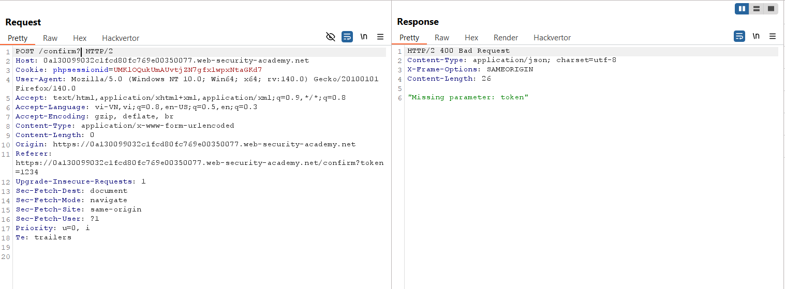
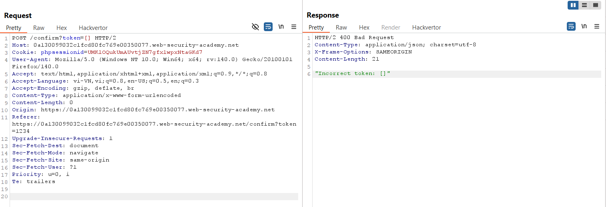
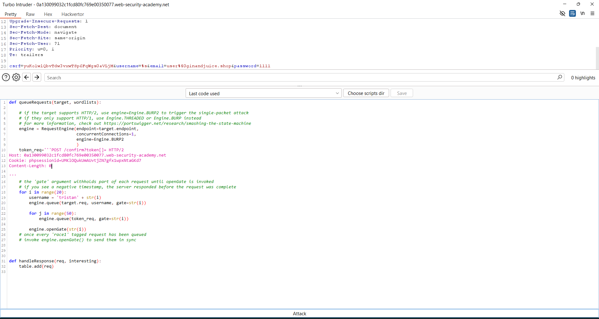
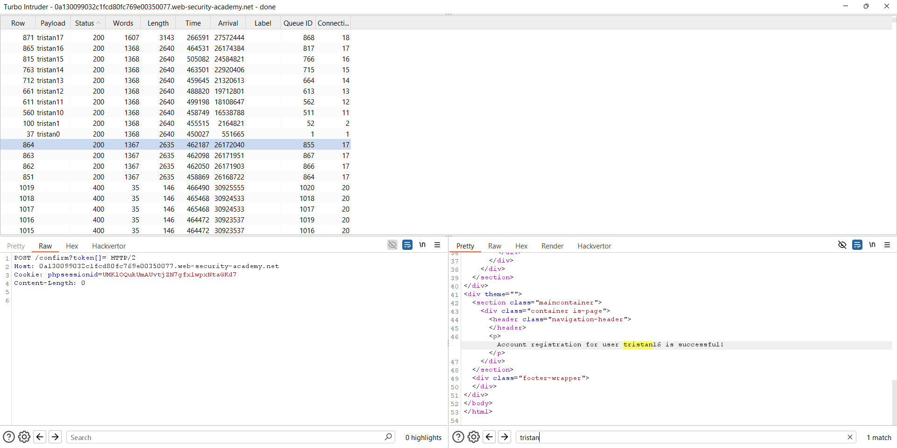

# Write-up: Partial construction race conditions

### Tổng quan
Khai thác lỗ hổng race condition trong cơ chế đăng ký người dùng, lợi dụng khoảng thời gian giữa đăng ký và xác nhận email để gửi yêu cầu xác nhận với `token[]`, bypass xác minh email, đăng ký tài khoản `tristan16` với quyền admin, đăng nhập, truy cập admin panel, và xóa tài khoản `carlos` để hoàn thành lab.

### Mục tiêu
- Khai thác race condition để bypass xác minh email, đăng ký tài khoản với email tùy ý, đăng nhập, và xóa tài khoản carlos.

### Công cụ sử dụng
- Burp Suite Community
- Firefox Browser

### Quy trình khai thác
1. **Thu thập thông tin (Reconnaissance)**
- Phân tích source code users.js leak từ Burp:
    
   - source code users.js leak từ burp

        ```javascript
           const createRegistrationForm = () => {
               const form = document.getElementById('user-registration');

               const usernameLabel = document.createElement('label');
               usernameLabel.textContent = 'Username';
               const usernameInput = document.createElement('input');
               usernameInput.required = true;
               usernameInput.type = 'text';
               usernameInput.name = 'username';

               const emailLabel = document.createElement('label');
               emailLabel.textContent = 'Email';
               const emailInput = document.createElement('input');
               emailInput.required = true;
               emailInput.type = 'email';
               emailInput.name = 'email';

               const passwordLabel = document.createElement('label');
               passwordLabel.textContent = 'Password';
               const passwordInput = document.createElement('input');
               passwordInput.required = true;
               passwordInput.type = 'password';
               passwordInput.name = 'password';

               const button = document.createElement('button');
               button.className = 'button';
               button.type = 'submit';
               button.textContent = 'Register';

               form.appendChild(usernameLabel);
               form.appendChild(usernameInput);
               form.appendChild(emailLabel);
               form.appendChild(emailInput);
               form.appendChild(passwordLabel);
               form.appendChild(passwordInput);
               form.appendChild(button);
           }

           const confirmEmail = () => {
               const container = document.getElementsByClassName('confirmation')[0];

               const parts = window.location.href.split("?");
               const query = parts.length == 2 ? parts[1] : "";
               const action = query.includes('token') ? query : "";

               const form = document.createElement('form');
               form.method = 'POST';
               form.action = '/confirm?' + action;

               const button = document.createElement('button');
               button.className = 'button';
               button.type = 'submit';
               button.textContent = 'Confirm';

               form.appendChild(button);
               container.appendChild(form);
           }
        ```
    - Hàm `createRegistrationForm()` tạo form đăng ký với các trường `username`, `email`, `password`.
    - Hàm `confirmEmail()` gửi token qua GET trong URL nhưng xác nhận qua `POST /confirm?token=....`
    - **Quan sát**: Có khoảng thời gian giữa đăng ký và xác nhận email, gợi ý lỗ hổng race condition trong trạng thái khởi tạo.

- Kiểm thử phản hồi khi gửi yêu cầu xác nhận:
    - `GET /confirm?token=1234`: "Incorrect token: 1234"
        
    - `GET /confirm?`: "Missing parameter: token"
        
    - `GET /confirm?token=`: "Forbidden"
        
    - `GET /confirm?token[]`: "Incorrect token: Array"
        
    - **Quan sát**: `token[]` có thể khớp với trạng thái null của token trong quá trình xử lý, do lỗi partial construction.

2. **Kiểm chứng độ trễ (Benchmark)**
- Chuẩn bị hai yêu cầu trong Burp Repeater:
    - Yêu cầu đăng ký: `POST /register HTTP/2`
    - Yêu cầu xác nhận: `POST /confirm?token[] HTTP/2`
- Nhóm hai yêu cầu, chọn `Send group in parallel (single-packet attack)`:
    - **Phản hồi**:
        - Yêu cầu đăng ký: 542ms.
        - Yêu cầu xác nhận: 382ms.
    - **Quan sát**: Yêu cầu xác nhận nhanh hơn, có thể tận dụng race window để xác nhận trước khi token được khởi tạo.
        
3. **Khai thác (Prove)**
- Sử dụng Turbo Intruder để tấn công race condition:
    - **Ý tưởng**: Gửi 1 yêu cầu đăng ký tài khoản và ngay lập tức gửi 50 yêu cầu xác nhận với `token[]` để trúng race window.
    - Script Turbo Intruder:
        

    - Gửi yêu cầu:   
        - **Phản hồi**: Tài khoản `tristan16` được đăng ký và xác nhận thành công:  
             

        - **Giải thích**: Yêu cầu xác nhận với token[] trúng race window khi server chưa khởi tạo token, bypass xác minh email.

- Đăng nhập với `tristan16`:`1111`
    
    - Truy cập vào trang admin panel, xóa tài khoản carlos và hoàn thành lab
        

### Bài học rút ra
- Hiểu cách khai thác lỗ hổng race condition trong trạng thái khởi tạo để bypass xác minh email và đăng ký tài khoản với email tùy ý.
- Nhận thức tầm quan trọng của việc đồng bộ hóa trạng thái khởi tạo và kiểm tra token để ngăn chặn race condition.

### Tài liệu tham khảo
- PortSwigger: Race conditions
- PortSwigger: Authentication vulnerabilities

### Kết luận
Lab này cung cấp kinh nghiệm thực tiễn trong việc khai thác lỗ hổng race condition trong trạng thái khởi tạo, sử dụng Turbo Intruder để gửi yêu cầu song song, bypass xác minh email, nhận quyền admin, và xóa tài khoản mục tiêu. Xem portfolio đầy đủ tại https://github.com/Furu2805/Lab_PortSwigger.

*Viết bởi Toàn Lương, Tháng 7/2025.*