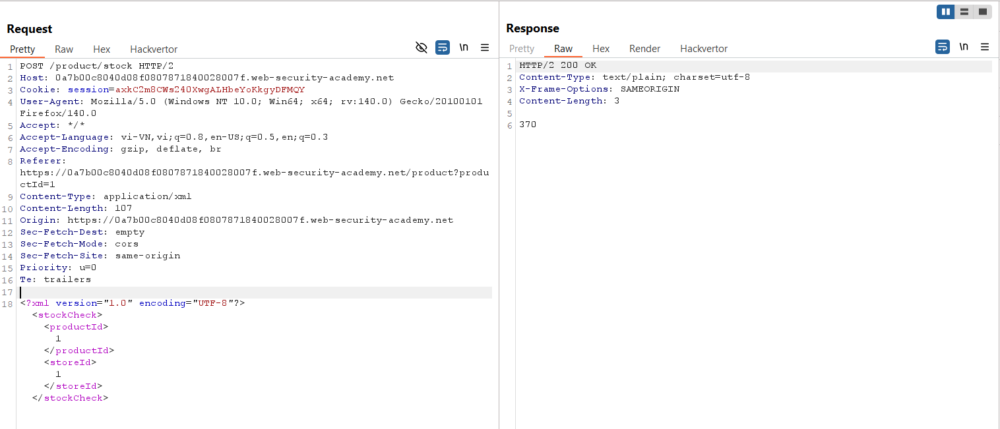
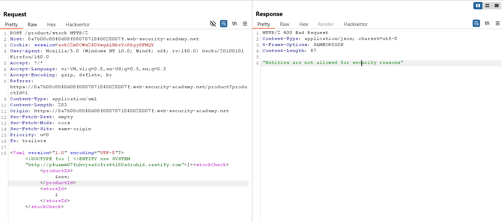
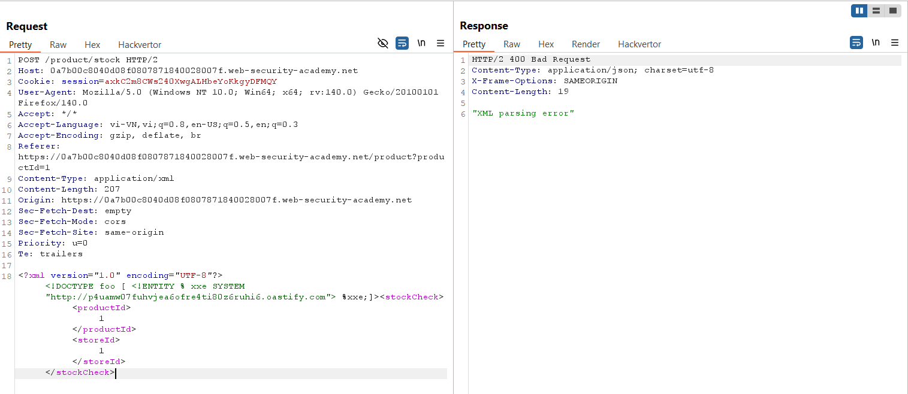
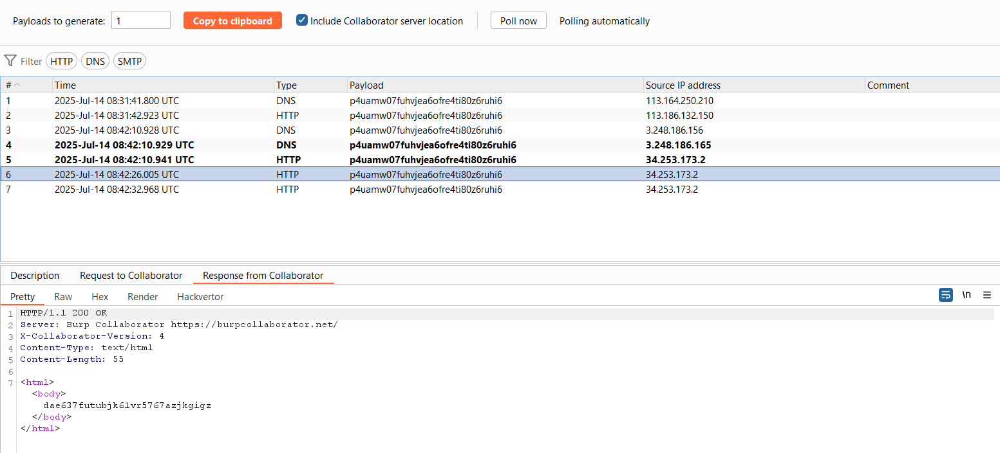
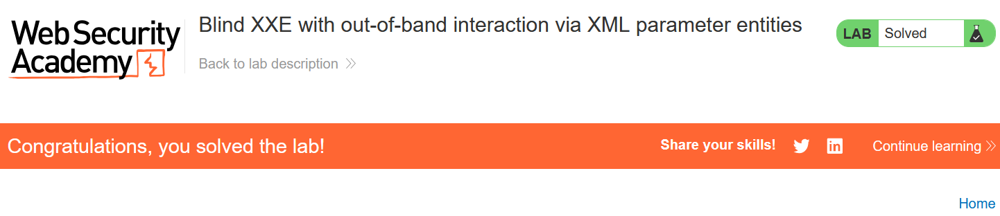

# Write-up: Blind XXE with out-of-band interaction via XML parameter entities

### Tổng quan
Khai thác lỗ hổng Blind XML External Entity (XXE) trong chức năng kiểm tra kho hàng (check stock), sử dụng parameter entity để bypass cơ chế chặn regular entities, kích hoạt tương tác out-of-band với Burp Collaborator thông qua DNS lookup và HTTP request, và hoàn thành lab.

### Mục tiêu
- Inject parameter entity qua XXE để kích hoạt DNS lookup và HTTP request tới Burp Collaborator, xác nhận lỗ hổng Blind XXE.

### Công cụ sử dụng
- Burp Suite Pro
- Firefox Browser

### Quy trình khai thác
1. **Thu thập thông tin (Reconnaissance)**
- Kiểm tra chức năng check stock trên giao diện web với một sản phẩm bất kỳ
- Trong Burp Suite Proxy, bắt được yêu cầu:
    
    - **Quan sát**: Yêu cầu gửi dữ liệu XML, gợi ý khả năng tồn tại lỗ hổng Blind XXE do server xử lý XML nhưng không hiển thị kết quả trực tiếp:

2. **Khai thác (Exploitation)**
- Thử regular external entity để kiểm tra khả năng XXE:
    
    - **Phản hồi**: Server trả về lỗi `"Entities are not allowed for security reasons"`, xác nhận regular entities bị chặn.

- Sửa payload sử dụng parameter entity để bypass chặn:
    
    - **Phản hồi**: Không hiển thị kết quả trong response (Blind XXE).

- Kiểm tra Burp Collaborator: Ghi nhận tương tác DNS lookup và HTTP request tới `p4uamw07fuhvjea6ofre4ti80z6ruhi6.oastify.com`:
    
    - **Giải thích**: Server không chặn parameter entities, cho phép thực thi %xxe để gửi yêu cầu out-of-band tới Collaborator, xác nhận lỗ hổng Blind XXE.

- Kiểm tra trạng thái lab:
    

### Bài học rút ra
- Hiểu cách khai thác lỗ hổng Blind XXE bằng parameter entities để bypass cơ chế chặn regular entities và kích hoạt tương tác out-of-band.
- Nhận thức tầm quan trọng của việc vô hiệu hóa xử lý parameter entities và hạn chế kết nối mạng ra ngoài trong XML parser để ngăn chặn Blind XXE.

### Tài liệu tham khảo
- PortSwigger: XML External Entity (XXE) Injection
- PortSwigger: Blind XXE vulnerabilities

### Kết luận
Lab này cung cấp kinh nghiệm thực tiễn trong việc khai thác Blind XXE bằng parameter entities, sử dụng Burp Collaborator để xác nhận tương tác out-of-band, và hiểu cách bảo vệ hệ thống khỏi XXE. Xem portfolio đầy đủ tại https://github.com/Furu2805/Lab_PortSwigger.

*Viết bởi Toàn Lương, Tháng 7/2025.*