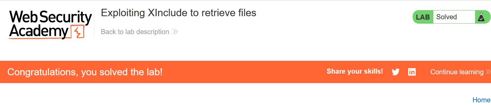

# Write-up: Exploiting XInclude to retrieve files

### Tổng quan
Khai thác lỗ hổng XInclude trong chức năng kiểm tra kho hàng (check stock), nhúng payload XInclude vào tham số `productId` để đọc file nội bộ `/etc/passwd`, tận dụng việc server xử lý XML không an toàn, và hoàn thành lab.

### Mục tiêu
- Inject XInclude statement vào tham số `productId` để truy xuất nội dung file `/etc/passwd`

### Công cụ sử dụng
- Burp Suite Community
- Firefox Browser

### Quy trình khai thác
1. **Thu thập thông tin (Reconnaissance)**
- Kiểm tra chức năng check stock trên giao diện web với một sản phẩm bất kỳ 
- Trong Burp Suite Proxy, bắt được yêu cầu:
    
    - **Quan sát**: Không thấy XML trực tiếp trong request, nhưng mô tả lab cho biết server nhúng input vào XML document và xử lý nó, gợi ý khả năng khai thác XInclude do không thể định nghĩa DTD:

2. **Khai thác (Exploitation)**
- Gửi yêu cầu `POST /product/stock` tới Burp Repeater, sửa tham số `productId` để nhúng payload XInclude:
    - Giải thích:
        - `<foo xmlns:xi="http://www.w3.org/2001/XInclude">`: Khai báo namespace xi cho XInclude.
        - `<xi:include parse="text" href="file:///etc/passwd"/>`: Chỉ định XInclude để đọc file `/etc/passwd` dưới dạng text.

    - **Phản hồi**: Server trả về nội dung file `/etc/passwd`:
        

    - **Giải thích**: Server xử lý XInclude trong XML document, cho phép truy xuất file nội bộ `/etc/passwd` do không vô hiệu hóa hoặc lọc XInclude statements.

- Kiểm tra trạng thái lab:
    

### Bài học rút ra
- Hiểu cách khai thác lỗ hổng XInclude để truy xuất file nội bộ khi không thể sử dụng XXE truyền thống với DTD.
- Nhận thức tầm quan trọng của việc vô hiệu hóa xử lý XInclude trong XML parser và kiểm tra chặt chẽ input nhúng vào XML document.

### Tài liệu tham khảo
- PortSwigger: XML External Entity (XXE) Injection

### Kết luận
Lab này cung cấp kinh nghiệm thực tiễn trong việc khai thác XInclude để đọc file nội bộ, tận dụng lỗ hổng trong xử lý XML của server, và hiểu cách bảo vệ hệ thống khỏi các tấn công liên quan đến XML. Xem portfolio đầy đủ tại https://github.com/Furu2805/Lab_PortSwigger.

*Viết bởi Toàn Lương, Tháng 7/2025.*