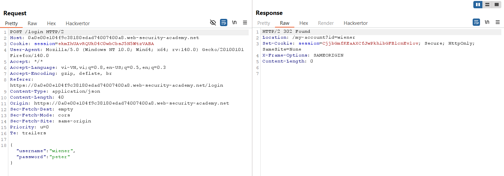
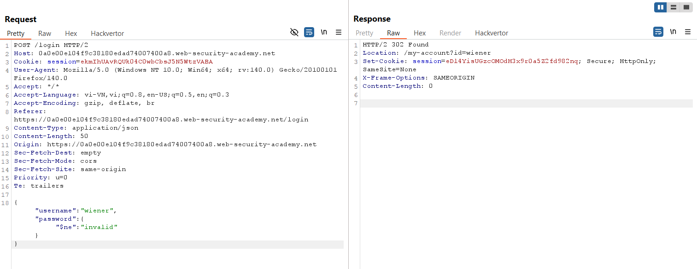
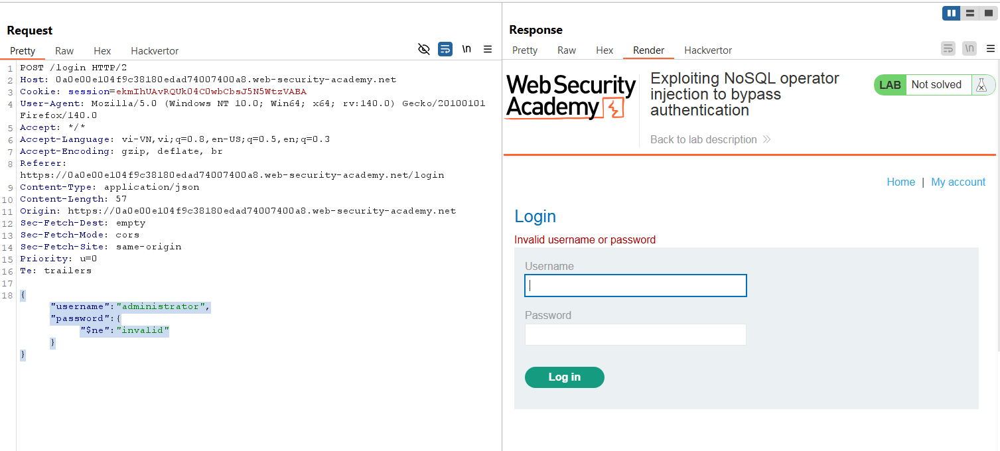
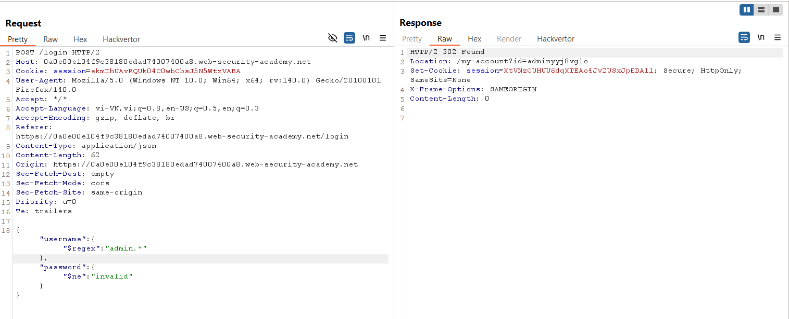
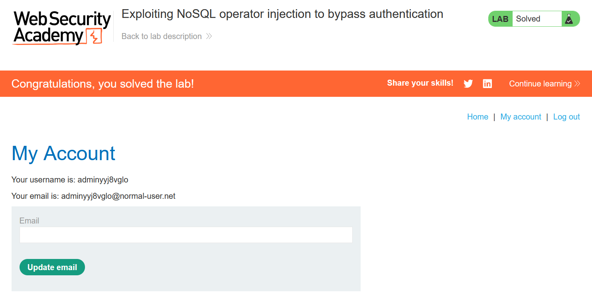

# Write-up: Exploiting NoSQL operator injection to bypass authentication

### Tổng quan
Khai thác lỗ hổng NoSQL operator injection trong chức năng đăng nhập sử dụng MongoDB, tận dụng các toán tử `$ne` và `$regex` để bypass xác thực, đăng nhập vào tài khoản bắt đầu bằng admin và hoàn thành lab.

### Mục tiêu
- Sử dụng NoSQL operator injection để bypass xác thực và đăng nhập vào tài khoản `administrator`.

### Công cụ sử dụng
- Burp Suite Community
- Firefox Browser

### Quy trình khai thác
1. **Thu thập thông tin (Reconnaissance)**
- Đăng nhập tài khoản `wiener`:`peter` để kiểm tra chức năng đăng nhập.
- Trong Burp Suite Proxy, bắt được yêu cầu POST tới endpoint
    
    - **Quan sát**: Yêu cầu sử dụng JSON, ứng dụng chạy trên MongoDB NoSQL, gợi ý khả năng tồn tại lỗ hổng NoSQL injection:

2. **Khai thác (Exploitation)**
- Gửi yêu cầu `POST /login` tới Burp Repeater, thử NoSQL injection với toán tử `$ne`: `{"username":"wiener","password":{"$ne":"invalid"}}`
    - **Phản hồi**: Đăng nhập thành công vào tài khoản wiener, xác nhận lỗ hổng NoSQL injection do toán tử `$ne` bypass kiểm tra mật khẩu.
        

- Thử đăng nhập tài khoản administrator: `{"username":"administrator","password":{"$ne":"invalid"}}`
    - **Phản hồi**: "Invalid username or password", cho thấy tài khoản administrator không khớp chính xác.
        

- Sử dụng toán tử `$regex` để tìm tài khoản bắt đầu bằng admin: `{"username":{"$regex":"admin.*"},"password":{"$ne":"invalid"}}`
    - **Phản hồi**: Đăng nhập thành công vào tài khoản bắt đầu bằng admin
        

    - **Giải thích**: Toán tử `$regex` cho phép tìm kiếm username khớp với mẫu admin.*, kết hợp `$ne` để bypass kiểm tra mật khẩu, do server không xác thực chặt chẽ input JSON.

- Kiểm tra trạng thái lab:
    

### Bài học rút ra
- Hiểu cách khai thác NoSQL operator injection với $ne và $regex để bypass cơ chế xác thực trong MongoDB.
- Nhận thức tầm quan trọng của việc xác thực và làm sạch input JSON trong các ứng dụng NoSQL để ngăn chặn injection.

### Tài liệu tham khảo
- PortSwigger: NoSQL Injection

### Kết luận
Lab này cung cấp kinh nghiệm thực tiễn trong việc khai thác NoSQL operator injection để bypass xác thực, đăng nhập vào tài khoản quản trị, và hiểu cách bảo vệ ứng dụng MongoDB khỏi injection. Xem portfolio đầy đủ tại https://github.com/Furu2805/Lab_PortSwigger.

*Viết bởi Toàn Lương, Tháng 7/2025.*