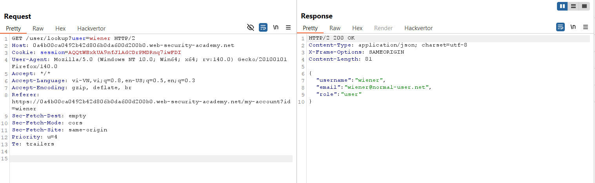
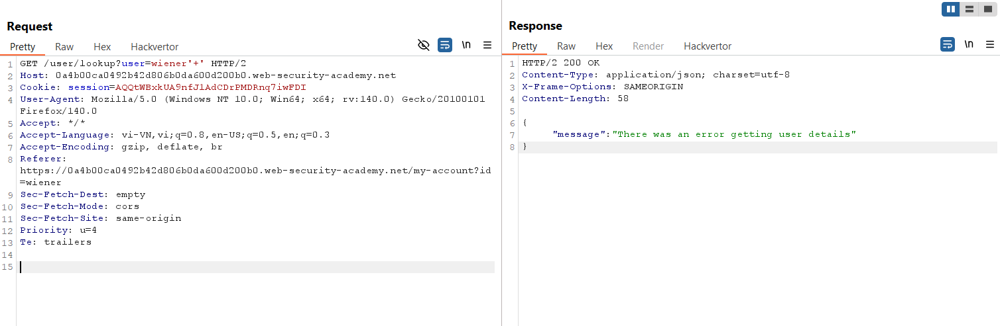
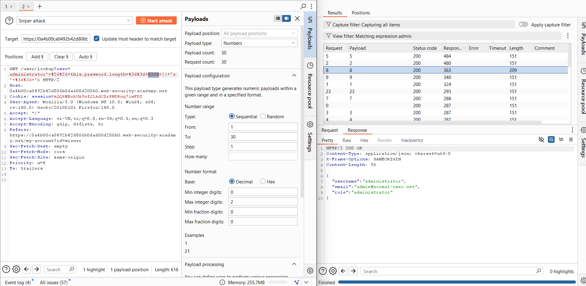
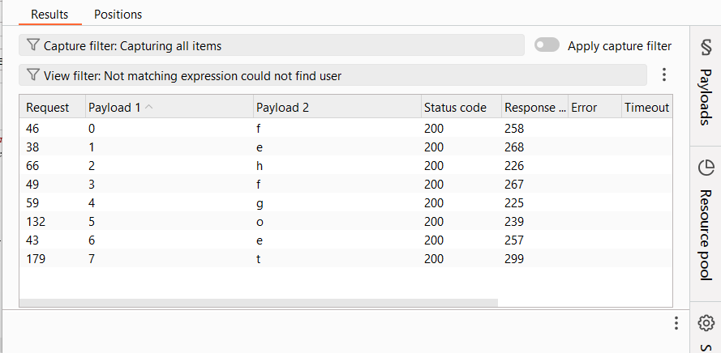
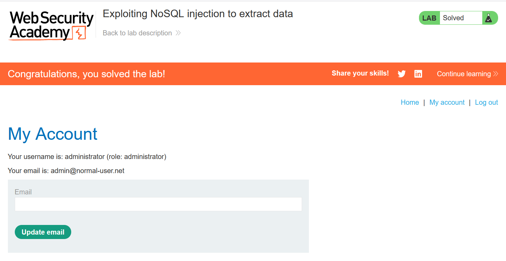

# Write-up: Exploiting NoSQL injection to extract data

### Tổng quan
Khai thác lỗ hổng NoSQL injection trong chức năng user lookup sử dụng MongoDB, tận dụng truy vấn để dò độ dài và từng ký tự mật khẩu của tài khoản `administrator`, lấy mật khẩu `fehfgoet`, đăng nhập và hoàn thành lab.

### Mục tiêu
- Sử dụng NoSQL injection để trích xuất mật khẩu của tài khoản administrator và đăng nhập vào tài khoản này.

### Công cụ sử dụng
- Burp Suite Community
- Firefox Browser

### Quy trình khai thác
1. **Thu thập thông tin (Reconnaissance)**
- Đăng nhập tài khoản `wiener`:`peter` để kiểm tra chức năng ứng dụng.
- Kiểm tra endpoint `/user/lookup` với tham số `user`:
    - **Phản hồi**: Trả về thông tin người dùng wiener.
        

- Thử NoSQL injection:
    - **Phản hồi**: Không báo lỗi cú pháp, gợi ý khả năng NoSQL injection.
        

- Xác nhận lỗ hổng: `/user/lookup?user=wiener' && '1'=='2`
    - **Phản hồi**: {"message": "Could not find user"}, xác nhận tham số user dễ bị NoSQL injection
    
2. **Khai thác (Exploitation)**
- Dò độ dài mật khẩu của `administrator`: `/user/lookup?user=administrator' && this.password.length = §30§ || 'a' == 'b`:
    - Sử dụng Burp Intruder, thay §30§ từ 1 đến 30.
    - **Kết quả**: Phản hồi thay đổi tại length < 9 , xác nhận độ dài mật khẩu là 8:
        

- Dò từng ký tự mật khẩu: `/user/lookup?user=administrator' && this.password[§0§] == '§a§`
    - Sử dụng Burp Intruder:
        - Payload 1: Vị trí ký tự (§0§) từ 0 đến 7, bước 1.
        - Payload 2: Brute force ký tự (§a§) với tập hợp abcdefghijklmnopqrstuvwxyz, độ dài 1.
    - **Kết quả**: Lấy được mật khẩu `fehfgoet`:
        

- Đăng nhập tài khoản `administrator`:`fehfgoet`:
    - **Phản hồi**: Đăng nhập thành công.
        

- **Giải thích**: Lỗ hổng NoSQL injection cho phép thao túng truy vấn MongoDB, dò độ dài và ký tự mật khẩu của `administrator` do server không xác thực hoặc làm sạch input trong tham số `user`.

### Bài học rút ra
- Hiểu cách khai thác NoSQL injection để trích xuất dữ liệu nhạy cảm (như mật khẩu) bằng cách dò độ dài và ký tự trong MongoDB.
- Nhận thức tầm quan trọng của việc xác thực và làm sạch input trong các ứng dụng sử dụng NoSQL database để ngăn chặn injection.

### Tài liệu tham khảo
- PortSwigger: NoSQL Injection

### Kết luận
Lab này cung cấp kinh nghiệm thực tiễn trong việc khai thác NoSQL injection để trích xuất mật khẩu, bypass cơ chế xác thực, và hiểu cách bảo vệ ứng dụng MongoDB khỏi injection. Xem portfolio đầy đủ tại https://github.com/Furu2805/Lab_PortSwigger.

*Viết bởi Toàn Lương, Tháng 7/2025.*