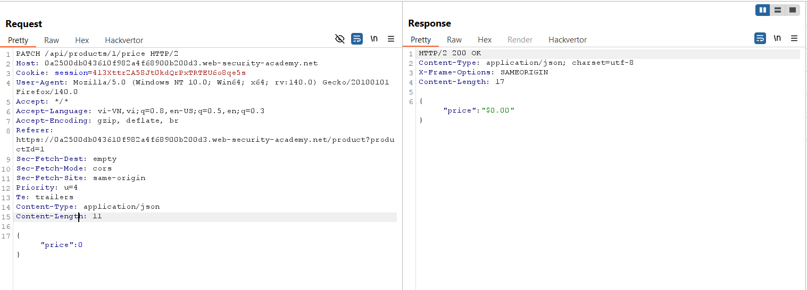

# Write-up: Finding and exploiting an unused API endpoint

### Tổng quan
Khai thác một API endpoint không được sử dụng (`/api/products/{id}/price`) để thay đổi giá sản phẩm "Lightweight l33t Leather Jacket" về 0 bằng phương thức `PATCH`, tận dụng lỗ hổng thiếu kiểm soát quyền truy cập, mua sản phẩm với giá 0 và hoàn thành lab.

### Mục tiêu
- Tìm và khai thác một API endpoint không được sử dụng để đặt giá sản phẩm "Lightweight l33t Leather Jacket" về 0 và mua sản phẩm.

### Công cụ sử dụng
- Burp Suite Community
- Firefox Browser

### Quy trình khai thác
1. **Thu thập thông tin (Reconnaissance)**
- Đăng nhập tài khoản `wiener`:`peter` và chọn một sản phẩm bất kỳ (ví dụ: product ID 1) trong cửa hàng.
- Trong Burp Suite Proxy, quan sát yêu cầu:
`GET /api/products/1/price`
    - Phản hồi: Trả về giá sản phẩm 
    - **Quan sát**: Endpoint `/api/products/1/price` được gọi khi xem sản phẩm, gợi ý khả năng tồn tại endpoint API không được bảo vệ:
        

2. **Khai thác (Exploitation)**
- Gửi yêu cầu `GET /api/products/1/price` tới Burp Repeater, thử kiểm tra các phương thức được hỗ trợ:
    `OPTIONS /api/products/1/price HTTP/2`
    - **Phản hồi**: Trả về header `Allow: GET, PATCH`, xác nhận endpoint hỗ trợ phương thức `PATCH`.
        

- Sử dụng phương thức `PATCH` và thêm `Content-Type: application/json` và body `{"price":0}` để thay đổi giá sản phẩm về 0:
    - **Phản hồi**: Giá sản phẩm được cập nhật thành 0:
        

- **Kiểm tra lại trong cửa hàng**: Giá sản phẩm "Lightweight l33t Leather Jacket" giờ là 0.
    
- Thêm sản phẩm vào giỏ hàng và thanh toán: `Content-Type: application/json`
    ```
    {"chosen_products":[{"product_id":"1","name":"Lightweight \"l33t\" Leather Jacket","quantity":1,"item_price":0}]}
    ```
    - **Phản hồi**: Mua sản phẩm thành công với giá 0 và hoàn thành lab
        

- **Giải thích**: Endpoint `/api/products/1/price` không được bảo vệ đúng cách, cho phép người dùng thường (wiener) sử dụng `PATCH` để thay đổi giá sản phẩm do thiếu kiểm soát quyền truy cập (Broken Object Level Authorization).

### Bài học rút ra
- Hiểu cách khai thác các API endpoint không được sử dụng hoặc bảo vệ kém để thao túng dữ liệu nhạy cảm, như giá sản phẩm.
- Nhận thức tầm quan trọng của việc kiểm soát quyền truy cập và giới hạn các phương thức API (như `PATCH`) để ngăn chặn truy cập trái phép.

### Tài liệu tham khảo
- PortSwigger: API Testing - Improper Assets Management

### Kết luận
Lab này cung cấp kinh nghiệm thực tiễn trong việc phát hiện và khai thác API endpoint không được bảo vệ, thay đổi giá sản phẩm để mua với giá 0, và hiểu cách bảo vệ API khỏi các cuộc tấn công tương tự. Xem portfolio đầy đủ tại https://github.com/Furu2805/Lab_PortSwigger.

*Viết bởi Toàn Lương, Tháng 7/2025.*