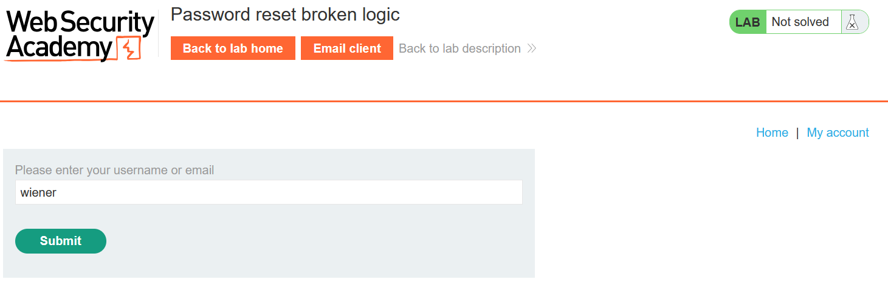
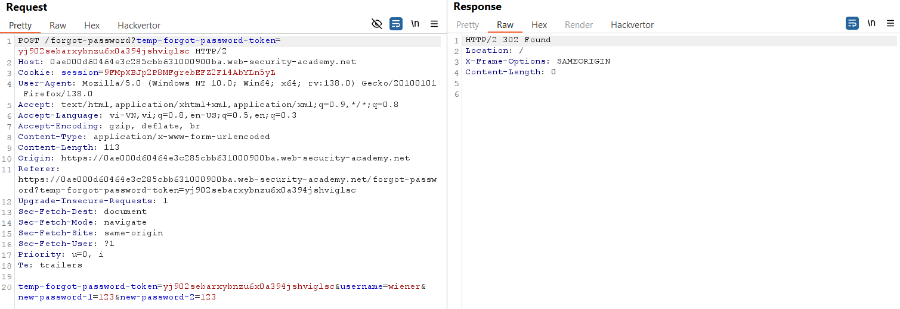
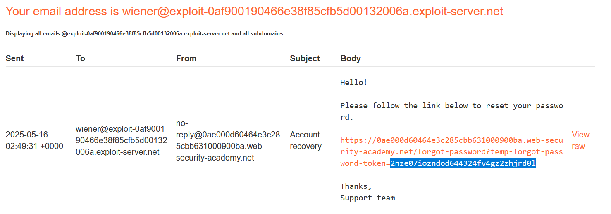
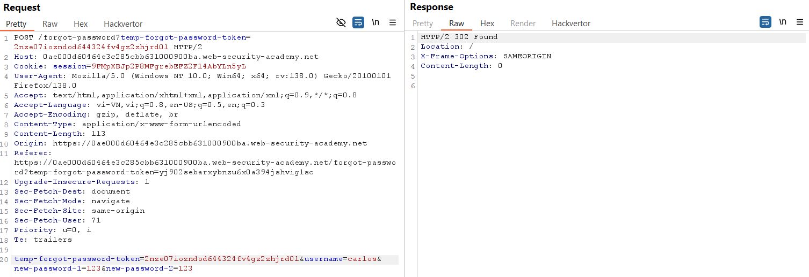
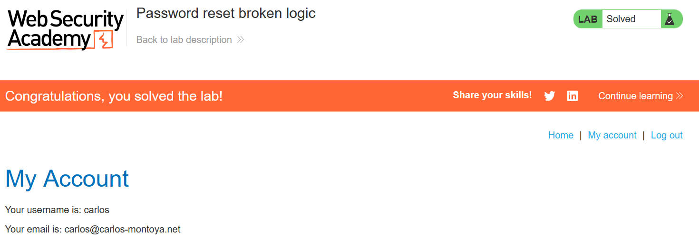

# Write-up: Password reset broken logic

### Tổng quan
Ghi lại quá trình khai thác lỗ hổng trong chức năng đặt lại mật khẩu để đặt lại mật khẩu của tài khoản `carlos` mà không cần truy cập email của nạn nhân.

### Thông tin đăng nhập:
- Tài khoản của bạn: `wiener`:`peter`
- Tài khoản nạn nhân: `carlos` (username đã biết)

### Mục tiêu
- Khai thác lỗ hổng trong cơ chế đặt lại mật khẩu.
- Đặt lại mật khẩu của carlos và đăng nhập vào tài khoản đó.

### Công cụ sử dụng
- Firefox Browser: Để thao tác với chức năng đặt lại mật khẩu và đăng nhập.
- Burp Suite Community: Để bắt, phân tích và chỉnh sửa các yêu cầu HTTP.

### Quy trình khai thác 
1. **Thu thập thông tin (Recon)**
- Kiểm tra chức năng `Forgot Password`:
  - Truy cập trang quên mật khẩu, nhập username `wiener` và submit
    
  - Kiểm tra email client (cung cấp bởi lab), nhận được liên kết đặt lại mật khẩu cho wiener. 

- Nhấp vào liên kết reset, đặt mật khẩu mới cho wiener, và sử dụng Burp Suite để bắt POST request:
  - Yêu cầu POST request có dạng:
    

  - **Giải thích**: `temp-forgot-password-token` là một mã đặc biệt để xác nhận đạt lại mật khẩu. Nhưng ứng dụng chỉ kiểm tra mã này có đúng hay không, không kiểm tra nó thuộc về ai

- **Kết luận**: Có thể dùng mã token của `wiener` để đặt lại mật khẩu cho bất kỳ tài khoản nào, như `carlos`, do lỗi trong cách ứng dụng xử lý.

1. **Khai thác (Exploitation)**
- Gửi POST Request đã bắt được vào Burp Repeater để thử nghiệm.
- Truy cập lại trang `Forgot Password`, nhập username `wiener` để nhận một `temp-forgot-password-token` mới qua email client: `2nze07iozndod644324fv4gz2zhjrd0l`
    

- Trong burp repeater, chỉnh sửa lại yêu cầu POST:
  - sửa giá trị tham số `temp-forgot-password-token` thành `2nze07iozndod644324fv4gz2zhjrd0l`
  - Thay `username=wiener` thành `username=carlos`, đặt mật khẩu mới `123`
    

- Đăng nhập tài khoản `carlos`:`123` và hoàn thành lab
    

### Bài học rút ra
- Hiểu rằng lỗi trong chức năng đặt lại mật khẩu có thể cho phép kẻ tấn công thay đổi mật khẩu của người khác nếu ứng dụng không kiểm tra đúng.
- Nhận thức tầm quan trọng của việc kiểm tra kỹ lưỡng thông tin (như token và username) trong các chức năng nhạy cảm.

### Tài liệu tham khảo
- PortSwigger: Password reset vulnerabilities

### Kết luận
Lab này giúp tôi nắm rõ cách khai thác lỗ hổng trong logic đặt lại mật khẩu thông qua việc thao tác yêu cầu HTTP và phân tích hành vi ứng dụng. Kỹ năng này nhấn mạnh tầm quan trọng của việc thiết kế cơ chế xác thực an toàn trong các hệ thống web. Xem portfolio đầy đủ tại https://github.com/Furu2805/Lab_PortSwigger 

*Viết bởi Toàn Lương, Tháng 5/2025*.
