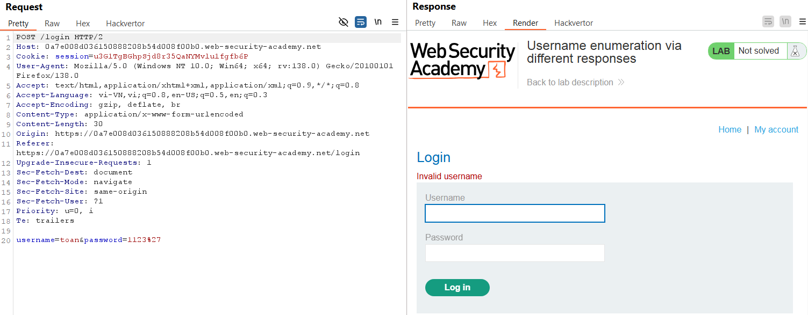
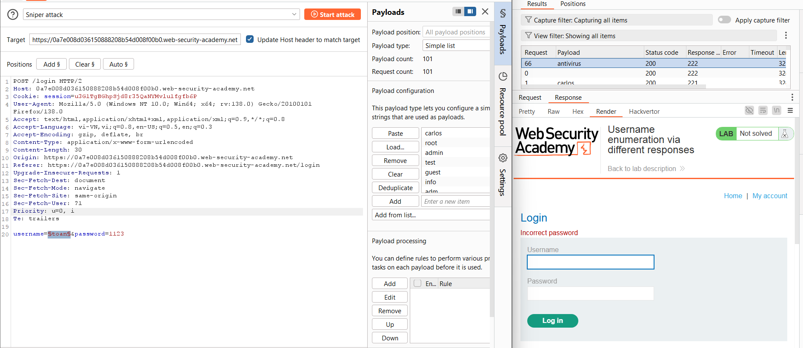
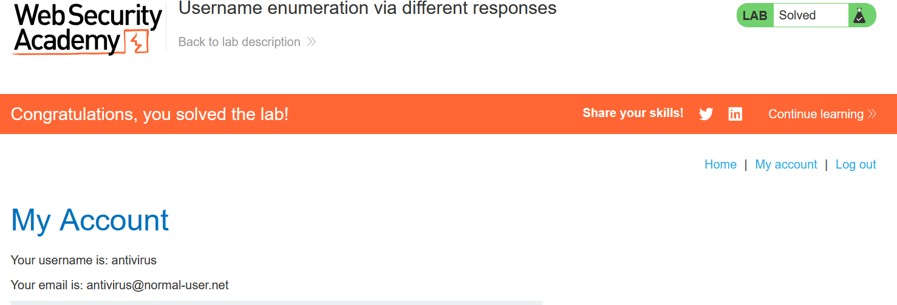

# Write-up: Username enumeration via different responses

### Tổng quan
Ghi lại quá trình khai thác lỗ hổng liệt kê tên người dùng thông qua sự khác biệt trong phản hồi của ứng dụng, sau đó brute-force mật khẩu để đăng nhập vào hệ thống

### Mục tiêu
- Xác định tên người dùng
- Bruteforce mật khẩu
- Đăng nhập vào hệ thống dưới tên người dùng đó

### Công cụ
- BurpSuite Community
- Firefox Browser

### Quy trình khai thác
1. **Thu thập thông tin (Recon)**
- Quan sát phản hồi của ứng dụng khi nhập tên đăng nhập và mật khẩu sai
    
    - **Kết luận**: lỗi `Invalid username`, xác nhận có thể liệt kê username dựa trên khác biệt phản hồi khi sai username và mật khẩu

- Xác định username hợp lệ, gửi POST request qua Burp Intruder và thiết lập sử dụng danh sách [Candidate username](https://portswigger.net/web-security/authentication/auth-lab-usernames)
    
    - **Kết quả**: Xác nhận `username` = `antivirus` hợp lệ
    
2. **Bruteforce**
- Bruteforce mật khẩu của tài khaorn `antivirus` bằng danh sách mật khẩu [Candidate passwords](https://portswigger.net/web-security/authentication/auth-lab-passwords)
    
    - **Kết quả**: Xác nhận mật khẩu `klaster`

3. **Khai thác (Exploitation)**
- Vào phần `/login` và đăng nhập `antivirus` : `klaster` và hoàn thành lab
    

### Bài học rút ra
- Nắm rõ cách khai thác lỗ hổng liệt kê username thông qua sự khác biệt trong phản hồi của ứng dụng.
- Hiểu tầm quan trọng của việc kiểm tra và xử lý phản hồi server để ngăn chặn các cuộc tấn công liệt kê thông tin nhạy cảm.

### Tài liệu tham khảo
- PortSwigger: Authentication lab usernames
- PortSwigger: Authentication lab passwords

### Kết luận
Lab này giúp tôi rèn luyện kỹ năng phân tích phản hồi ứng dụng và sử dụng công cụ như Burp Suite để khai thác lỗ hổng liệt kê username và brute-force mật khẩu. Xem portfolio đầy đủ tại https://github.com/Furu2805/Lab_PortSwigger 

*Viết bởi Toàn Lương, Tháng 5/2025*.