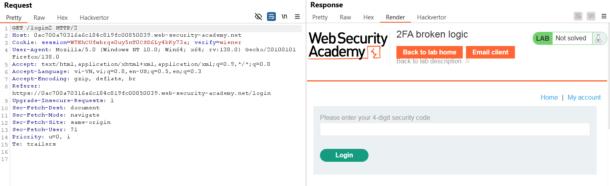
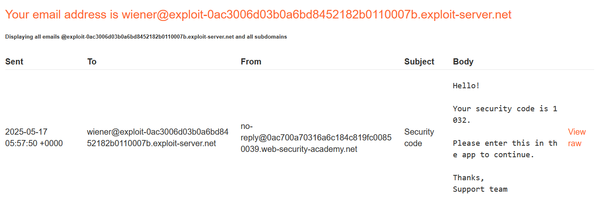
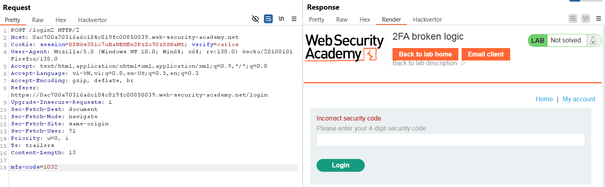
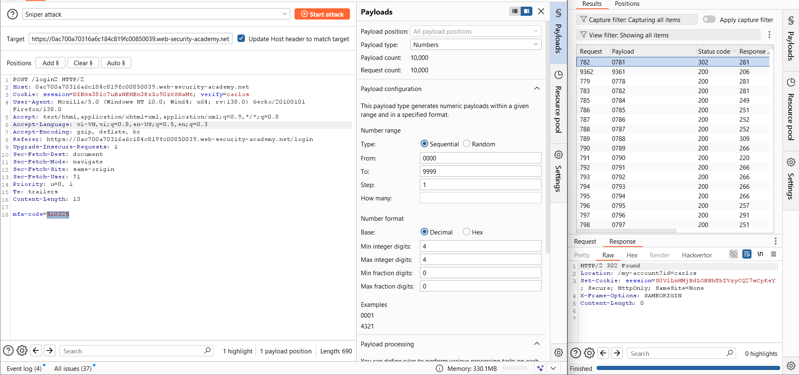
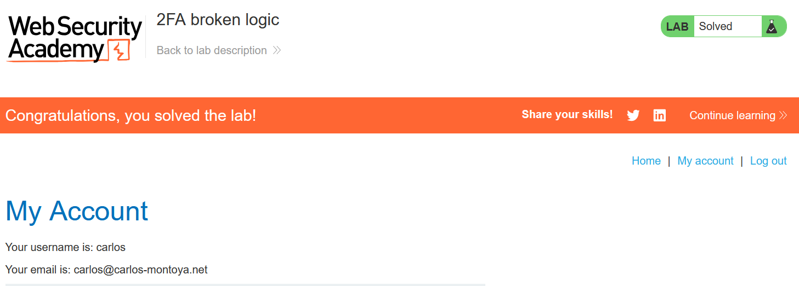

# Write-up: 2FA broken logic

### Tổng quan
Khai thác lỗi logic trong cơ chế xác thực hai yếu tố (2FA) để vượt qua bước nhập mã code của carlos, sử dụng brute-force mã code để đăng nhập vào tài khoản nạn nhân.

### Mục tiêu
- Vượt qua 2FA của `carlos` bằng cách khai thác lỗi logic.
- Đăng nhập và truy cập trang "My account" của `carlos`.

### Thông tin đăng nhập
- Tài khoản đăng nhập `wiener`:`peter`
- Tài khoản nạn nhân `carlos`
- Công cụ bổ sung: Email server để nhận mã 2FA của `wiener`.

### Quy trình khai thác
1. **Thu thập thông tin (Recon)**
- Đăng nhập vào tài khoản `wiener`:`peter`, sau đó truy cập `/login2` để nhập mã 2FA.

- Kiểm tra yêu cầu `GET /login2`:
    

- Nhận mã code 2FA từ email server cho `wiener`.

- **Phân tích**: Tham số `verify=wiener` xác định tài khoản nhận mã 2FA, nhưng ứng dụng không kiểm tra xem cookie session có khớp với `verify` hay không. Điều này cho phép thay `verify=carlos` để nhận mã của `carlos`.

2. **Khai thác lỗi logic (Exploitation)**
- Trong Burp Repeater, gửi lại yêu cầu `GET /login2` với tham số sửa đổi: `verify=carlos`
    
- Web gửi mã 2FA của carlos tới email của anh ta (không kiểm tra quyền sở hữu session).
    

- Thử dùng mã 2FA của `wiener` trên giao diện `/login2` của `carlos`:
    - Kết quả: Thông báo `Incorrect security code`.
        

3. **Brute-force mã 2FA**
- Sử dụng Burp Intruder để brute-force mã 2FA của `carlos`:
    - Gửi yêu cầu `POST /login2` tới Intruder:
    - Payload: Thử các mã từ 0000 đến 9999 (mã 2FA thường là 4 chữ số).
    - Kiểm tra phản hồi: Phản hồi chứa mã trạng thái 302 hoặc chuyển hướng tới /my-account chỉ ra mã đúng.
    - **Kết quả**: Tìm được mã 2FA đúng, đăng nhập thành công vào tài khoản `carlos`:`0781`  
         

4. **Hoàn thành lab**
- Truy cập trang "My account" của `carlos`, hoàn thành lab.
    

### Bài học rút ra
- Hiểu cách khai thác lỗi logic trong 2FA khi ứng dụng không xác thực quyền sở hữu session.
- Nhận thức tầm quan trọng của việc kiểm tra mối liên kết giữa session và tài khoản trong các chức năng nhạy cảm.
- Rèn luyện kỹ năng dùng Burp Intruder để brute-force mã 2FA.

### Tài liệu tham khảo
- PortSwigger: Authentication vulnerabilities

### Kết luận
Lab này giúp tôi nắm rõ cách khai thác lỗi logic trong cơ chế 2FA, sử dụng Burp Intruder để brute-force mã code và đăng nhập vào tài khoản carlos.  Xem portfolio đầy đủ tại https://github.com/Furu2805/Lab_PortSwigger 

*Viết bởi Toàn Lương, Tháng 5/2025*.