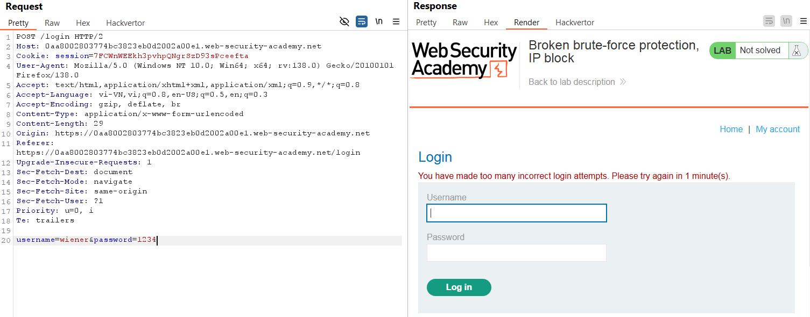
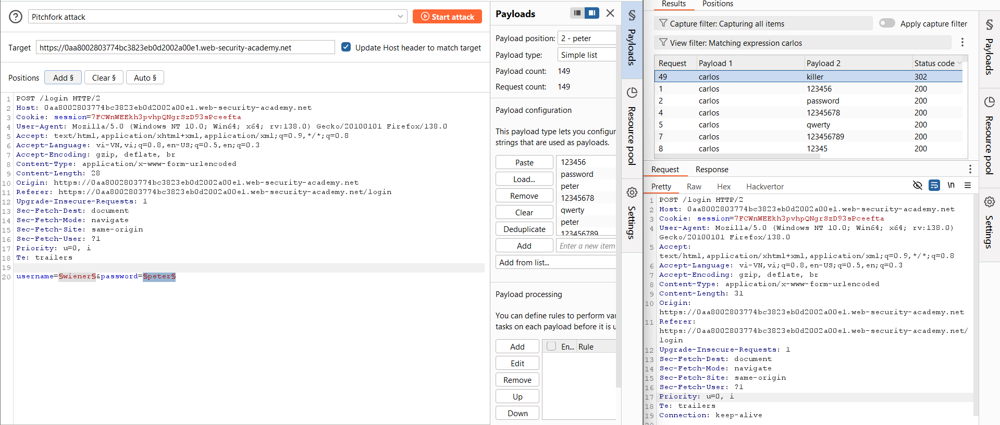
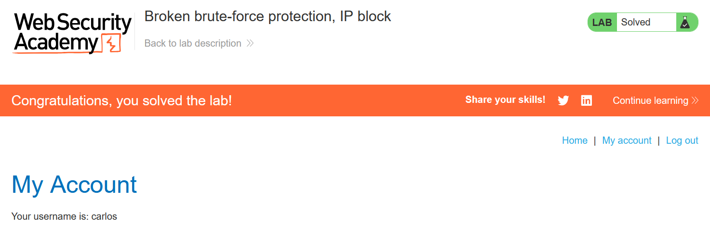

# Write-up: Broken brute-force protection, IP block

### Tổng quan
Ghi lại quá trình khai thác lỗ hổng logic trong cơ chế chống brute-force mật khẩu, bypass hạn chế chặn IP, và brute-force mật khẩu để đăng nhập vào tài khoản nạn nhân.

### Mục tiêu
- Bypass cơ chế chống brute-force bằng cách khai thác lỗi logic.
- Brute-force mật khẩu của tài khoản carlos và đăng nhập vào trang tài khoản.

### Thông tin đăng nhập:
- Tài khoản của bạn: `wiener`:`peter`
- Tài khoản nạn nhận: `carlos`

### Công cụ sử dụng
- Burpsuite Community
- Firefox Browser

### Quy trình khai thác
1. **Thu thập thông tin (Recon)**
- Kiểm tra chức năng đăng nhập:
    - Thử đăng nhập với username `wiener` và mật khẩu sai 3 liên tiếp
    - Nhận thông báo lỗi:
      ```
      You have made too many incorrect login attempts. Please try again in 1 minute(s).
      ```
         
    - **Phân tích**: Ứng dụng chặn IP sau 3 lần đăng nhập sai, với thời gian chờ 1 phút.

- Thử đăng nhập với tài khoản `wiener` và mật khẩu đúng (`peter`) 
    - Đăng nhập thành công, sau đó gửi lại mật khẩu sai không bị chặn ngay lập tức. 
    - **Kết luận**: Đăng nhập thành công bằng tài khoản hợp lệ `wiener`:`peter` sẽ reset cơ chế chặn IP ngay lập tức, cho phép tiếp tục gửi yêu cầu mà không bị giới hạn. 

- **Chiến lược brute-force**: Tạo danh sách yêu cầu xen kẽ giữa brute-force mật khẩu cho `carlos` và đăng nhập hợp lệ bằng `wiener`:`peter` để reset chặn IP. Ví dụ:
    ```
    username=carlos&password=1234
    username=carlos&password=123123
    username=wiener&password=peter
    ```
    - Điều này đảm bảo sau mỗi 2 lần thử mật khẩu sai cho carlos, đăng nhập wiener sẽ reset giới hạn

2. **Brute-force mật khẩu**
- Sử dụng Burp Intruder để brute-force mật khẩu cho tài khoản `carlos` với danh sách [Candidate passwords](https://portswigger.net/web-security/authentication/auth-lab-passwords)
    - Cấu hình intruder theo danh sách xen kẽ.
    
    - Xác nhận mật khẩu là `killer`

3. **Khai thác (Exploitation)**
- Vào phần `/login` và đăng nhập `carlos` : `killer` và hoàn thành lab
    

### Bài học rút ra
- Hiểu cách khai thác lỗ hỏng logic trong cơ chế phòng chống brute-force khi ứng dụng cho phép reset giới hạn bằng hành động hợp lệ.
- Nhận thức tầm quan trọng của việc thiết cơ chế bảo vệ ngăn chặn bypass, như không cho phép reset giới hạn qua đăng nhập khác.

### Tài liệu tham khảo
- PortSwigger: Authentication lab usernames
- PortSwigger: Authentication lab passwords

### Kết luận
Lab này giúp tôi rèn luyện kỹ năng phân tích logic bảo mật và sử dụng Burp Suite để bypass cơ chế chống brute-force, từ đó brute-force mật khẩu thành công. Kỹ năng này nhấn mạnh tầm quan trọng của việc thiết kế cơ chế bảo vệ chặt chẽ. Xem portfolio đầy đủ tại https://github.com/Furu2805/Lab_PortSwigger 

*Viết bởi Toàn Lương, Tháng 5/2025*.