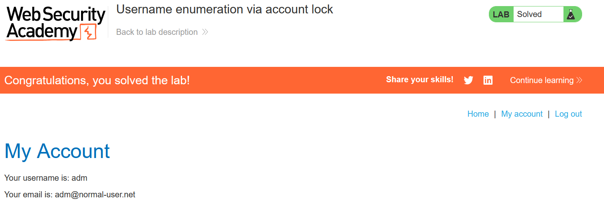

# Write-up: Username enumeration via account lock

### Tổng quan
Ghi lại quá trình khai thác lỗ hổng liệt kê tên người dùng dựa trên lỗi logic trong cơ chế chặn tài khoản, sau đó brute-force mật khẩu để đăng nhập vào tài khoản nạn nhân.

### Mục tiêu
- Xác định tên người dùng hợp lệ bằng cách khai thác cơ chế chặn tài khoản.
- Brute-force mật khẩu của tài khoản
- Đăng nhập vào hệ thống dưới tên người dùng đó

### Công cụ sử dụng
- Burpsuite Community
- Firefox Browser

### Quy trình khai thác
1. **Thu thập thông tin (Recon)**
- Kiểm tra chức năng đăng nhập:
    - Thử đăng nhập với username và password bất kì liên tiếp 10 lần, nhận được thông báo `Invalid username or password.`
        
    - **Phân tích**: Do username không tồn tại nên hệ thống không thực hiện cơ chế, lợi dụng việc đó để kiểm tra sự khác biệt trong phản hồi trả về khi liệt kê username.
    
- Liệt kê username hợp lệ:
    - Sử dụng Burp Intruder để gửi POST request tới `/login` với danh sách[Candidate username](https://portswigger.net/web-security/authentication/auth-lab-usernames)

        - Payload: 
            ```
            username=§test§&password=test§§
            ```
        - Cấu hình Intruder:
            - Payload 1: Danh sách candidate usernames.
            - Payload 2: Null payloads (gửi 5 lần cho mỗi username để kích hoạt khóa tài khoản).
    
        
      - **Kiểm tra phản hồi**: Username hợp lệ (`adm`) độ dài phản hồi khác sau 5 lần thử.

2. **Brute-force mật khẩu**
- Sử dụng Burp Intruder để brute-force mật khẩu cho tài khoản user với danh sách [Candidate passwords](https://portswigger.net/web-security/authentication/auth-lab-passwords)
    - Payload: 
        ```
        username=adm&password=§test§
        ```
    
    - **Kết quả**: Xác định mật khẩu đúng là `matrix`

3. **Khai thác (Exploitation)**
- Vào phần `/login` và đăng nhập `adm` : `matrix` và hoàn thành lab
    

### Bài học rút ra
- Hiểu cách khai thác lỗ hổng liệt kê username dựa trên cơ chế chặn tài khoản, khi ứng dụng trả về phản hồi khác nhau cho username hợp lệ và không hợp lệ.
- Nhận thức tầm quan trọng của việc thiết kế cơ chế bảo vệ để phản hồi đồng đều, tránh rò rỉ thông tin nhạy cảm như username.

### Tài liệu tham khảo
- PortSwigger: Authentication lab usernames
- PortSwigger: Authentication lab passwords

### Kết luận
Lab này giúp tôi rèn luyện kỹ năng phân tích lỗi logic trong cơ chế chặn tài khoản để liệt kê username và sử dụng Burp Suite để brute-force mật khẩu. Kỹ năng này nhấn mạnh tầm quan trọng của việc che giấu thông tin trong phản hồi ứng dụng. Xem portfolio đầy đủ tại https://github.com/Furu2805/Lab_PortSwigger 

*Viết bởi Toàn Lương, Tháng 5/2025*.