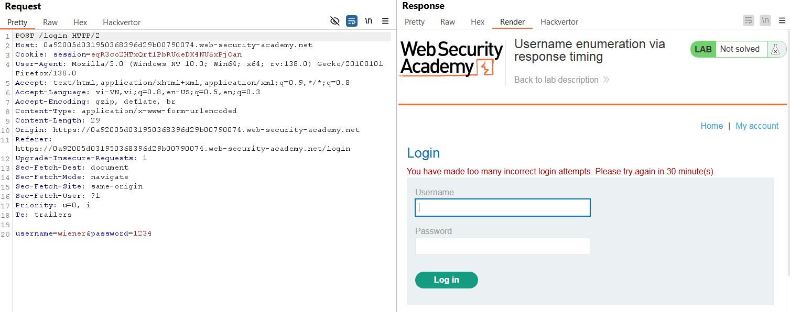
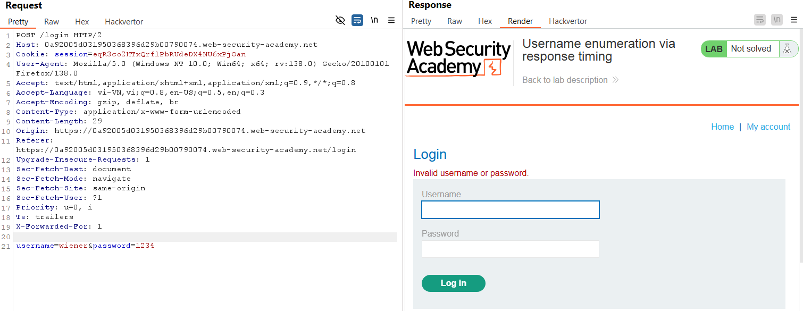
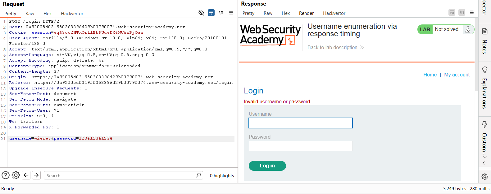
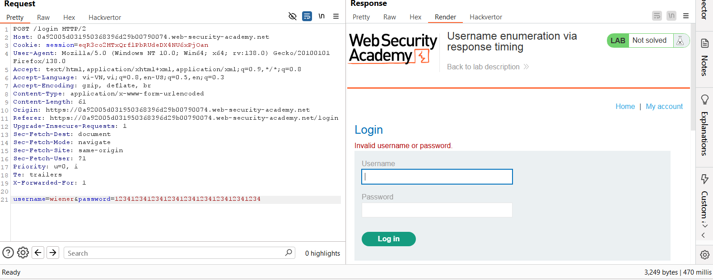
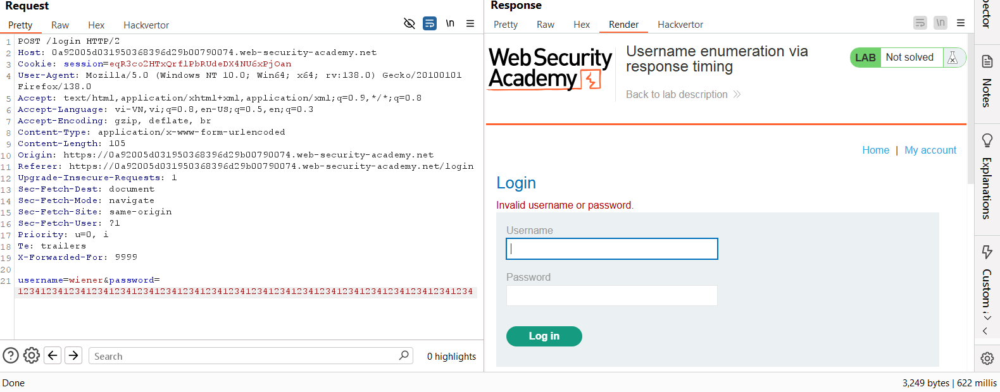
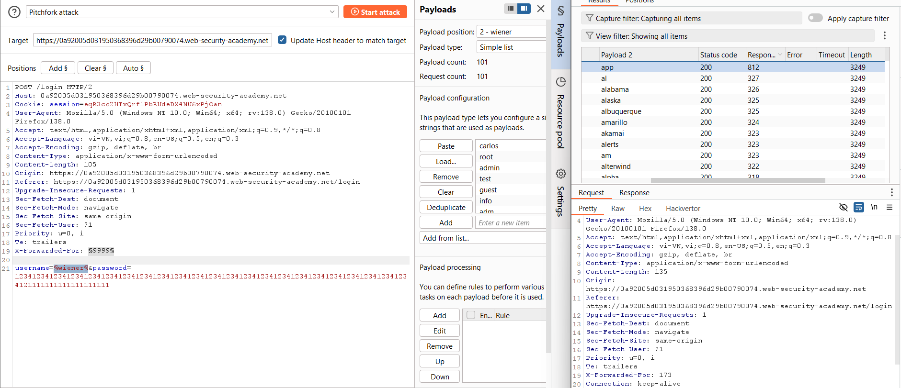
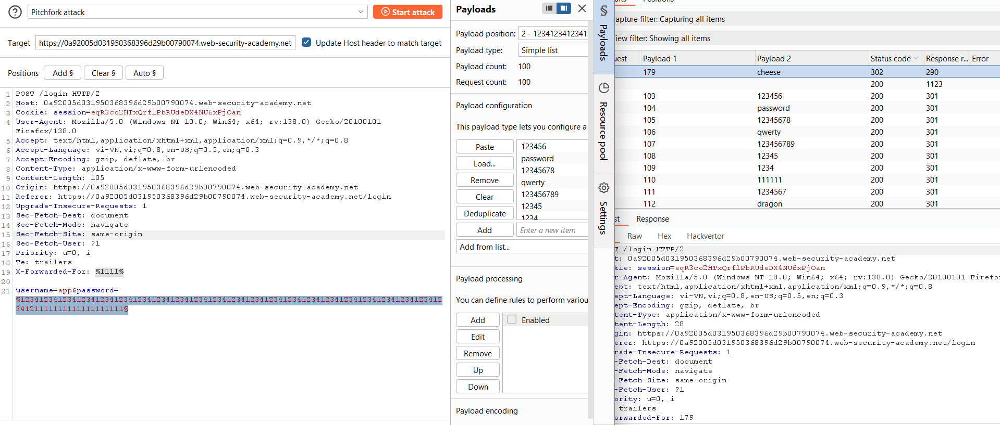
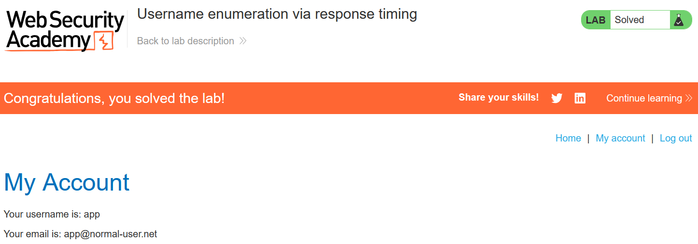

# Write-up: Username enumeration via response timing

### Tổng quan
Ghi lại quá trình khai thác lỗ hổng liệt kê tên người dùng dựa trên thời gian phản hồi, sau đó brute-force mật khẩu để đăng nhập vào hệ thống

### Mục tiêu 
- Xác định tên người dùng hợp lệ
- Brute-force mật khẩu của tài khoản
- Đăng nhập vào hệ thống dưới tên người dùng đó

### Thông tin đăng nhập:
- Tài khoản của bạn: `wiener`:`peter`

### Công cụ sử dụng
- Burpsuite Community
- Firefox Browser

### Quy trình khai thác 
1. **Thu thập thông tin (Recon)**
- Kiểm tra chức năng đăng nhập:
    - Thử đăng nhập với username `wiener` và mật khẩu sai nhiều lần, nhận thông báo thử lại sau 30p
    
    - **Giải pháp**: Thêm header X-Forwarded-For với giá trị IP khác nhau (ví dụ: 2) trong Burp Repeater để bypass hạn chế IP.
        
    - **Kết quả**: Xác nhận có thể sử dụng header `X-Forwarded-For` để by pass

- Kiểm tra thời gian phản hồi:
    - Sử dụng Burp Repeater, gửi yêu cầu đăng nhập với username `wiener` và mật khẩu có độ dài tăng dần
    
    
    
    - **Kết quả**: với username hợp lệ thời gian phản hồi phụ thuộc vào độ dài mật khẩu. Với username không hợp lệ, thời gian phản hồi không thay đổi đáng kể.

- Liệt kê username hợp lệ:
    - Sử dụng Burp Intruder để gửi POST request tới `/login` với danh sách[Candidate username](https://portswigger.net/web-security/authentication/auth-lab-usernames)
    - Thêm payload cho giá trị của header `X-Forwarded-For` (Tăng số từ 1-101)
    
    - **Kết quả**: Xác nhận `user` = `app` có thời gian phản hồi lâu hơn, hợp lệ.

2. **Brute-force mật khẩu**
- Sử dụng Burp Intruder để brute-force mật khẩu cho tài khoản user với danh sách [Candidate passwords](https://portswigger.net/web-security/authentication/auth-lab-passwords)
    
    - **Kết quả**: Xác định mật khẩu đúng là `cheese`

3. **Khai thác (Exploitation)**
- Vào phần `/login` và đăng nhập `app` : `cheese` và hoàn thành lab
    

### Bài học rút ra
- Hiểu cách khai thác lỗ hổng liệt kê username dựa trên thời gian phản hồi, một dấu hiệu tinh vi nhưng có thể bị phát hiện nếu không được che giấu.
- Nhận thức tầm quan trọng của việc thiết kế ứng dụng để phản hồi đồng đều, tránh rò rỉ thông tin qua thời gian xử lý.

### Tài liệu tham khảo
- PortSwigger: Authentication lab usernames
- PortSwigger: Authentication lab passwords

### Kết luận
Lab này giúp tôi rèn luyện kỹ năng phân tích thời gian phản hồi để phát hiện username hợp lệ và sử dụng Burp Suite để khai thác lỗ hổng liệt kê username và brute-force mật khẩu.. Xem portfolio đầy đủ tại https://github.com/Furu2805/Lab_PortSwigger 

*Viết bởi Toàn Lương, Tháng 5/2025*.