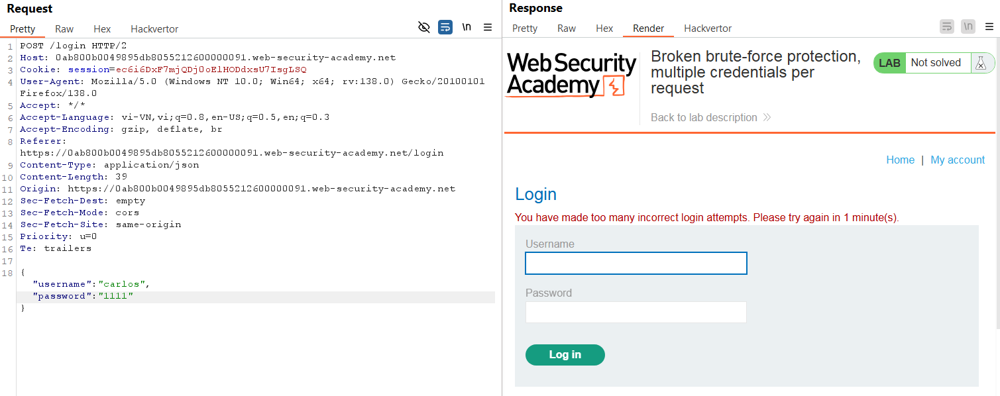
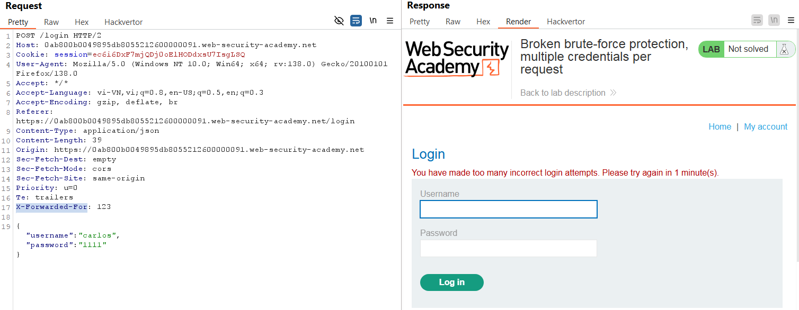
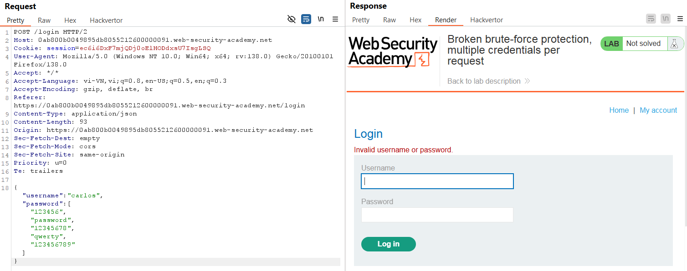
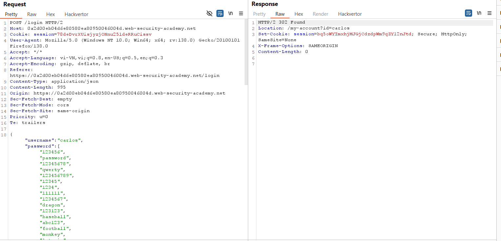
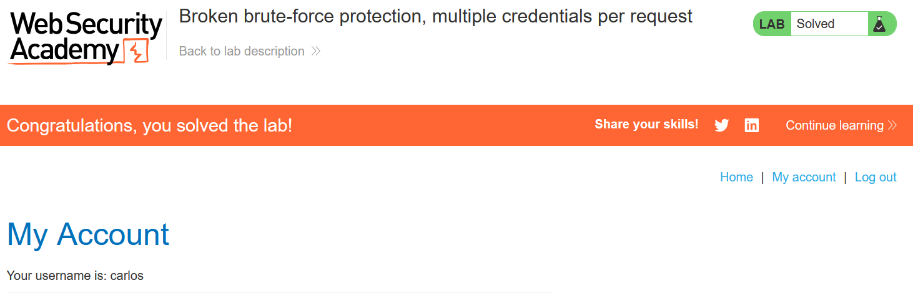

# Write-up: Broken brute-force protection, multiple credentials per request

### Tổng quan
Khai thác lỗi logic trong cơ chế chống brute-force bằng cách gửi mảng mật khẩu trong một yêu cầu, bypass hạn chế chặn IP để tìm mật khẩu của `carlos` và truy cập trang tài khoản nạn nhân.

### Mục tiêu
- Bypass cơ chế chống brute-force.
- Brute-force mật khẩu của carlos và đăng nhập vào trang "My account".

### Thông tin đăng nhập
- Tài khoản nạn nhân: carlos
- Danh sách: [Candidate passwords](https://portswigger.net/web-security/authentication/auth-lab-passwords).

### Công cụ sử dụng
- Burp Suite Community
- Firefox Browser
- Python: Để tạo payload mảng mật khẩu.

### Quy trình khai thác
1. **Thu thập thông tin (Recon)**
- Thử đăng nhập với username `carlos` và mật khẩu sai nhiều lần, nhận thông báo:
    ```
    You have made too many incorrect login attempts. Please try again in 1 minute(s).
    ```
    

- Thử thêm header `X-Forwarded-For: 123` để bypass chặn IP, nhưng vẫn nhận lỗi trên.
    

- **Phân tích**: Web không cho phép bypass chặn IP bằng `X-Forwarded-For`.

- Thử gửi yêu cầu `POST /login` với trường `password` là mảng các giá trị mật khẩu:
    
    - Nhận phản hồi `Invalid username or password` mà không bị chặn IP.
    - **Kết luận**: Web cho phép gửi mảng mật khẩu trong một yêu cầu, bypass được cơ chế chống brute-force.

2. **Brute-force Mật khẩu (Exploitation)**
- Tạo payload bằng Python [brute.py](./brute.py) để sinh mảng mật khẩu từ danh sách [Candidate passwords](https://portswigger.net/web-security/authentication/auth-lab-passwords).

- Gửi yêu cầu POST qua Burp Repeater với mảng mật khẩu
    

- Kiểm tra phản hồi: Nhận HTTP 302 Found, chỉ ra mật khẩu đúng nằm trong mảng.

- **Kết quả**: Đăng nhập được vào tài khoản `carlos`
    

### Bài học rút ra
- Hiểu cách khai thác lỗi logic khi web chấp nhận mảng mật khẩu để bypass chống brute-force.
- Nhận thức tầm quan trọng của việc kiểm tra dữ liệu đầu vào trong cơ chế bảo vệ.

### Tài liệu tham khảo
- PortSwigger: Authentication vulnerabilities

### Kết luận
Lab này giúp tôi nắm rõ cách bypass cơ chế chống brute-force bằng mảng mật khẩu, sử dụng Python và Burp Suite để tìm mật khẩu và đăng nhập vào tài khoản `carlos`.  Xem portfolio đầy đủ tại https://github.com/Furu2805/Lab_PortSwigger 

*Viết bởi Toàn Lương, Tháng 5/2025*.