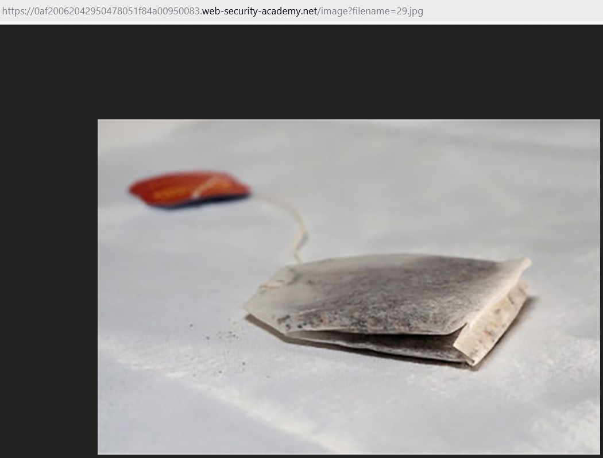
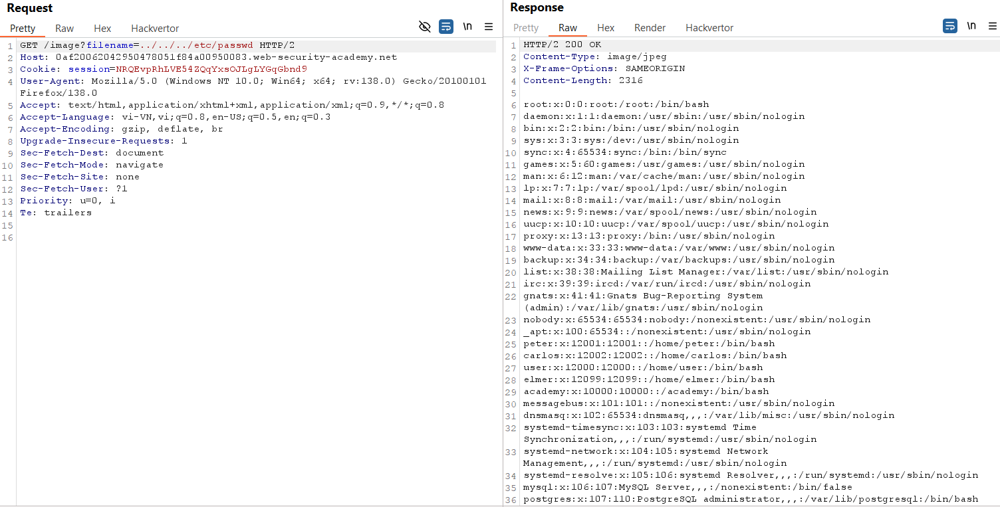
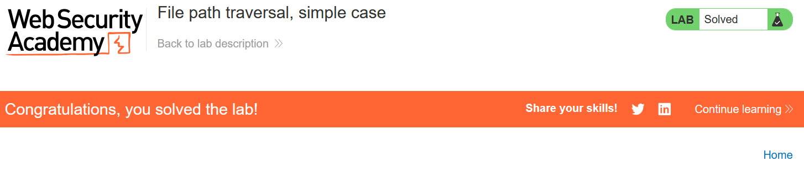

# Write-up: File path traversal, simple case

### Tổng quan
Khai thác lỗ hổng file path traversal trong chức năng hiển thị hình ảnh để truy cập và lấy nội dung tệp `/etc/passwd`.

### Mục tiêu
- Lấy nội dung tệp `/etc/passwd` bằng cách thao túng tham số `filename`.

### Công cụ sử dụng
- Firefox Browser: Để kiểm tra đường dẫn hình ảnh và gửi yêu cầu.

### Quy trình khai thác
1. **Thu thập thông tin (Reconnaissance)**
- Click chuột phải vào hình ảnh sản phẩm, chọn **Open image in new tab**.
- Nhận đường dẫn: `https://lab-id.web-security-academy.net/image?filename=29.jpg`
    
- **Phân tích**: Tham số filename quyết định tệp được truy cập, có thể thao túng để đọc các tệp khác.

2. **Khai thác (Exploitation)**
- Sửa tham số `filename` thành `../../../etc/passwd`:
    ```
    https://lab-id.web-security-academy.net/image?filename=../../../etc/passwd
    ```

- Gửi yêu cầu qua trình duyệt.
- Kết quả: Nhận nội dung tệp `/etc/passwd`, hoàn thành lab:
    
    

### Bài học rút ra
- Hiểu cách khai thác lỗ hổng file path traversal bằng cách thao túng tham số đường dẫn.
- Nhận thức tầm quan trọng của việc kiểm tra và lọc dữ liệu đầu vào trong các chức năng truy cập tệp.

### Tài liệu tham khảo
- PortSwigger: File path traversal

### Kết luận
Lab này giúp tôi nắm rõ cách khai thác file path traversal để truy cập tệp hệ thống, nhấn mạnh tầm quan trọng của việc bảo mật tham số đường dẫn. Xem portfolio đầy đủ tại https://github.com/Furu2805/Lab_PortSwigger.

*Viết bởi Toàn Lương, Tháng 5/2025.*