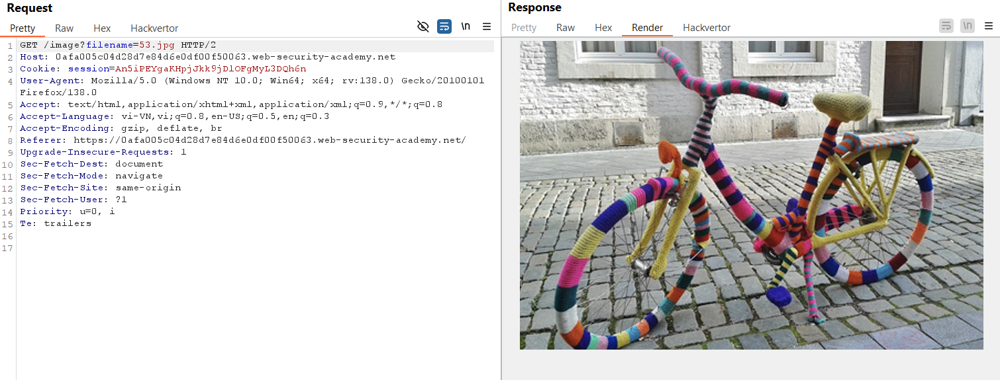
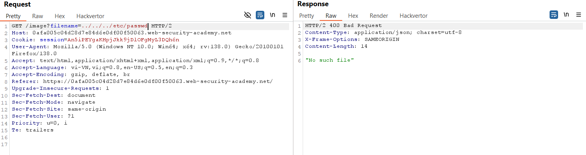
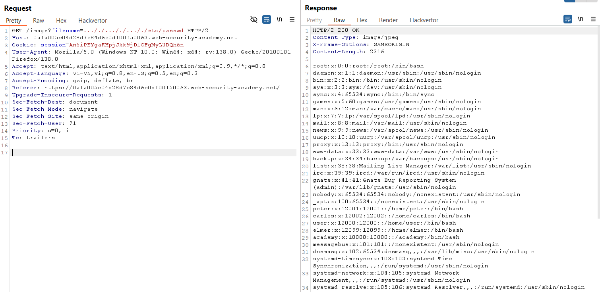

# Write-up: File path traversal, traversal sequences stripped non-recursively

### Tổng quan
Khai thác lỗ hổng file path traversal trong chức năng hiển thị hình ảnh, bypass cơ chế xóa chuỗi `../` non-recursively bằng chuỗi lồng ghép `..././` để lấy nội dung tệp `/etc/passwd`.

### Mục tiêu
- Lấy nội dung tệp `/etc/passwd` bằng cách thao túng tham số `filename` để vượt qua cơ chế lọc.

### Công cụ sử dụng
- Burp Suite Community
- Firefox Browser

### Quy trình khai thác
1. **Thu thập thông tin (Reconnaissance)**
- Click chuột phải vào hình ảnh sản phẩm, chọn **Open image in new tab**.

- Nhận đường dẫn: `https://lab-id.web-security-academy.net/image?filename=53.jpg`
    

- Trong Burp Proxy HTTP History, gửi yêu cầu `GET /image?filename=53.jpg` tới Repeater.
- Sửa tham số `filename=../../../etc/passwd` và gửi:
- Nhận thông báo lỗi: `No such file`
    

- **Phân tích**:  Ứng dụng xóa chuỗi `../` trước khi xử lý đường dẫn, có thể non-recursively (chỉ xóa lần lượt từng `../`).

2. **Khai thác (Exploitation)**
- Thử chuỗi lồng ghép để bypass cơ chế xóa `../` non-recursively: `filename=..././..././..././etc/passwd`
- Gửi yêu cầu, nhận phản hồi chứa nội dung tệp /etc/passwd.
    

- **Kết quả**: Cơ chế lọc xóa `../`, để lại `../../../etc/passwd`,  trả về nội dung tệp `/etc/passwd`, hoàn thành lab
    

### Bài học rút ra
- Hiểu cách bypass cơ chế lọc traversal sequences non-recursively bằng chuỗi lồng ghép `..././`.
- Nhận thức tầm quan trọng của việc lọc đường dẫn một cách toàn diện trong chức năng truy cập tệp.

### Tài liệu tham khảo
- PortSwigger: File path traversal

### Kết luận
Lab này giúp tôi nắm rõ cách bypass cơ chế lọc `../` non-recursively bằng chuỗi lồng ghép, sử dụng Burp Suite để lấy nội dung tệp `/etc/passwd`. Xem portfolio đầy đủ tại https://github.com/Furu2805/Lab_PortSwigger.

*Viết bởi Toàn Lương, Tháng 5/2025.*