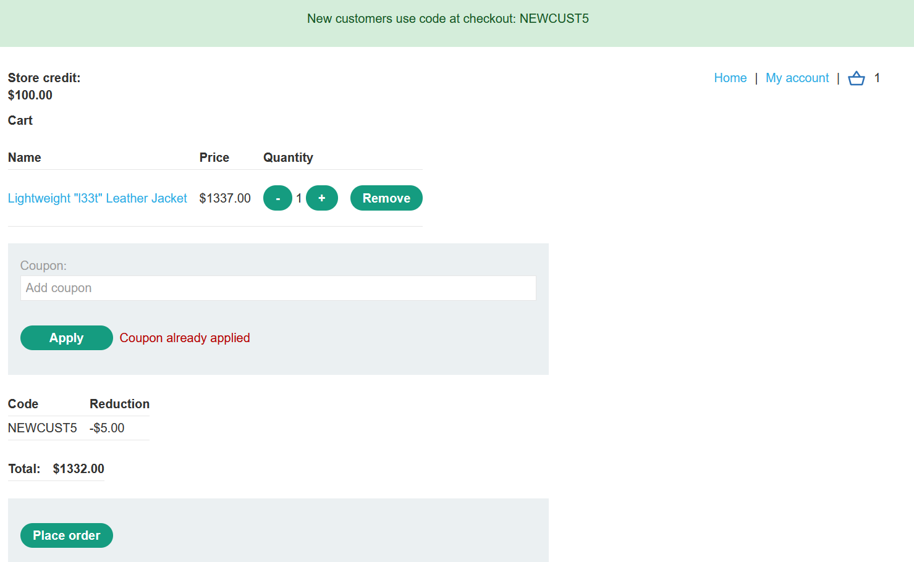
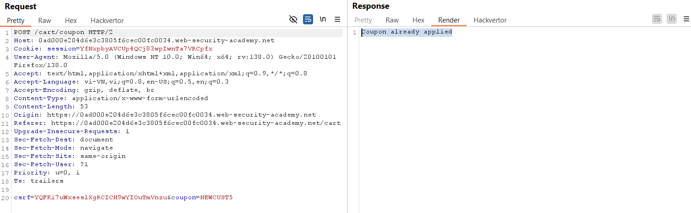
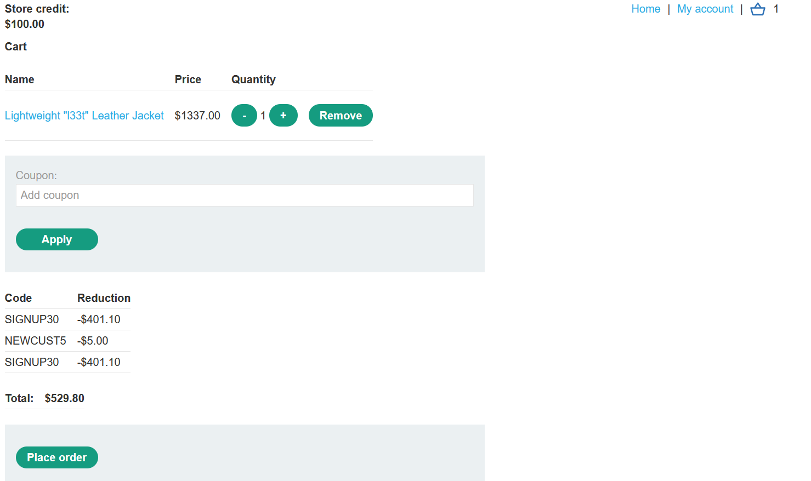
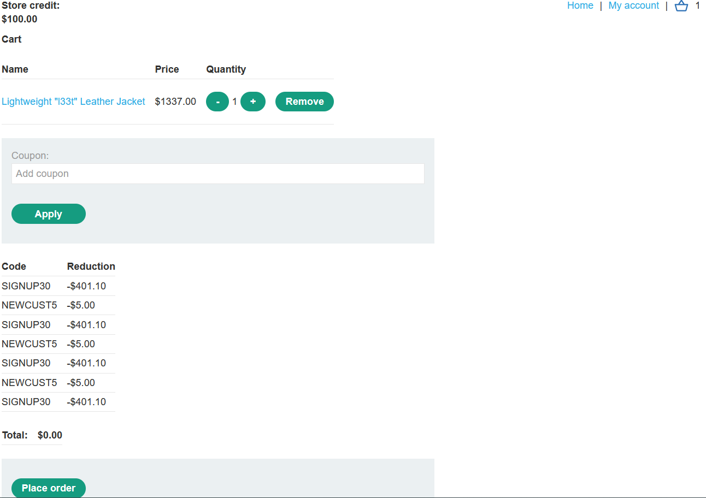
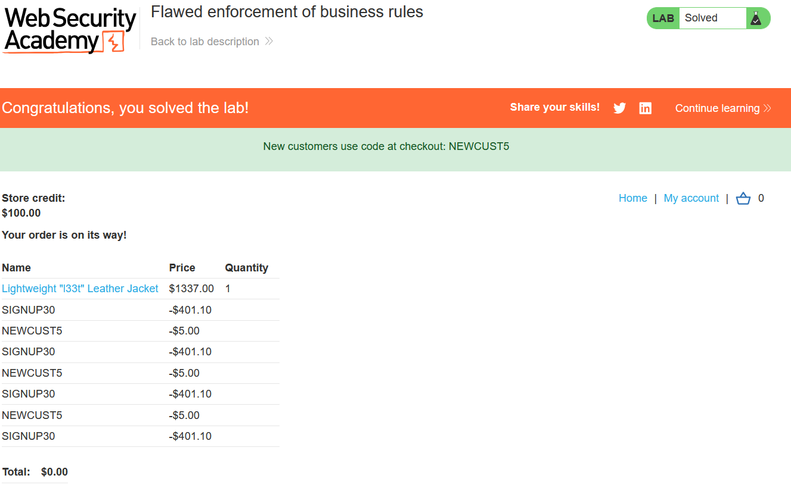

# Write-up Flawed enforcement of business rules

### Tổng quan
Khai thác lỗ hổng logic trong quy trình áp dụng mã giảm giá, lợi dụng việc kiểm tra coupon không chặt chẽ để nhập xen kẽ NEWCUST5 và SIGNUP30, giảm giá đủ để mua Lightweight l33t Leather Jacket.

### Mục tiêu
- Mua sản phẩm Lightweight l33t Leather Jacket bằng cách khai thác lỗi áp dụng coupon.

### Công cụ sử dụng
- Burp Suite Community
- Firefox Browser

### Quy trình khai thác
1. **Thu thập thông tin (Reconnaissance)**
- Đăng nhập vào tài khoản `wiener`:`peter`.
- Thêm sản phẩm `Lightweight l33t Leather Jacket` vào giỏ hàng:
- Điền email lần đầu trong giỏ hàng, nhận hai mã coupon: `NEWCUST5` (giảm 5$) và `SIGNUP30` (giảm 30% - mã có khi signup lần đầu với email bất kì).
    
    

- Thử nhập `NEWCUST5`, nhận phản hồi thành công. Nhập lại `NEWCUST5`, nhận lỗi: "Coupon already applied":
    
2. **Khai thác (Exploitation)**
- Thử nhập xen kẽ `NEWCUST5` và `SIGNUP30` trong giỏ hàng:

- Gửi yêu cầu POST /cart/coupon:
    ```
    POST /cart/coupon HTTP/2
    Host: 0ad000e204d6e3c3805f6cec00fc0034.web-security-academy.net
    Cookie: session=YfNxpbyAVCUp4QCj83wpIwnTa7VRCpfx
    ....

    csrf=YQFKi7uWxseslXgRCICH9wYIOuTmVnzu&coupon=NEWCUST5
    ```
    
- Gửi tiếp:
    ```
    POST /cart/coupon HTTP/2
    Host: 0ad000e204d6e3c3805f6cec00fc0034.web-security-academy.net
    Cookie: session=YfNxpbyAVCUp4QCj83wpIwnTa7VRCpfx
    ....

    csrf=YQFKi7uWxseslXgRCICH9wYIOuTmVnzu&coupon=SIGNUP30
    ```   
- **Giải thích**: Web chỉ kiểm tra mã vừa nhập cuối, không kiểm tra lịch sử mã trước đó, cho phép áp dụng xen kẽ để tích lũy giảm giá.

- Lặp lại xen kẽ NEWCUST5 và SIGNUP30 đến khi tổng giá giảm đủ để thanh toán (dưới 100$, vì credit là 100$)
    

- Chọn Place order để hoàn thành lab:
    

### Bài học rút ra
- Hiểu cách khai thác lỗ hổng logic khi ứng dụng không kiểm tra đầy đủ quy tắc kinh doanh.
- Nhận thức tầm quan trọng của việc xác thực và giới hạn số lần áp dụng mã giảm giá phía server.

### Tài liệu tham khảo
- PortSwigger: Business logic vulnerabilities

### Kết luận
Lab này cung cấp kinh nghiệm thực tiễn trong việc khai thác lỗ hổng logic, sử dụng Burp Suite để áp dụng xen kẽ coupon và mua hàng thành công. Xem portfolio đầy đủ tại https://github.com/Furu2805/Lab_PortSwigger.

*Viết bởi Toàn Lương, Tháng 5/2025.*