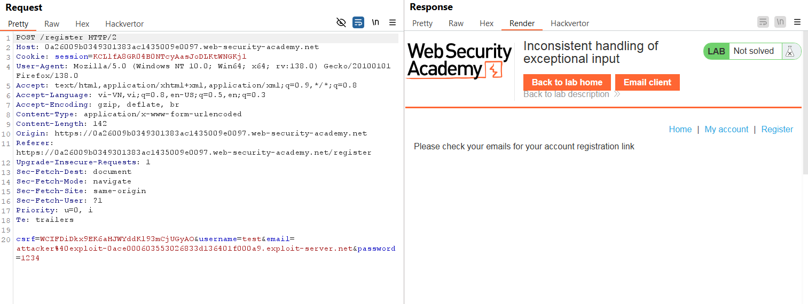
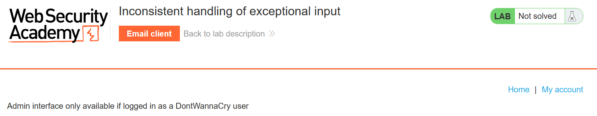
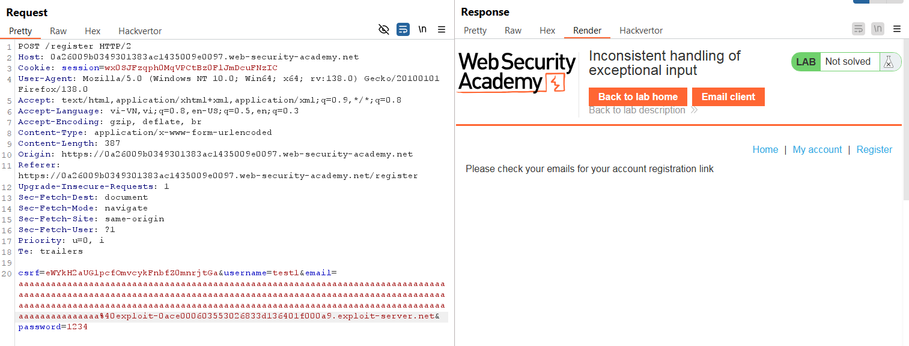
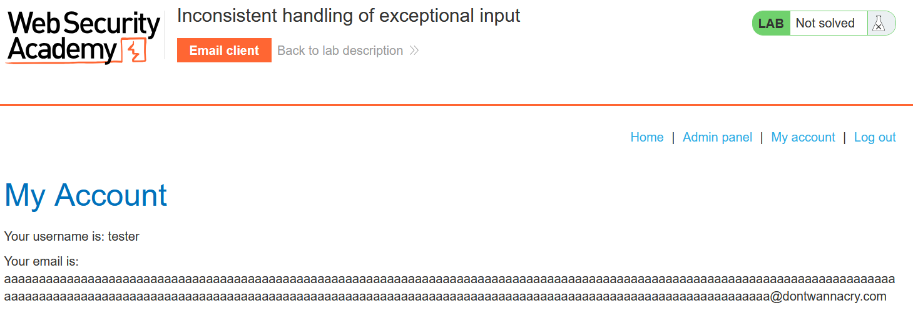
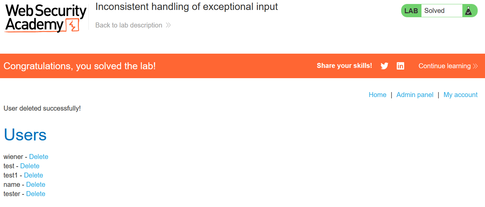

# Write-up: Inconsistent handling of exceptional input

### Tổng quan
Khai thác lỗ hổng xử lý đầu vào không nhất quán trong quy trình đăng ký tài khoản, lợi dụng tràn ký tự trong email để bỏ qua kiểm tra tên miền và truy cập admin panel với email giả mạo `@dontwannacry.com`, sau đó xóa tài khoản `carlos`.

### Mục tiêu
- Truy cập admin panel và xóa tài khoản `carlos`.

### Công cụ sử dụng
- Burp Suite Community
- Firefox Browser

### Quy trình khai thác
1. **Thu thập thông tin (Reconnaissance)**
- Đăng ký tài khoản qua `/register` với thông tin: `username=test`, `password=1234`, `email=attacker@exploit-0ace000603553026833d136401f000a9.exploit-server.net`:
    - Chức năng đăng ký hoạt động bình thường:
    

- Kiểm tra đường dẫn `/admin`
    - Chỉ dành cho tài khoản @dontwannacry.com
    

- Thử đăng ký với email có subdomain dài 252 ký tự a : `a...a@exploit-0ace000603553026833d136401f000a9.exploit-server.net`
    - Đăng ký thành công, nhưng email hiển thị trong client chỉ toàn ký tự a, mất đuôi @exploit-...:
    
    - **Giải thích**: Ứng dụng cắt bớt hoặc xử lý sai chuỗi email dài, bỏ qua phần tên miền, gây lỗi tràn ký tự.

2. **Khai thác (Exploitation)**
- Lợi dụng lỗi tràn ký tự, đăng ký tài khoản mới với email có subdomain 252 ký tự `a` và đuôi `@dontwannacry.com.exploit-0ace000603553026833d136401f000a9.exploit-server.net`, `username=tester`, `password=1111`:
    - - **Giải thích**: Chuỗi dài 252 ký tự a khiến ứng dụng cắt bớt, chỉ giữ `@dontwannacry.com` trong cơ sở dữ liệu, bỏ qua .exploit-..., giúp tài khoản vượt qua kiểm tra quyền admin

- Đăng nhập vào tài khoản `tester:1111` xuất hiện thẻ `Admin panel`
    
    
- Truy cập vào trang `Admin panel` và xóa tài khoản `carlos`
    - Kết quả: Tài khoản carlos bị xóa, hoàn thành lab:
        

### Bài học rút ra
- Hiểu cách khai thác lỗ hổng logic do xử lý không đúng chuỗi đầu vào dài.
- Nhận thức tầm quan trọng của việc kiểm tra và giới hạn độ dài đầu vào phía server.

### Tài liệu tham khảo
- PortSwigger: Business logic vulnerabilities

### Kết luận
Lab này cung cấp kinh nghiệm thực tiễn trong việc khai thác lỗ hổng logic, lợi dụng tràn ký tự để giả mạo email và truy cập admin panel. Xem portfolio đầy đủ tại https://github.com/Furu2805/Lab_PortSwigger.

*Viết bởi Toàn Lương, Tháng 5/2025.*