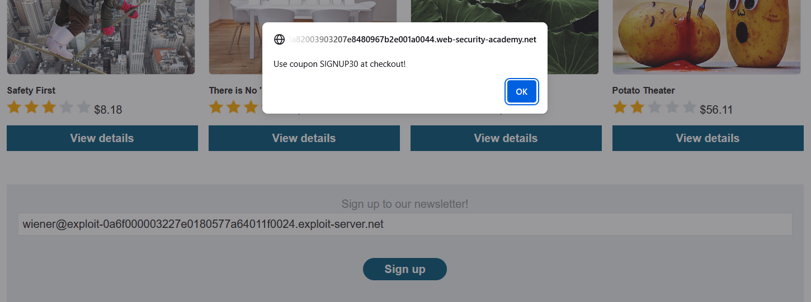
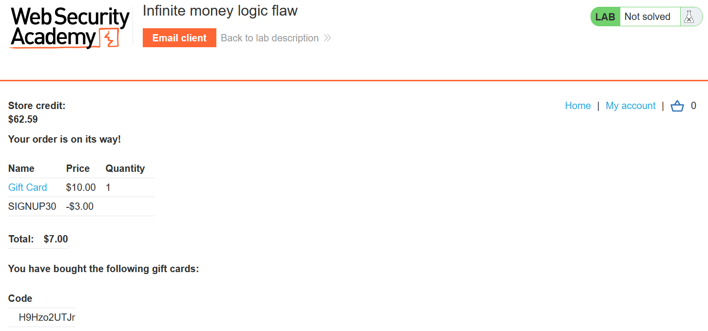
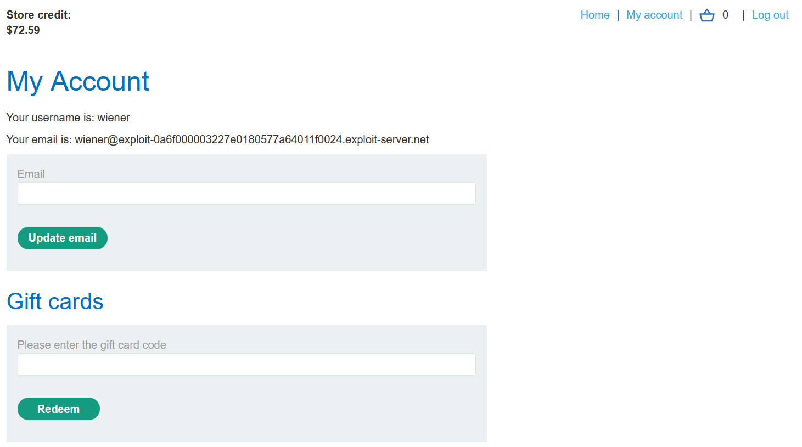
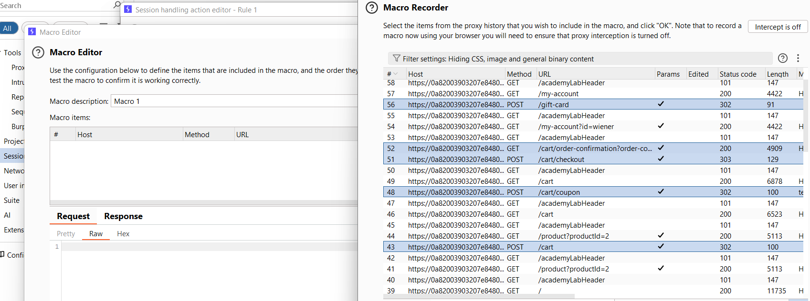
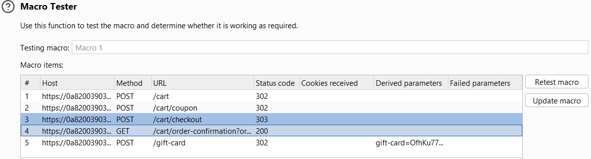
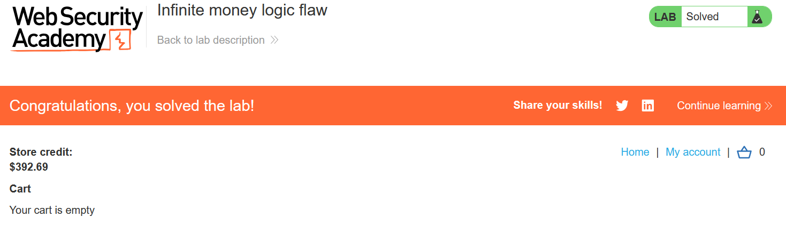

# Write-up: Infinite money logic flaw

### Tổng quan
Lợi dụng lỗ hổng logic khi mua và đổi gift card để áp mã giảm giá lên chính gift card, từ đó tạo ra store credit vượt giá trị thanh toán, tích lũy không giới hạn và mua Lightweight l33t Leather Jacket.

### Mục tiêu
- Mua sản phẩm Lightweight l33t Leather Jacket bằng cách tích lũy store credit.

### Công cụ sử dụng
- Burp Suite Community
- Firefox Browser

### Quy trình khai thác
1. **Thu thập thông tin (Reconnaissance)**
- Đăng nhập vào tài khoản `wiener`:`peter`
- Đăng kí nhận coupon `SIGNUP30` (giảm 30%) bằng email của tài khoản
    

- Thêm sản phẩm gift card 10$ vào giỏ hàng:
- Áp dụng coupon `SIGNUP30` tại giỏ hàng và thanh toán
    - Nhận gift cards
    
    
- Đổi `gift-card` tại trang `/my-account`
    - **Kết quả**: store credit mỗi lần tăng 10$, vậy ta tăng 3$
        
    - **Giải thích**: Ứng dụng không kiểm tra giá trị thực trả so với giá trị giftcard, cho phép tích lũy credit vô hạn

2. **Khai thác (Exploitation)**
- Tự động hóa quy trình bằng Burp Intruder:
    - Tạo Macro trong burp (Settings > Session > Add Rule >     Run a Macro):
        - Chọn chuỗi yêu cầu
            
        - Cấu hình `GET /cart/order-confirmation`: thêm tham số tùy chỉnh `gift-card`, trích xuất mã `gift-card` từ phản hồi
        - Cấu hình `POST /gift-card`, Sử dụng tham số `gift-card` từ phản hồi trước (`GET /cart/order-confirmation`)
        - Kiểm tra macro đảm bảo `POST /gift-card` nhận mã 302
            

- Gửi GET /my-account đến Intruder (Sniper attack)
    - Cấu hình payload: Null payloads, 412 lần lặp lại.
    - Resource pool: Maximum concurrent requests = 1.
    - Chạy tấn công để lặp lại quy trình mua và đổi gift card.
- **Kết quả**: store credit tăng đủ để mua sản phẩm Lightweight l33t Leather Jacket

- Thanh toán và hoàn thành lab:
    

### Bài học rút ra
- Hiểu cách khai thác lỗ hổng logic khi ứng dụng không kiểm tra giá trị thực trả so với giá trị sử dụng.
- Nhận thức tầm quan trọng của việc xác thực giao dịch và giới hạn tích lũy credit phía server.

### Tài liệu tham khảo 
- PortSwigger: Business logic vulnerabilities

### Kết luận
Lab này cung cấp kinh nghiệm thực tiễn trong việc khai thác lỗ hổng logic, sử dụng Burp Intruder để tự động hóa tích lũy credit và mua hàng thành công. Xem portfolio đầy đủ tại https://github.com/Furu2805/Lab_PortSwigger.

*Viết bởi Toàn Lương, Tháng 5/2025.*