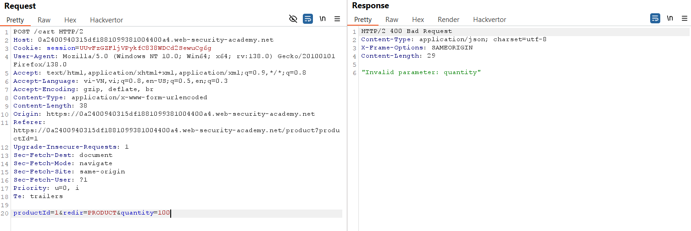
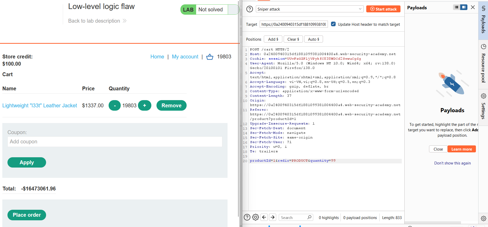
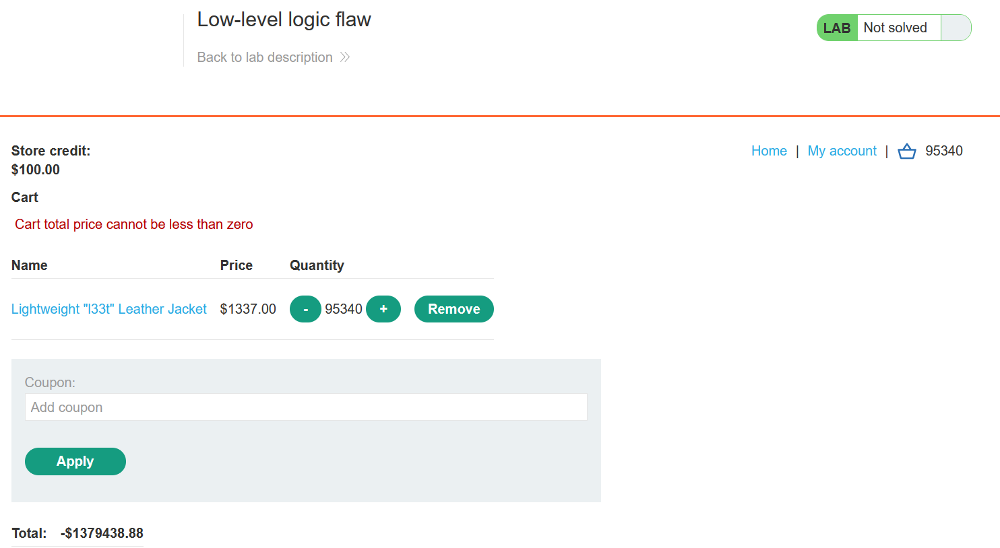
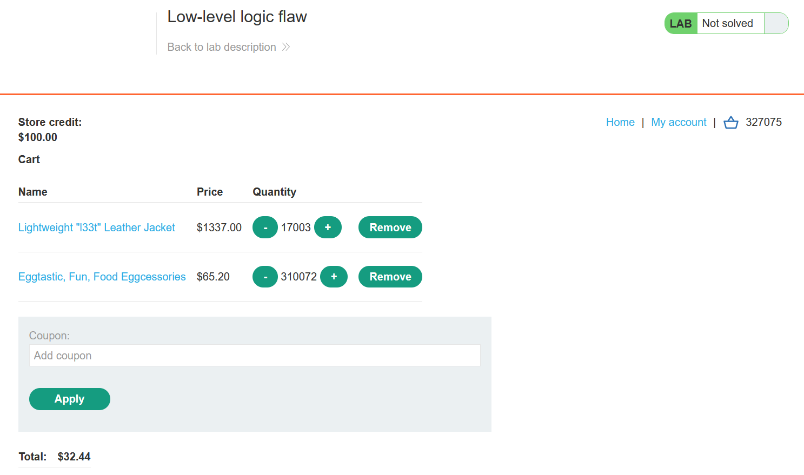
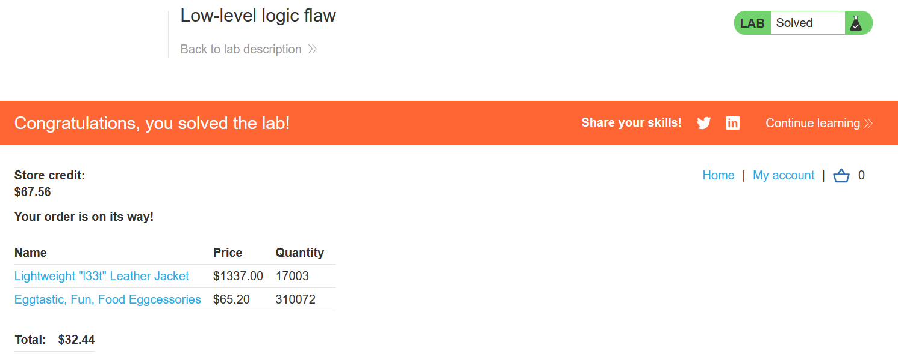

# Write-up: Low-level logic flaw

### Tổng quan
Khai thác lỗ hổng logic trong quy trình mua hàng, lợi dụng việc xử lý số lượng sản phẩm lớn gây tràn số, khiến tổng giá âm, sau đó thêm sản phẩm khác để điều chỉnh tổng giá hợp lệ và mua Lightweight l33t Leather Jacket.

### Mục tiêu
- Mua sản phẩm Lightweight l33t Leather Jacket bằng cách khai thác lỗi logic.

### Công cụ sử dụng
- Burp Suite Community
- Firefox Browser

### Quy trình khai thác
1. **Thu thập thông tin (Reconnaissance)**
- Đăng nhập vào tài khoản `wiener`:`peter`.
- Thêm sản phẩm `Lightweight l33t Leather Jacket` vào giỏ hàng:
- Kiểm tra Burp Proxy HTTP History, xác định yêu cầu POST tới `/cart`:
    - Gửi yêu cầu này tới Repeater để thử nghiệm:

2. **Khai thác (Exploitation)**
- Trong Repeater, thử sửa tham số `quantity=100`:
    
    - **Nhận lỗi**: `"Invalid parameter: productId"`, suy ra quantity bị giới hạn <100.

- Gửi yêu cầu vào Intruder, dùng payload null để tăng `quantity` từ 1 đến giới hạn (`quantity=99`)
    - Kết quả: Tại quantity=99, tổng giá trị sản phẩm `Lightweight l33t Leather Jacket` trong giỏ hàng tràn số trở thành số âm:
        

- **Giải thích**: Ứng dụng không kiểm tra tràn số khi nhân `price` với `quantity`, gây lỗi logic khiến tổng giá âm.
- Thanh toán với giá âm báo lỗi: `"Cart total price cannot be less than zero"`.
    

- Thêm sản phẩm khác để tổng giá nằm trong khoảng 0-100$
    

- Chọn Place order để hoàn thành lab:
    

### Bài học rút ra
- Hiểu cách khai thác lỗ hổng logic khi ứng dụng không kiểm tra đầy đủ quy tắc kinh doanh.
- Nhận thức tầm quan trọng của việc xác thực và giới hạn số lần áp dụng mã giảm giá phía server.

### Tài liệu tham khảo
- PortSwigger: Business logic vulnerabilities

### Kết luận
Lab này cung cấp kinh nghiệm thực tiễn trong việc khai thác lỗ hổng logic, sử dụng Burp Suite để tạo giá trị âm và mua hàng thành công. Xem portfolio đầy đủ tại https://github.com/Furu2805/Lab_PortSwigger.

*Viết bởi Toàn Lương, Tháng 5/2025.*