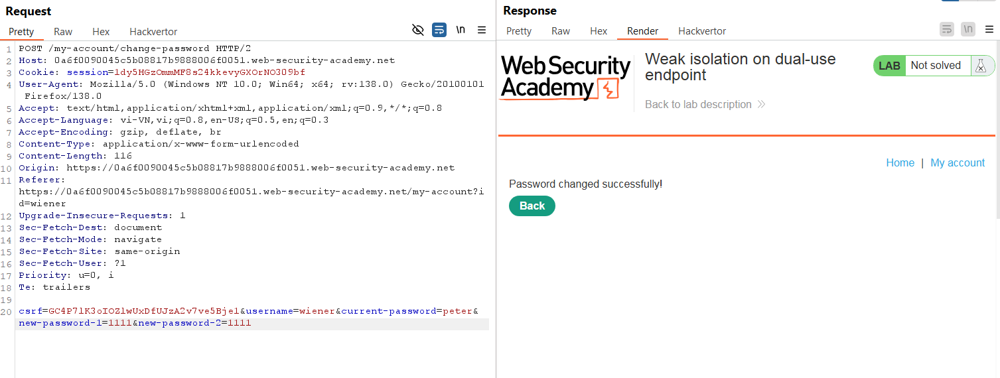

# Write-up: Weak isolation on dual-use endpoint

### Tổng quan
Khai thác lỗ hổng logic trong endpoint đổi mật khẩu, lợi dụng việc thiếu kiểm tra quyền người dùng và tham số `current-password` để đổi mật khẩu tài khoản `administrator`, sau đó đăng nhập và xóa tài khoản carlos.

### Mục tiêu
- Truy cập tài khoản `administrator` và xóa tài khoản `carlos`.

### Công cụ sử dụng
- Burp Suite Community
- Firefox Browser

### Quy trình khai thác
1. **Thu thập thông tin (Reconnaissance)**
- Đăng nhập vào tài khoản `wiener`:`peter`.
- Thử chức năng đổi mật khẩu tại `/my-account/change-password`, hoạt động bình thường:
    
    - Kiểm tra Burp Proxy HTTP History, gửi yêu cầu này tới Repeater để thử nghiệm:

2. **Khai thác (Exploitation)**
- Trong Repeater, xóa tham số `current-passwor`d:
    - **Kết quả**: Chức năng đổi mật khẩu vẫn thực hiện thành công.
        
    - **Giải thích**: Endpoint không yêu cầu xác thực mật khẩu hiện tại, cho phép đổi mật khẩu chỉ với `username` và mật khẩu mới, thể hiện lỗi logic thiếu kiểm tra quyền.
- Sửa tham số `username=administrator` và đặt mật khẩu mới là `1111`
    - **Kết quả**: Mật khẩu tài khoản `administrator` được đổi thành `1111`: 
          

- Đăng nhập vào tài khoản `administrator`:`1111`.
- Truy cập admin panel tại `/admin` và xóa tài khoản `carlos`:
    - Kết quả: Tài khoản carlos bị xóa, hoàn thành lab:
        

### Bài học rút ra
- Hiểu cách khai thác lỗ hổng logic khi endpoint không kiểm tra đầy đủ quyền người dùng và tham số đầu vào.
- Nhận thức tầm quan trọng của việc xác thực quyền và mật khẩu hiện tại trong các chức năng nhạy cảm.

### Tài liệu tham khảo
- PortSwigger: Business logic vulnerabilities

### Kết luận
Lab này cung cấp kinh nghiệm thực tiễn trong việc khai thác lỗ hổng logic, lợi dụng endpoint thiếu kiểm tra để đổi mật khẩu admin và xóa tài khoản. Xem portfolio đầy đủ tại https://github.com/Furu2805/Lab_PortSwigger.

*Viết bởi Toàn Lương, Tháng 5/2025.*