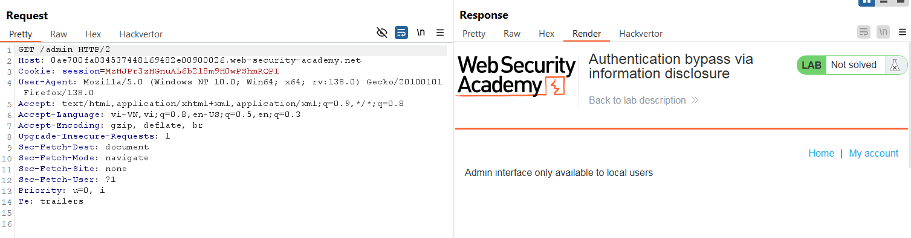
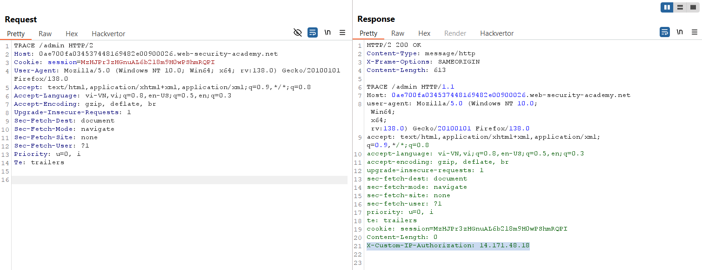
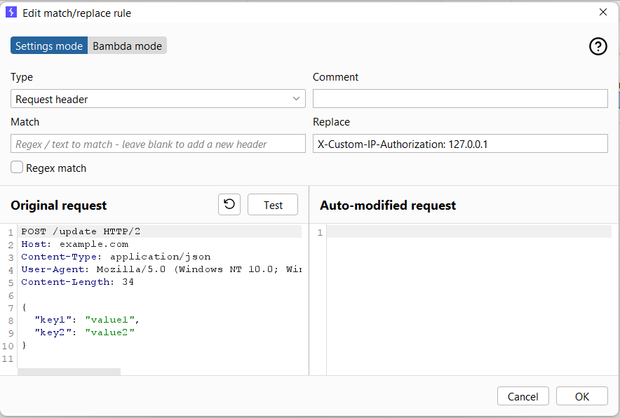
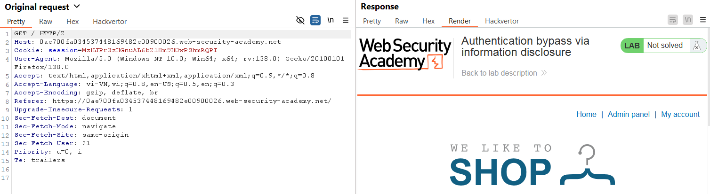
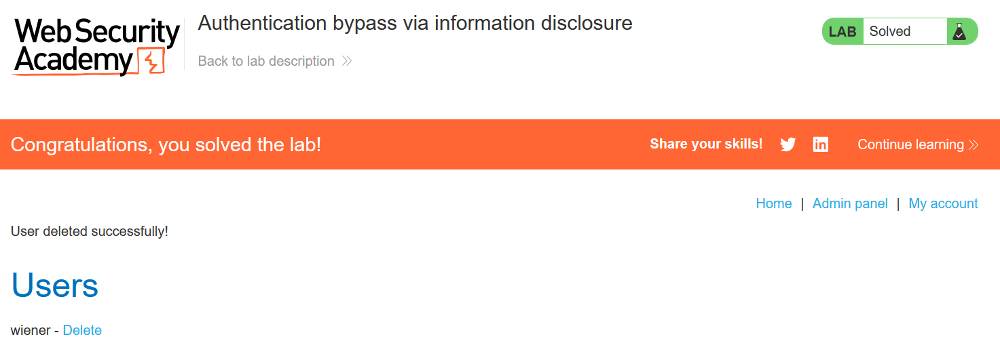

# Write-up: Authentication Bypass via information disclosure

### Tổng quan
Khai thác lỗ hổng rò rỉ thông tin qua phương thức HTTP TRACE, tiết lộ header `X-Custom-IP-Authorization`, sau đó giả mạo header này để bypass xác thực admin, truy cập admin panel và xóa tài khoản `carlos`.

### Mục tiêu
- Bypass xác thực để truy cập admin panel và xóa tài khoản carlos.

### Công cụ sử dụng
- Burp Suite Pro
- Firefox Browser

### Quy trình khai thác
1. **Thu thập thông tin (Reconnaissance)**
- Đăng nhập với tài khoản `wiener`:`peter`

- Trong Burp Repeater, gửi yêu cầu đến /admin 
    - Phản hồi thông báo lỗi, cho biết admin panel chỉ dành cho quản trị viên.
        
- Thay đổi phương thức thành TRACE:
    - Phản hồi tiết lộ header tự động thêm
        
    - **Giải thích**: Ứng dụng sử dụng header `X-Custom-IP-Authorization` để kiểm tra IP.

2. **Khai thác (Exploitation)**
- Trong Burp Suite, vào `Proxy` > `Options` > `Match and Replace`:
    - Thêm rule mới:
        - Type: Request header
        - Match: (để trống)
        - Replace: X-Custom-IP-Authorization: 127.0.0.1
    - Kiểm tra rule bằng nút Test, xác nhận header được thêm vào yêu cầu
        

- Truy cập lại trang homepage
    - **Kết quả**: Admin panel tại / xuất hiện do header giả mạo IP localhost
        

- Xóa tài khoản `carlos` và hoàn thành lab
    

### Bài học rút ra
- Hiểu cách khai thác rò rỉ thông tin qua phương thức TRACE để phát hiện header tùy chỉnh.
- Nhận thức tầm quan trọng của việc vô hiệu hóa TRACE và kiểm tra header phía server để ngăn bypass xác thực.

### Tài liệu tham khảo
PortSwigger: Information disclosure

### Kết luận
Lab này cung cấp kinh nghiệm thực tiễn trong việc khai thác lỗ hổng rò rỉ thông tin và bypass xác thực, sử dụng Burp Suite để giả mạo header và xóa tài khoản. Xem portfolio đầy đủ tại https://github.com/Furu2805/Lab_PortSwigger.

*Viết bởi Toàn Lương, Tháng 5/2025.*