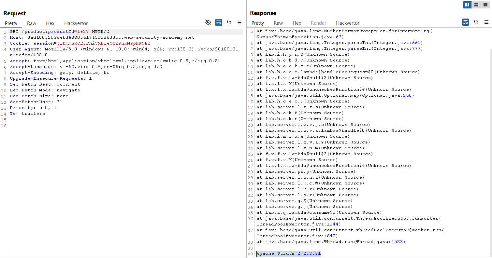
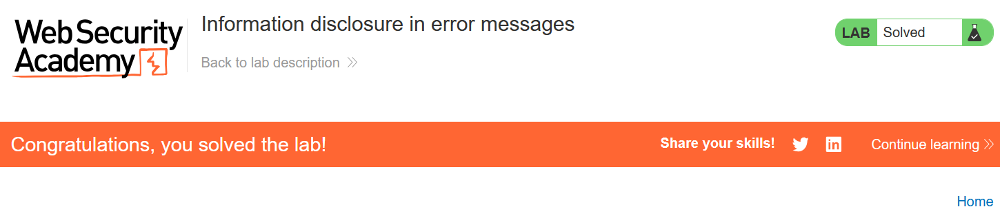

# Write-up: Information Disclosure in Error Messages

### Tổng quan
Khai thác lỗ hổng rò rỉ thông tin trong thông báo lỗi của ứng dụng, lợi dụng tham số `productId` để gây lỗi và lấy thông tin phiên bản framework của web.

### Mục tiêu
- Xác định và submit phiên bản framework của web.

### Công cụ sử dụng
- Burp Suite Community
- Firefox Browser

### Quy trình khai thác
1. **Thu thập thông tin (Reconnaissance)**
- Truy cập trang sản phẩm và chọn một sản phẩm bất kỳ, quan sát URL chứa tham số `productId`, sửa tham số `productId` bằng cách thêm dấu `'`
    - **Kết quả**: Nhận thông báo lỗi chi tiết, tiết lộ ứng dụng sử dụng `Apache Struts 2.3.31`:
        
    - **Giải thích**: Ứng dụng không xử lý đúng đầu vào productId, dẫn đến lỗi SQL hoặc framework, và thông báo lỗi hiển thị phiên bản framework, gây rò rỉ thông tin.

2. **Khai thác (Exploitation)**
- Submit phiên bản và hoàn thành lab
    

### Bài học rút ra
- Hiểu cách khai thác thông tin nhạy cảm từ thông báo lỗi do thiếu xử lý đầu vào.
- Nhận thức tầm quan trọng của việc ẩn thông tin phiên bản framework để ngăn chặn tấn công nhắm vào lỗ hổng đã biết.

### Tài liệu tham khảo
PortSwigger: Information disclosure

### Kết luận
Lab này cung cấp kinh nghiệm thực tiễn trong việc khai thác rò rỉ thông tin từ thông báo lỗi, xác định phiên bản framework và hoàn thành mục tiêu. Xem portfolio đầy đủ tại https://github.com/Furu2805/Lab_PortSwigger.

*Viết bởi Toàn Lương, Tháng 5/2025.*