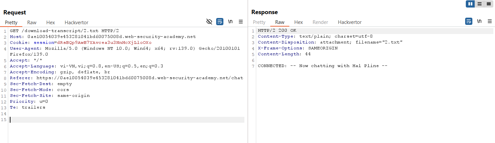

# Write-up: Insecure direct object references

### Tổng quan
Khai thác lỗ hổng Insecure Direct Object Reference (IDOR) trong tính năng live chat, truy cập transcript chat bằng URL tĩnh với tên file dạng số, tải file `1.txt` để lấy mật khẩu của `carlos`, đăng nhập và hoàn thành lab.

### Mục tiêu
- Thu thập mật khẩu của tài khoản carlos và đăng nhập vào tài khoản này.

### Công cụ sử dụng
- Burp Suite Community
- Firefox Browser

### Quy trình khai thác
1. **Thu thập thông tin (Reconnaissance)**
- Đăng nhập với tài khoản `wiener`:`peter`
- Truy cập tính năng live chat, sử dụng chức năng `"View transcript"` để tải file chat :
    - File 2.txt chứa nội dung đoạn chat của wiener
        

    - **Quan sát**: Tên file transcript được đặt theo số thứ tự (1.txt, 2.txt, 3.txt, ...), gợi ý các file chat được lưu trên hệ thống file với định dạng số.

2. **Khai thác (Exploitation)**
- Trong Burp Repeater, thử tải file `1.txt` bằng cách thay đổi URL:
    - Phản hồi chứa nội dung đoạn chat của carlos, bao gồm mật khẩu:
        - `Password`: `b5sxrkgxhyby6dcx9ic9`
        

- **Giải thích**: Ứng dụng không kiểm tra quyền truy cập khi tải file transcript, dẫn đến lỗ hổng IDOR, cho phép `wiener` truy cập file chat của `carlos`.

- Đăng nhập vào tài khoản `carlos` với mật khẩu `b5sxrkgxhyby6dcx9ic9`
    - **Kết quả**: Đăng nhập thành công, hoàn thành lab:
        

### Bài học rút ra
- Hiểu cách khai thác lỗ hổng IDOR do thiếu kiểm tra quyền truy cập trên URL tĩnh.
- Nhận thức tầm quan trọng của việc xác thực quyền truy cập tài nguyên và sử dụng định danh khó đoán để bảo vệ dữ liệu nhạy cảm.

### Tài liệu tham khảo
- PortSwigger: Access control vulnerabilities

### Kết luận
Lab này cung cấp kinh nghiệm thực tiễn trong việc khai thác lỗ hổng IDOR, sử dụng Burp Repeater để truy cập file chat trái phép, lấy mật khẩu và đăng nhập vào tài khoản mục tiêu. Xem portfolio đầy đủ tại https://github.com/Furu2805/Lab_PortSwigger.

*Viết bởi Toàn Lương, Tháng 6/2025.*