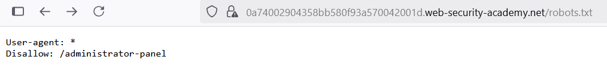
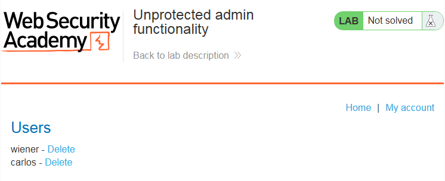
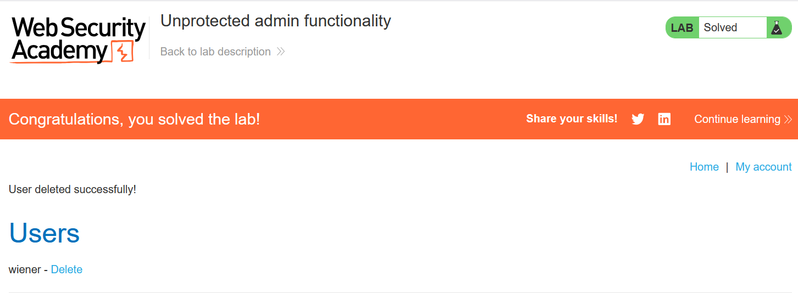

# Write-up: Unprotected admin functionality

### Tổng quan
Khai thác lỗ hổng admin panel không được bảo vệ, phát hiện đường dẫn `/administrator-panel` qua file `/robots.txt`, truy cập panel và xóa tài khoản carlos để hoàn thành lab.

### Mục tiêu
- Xóa tài khoản `carlos` bằng cách truy cập `admin panel`.

### Công cụ sử dụng
- Burp Suite Community
- Firefox Browser

### Quy trình khai thác
1. *Thu thập thông tin (Reconnaissance)*
- Truy cập `/robots.txt` để kiểm tra các quy tắc crawl của web:
    
    - Nội dung file tiết lộ đường dẫn: `Disallow: /administrator-panel`

- Truy cập đường dẫn `/administrator-pane`l: 
    - **Kết quả**: Truy cập thành công admin panel mà không yêu cầu xác thực:
        

2. **Khai thác (Exploitation)**
- Trong admin panel, tìm chức năng xóa người dùng và xóa tài khoản `carlos`:
    - **Kết quả**: Tài khoản `carlos` bị xóa, hoàn thành lab.
        

### Bài học rút ra
- Hiểu cách khai thác admin panel không được bảo vệ do rò rỉ đường dẫn qua `/robots.txt`.
- Nhận thức tầm quan trọng của việc bảo vệ chức năng admin bằng xác thực và ẩn các đường dẫn nhạy cảm.

### Tài liệu tham khảo
- PortSwigger: Access control vulnerabilities

### Kết luận
Lab này cung cấp kinh nghiệm thực tiễn trong việc tìm kiếm và khai thác chức năng admin không được bảo vệ, sử dụng `/robots.txt` để phát hiện đường dẫn và xóa tài khoản mục tiêu. Xem portfolio đầy đủ tại https://github.com/Furu2805/Lab_PortSwigger.

*Viết bởi Toàn Lương, Tháng 6/2025.*