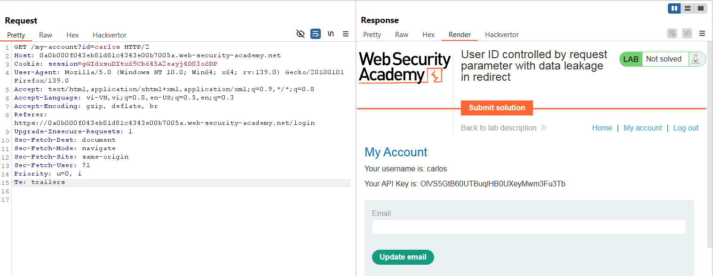
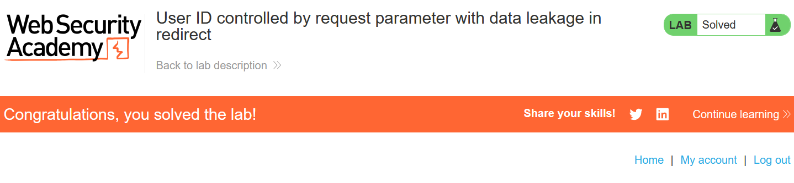

# Write-up: User ID controlled by request parameter with data leakage in redirect

### Tổng quan
Khai thác lỗ hổng leo thang đặc quyền ngang trên trang tài khoản người dùng, sửa tham số `id` trong yêu cầu để truy cập thông tin tài khoản `carlos`, lấy API key từ phản hồi redirect và submit để hoàn thành lab.

### Mục tiêu
- Thu thập API key của tài khoản `carlos` và submit giải pháp.

### Công cụ sử dụng
- Burp Suite Community
- Firefox Browser

### Quy trình khai thác
1. **Thu thập thông tin (Reconnaissance)**
- Đăng nhập với tài khoản `wiener`:`peter`
- Truy cập trang tài khoản người dùng, quan sát URL chứa tham số `id=wiener` (`/my-account?id=wiener`):

- Trong Burp Repeater, sửa tham số `id=wiener` thành `id=carlos`:
    - Phản hồi redirect (HTTP 302) chứa thông tin tài khoản `carlos` trong body, bao gồm `API key`:`OlVS5GtB60UTBuqlHB0UXeyMwm3Fu3Tb`
        

- **Giải thích**: Ứng dụng không kiểm tra quyền truy cập khi thay đổi tham số `id`, và phản hồi redirect rò rỉ thông tin nhạy cảm của `carlos`.

2. **Khai thác (Exploitation)**
- Ghi lại API key của carlos: `OlVS5GtB60UTBuqlHB0UXeyMwm3Fu3Tb`

- Truy cập trang submit giải pháp (/submitSolution) và gửi API key:
    - **Kết quả**: Lab xác nhận giải pháp đúng, hoàn thành lab
        

### Bài học rút ra
- Hiểu cách khai thác lỗ hổng leo thang đặc quyền ngang do thiếu kiểm tra quyền trên tham số `id`.
- Nhận thức tầm quan trọng của việc bảo vệ dữ liệu nhạy cảm trong phản hồi redirect và xác thực quyền truy cập phía server.

### Tài liệu tham khảo
- PortSwigger: Access control vulnerabilities

### Kết luận
Lab này cung cấp kinh nghiệm thực tiễn trong việc khai thác lỗ hổng kiểm soát quyền truy cập và rò rỉ thông tin qua redirect, sử dụng Burp Repeater để lấy API key và hoàn thành mục tiêu. Xem portfolio đầy đủ tại https://github.com/Furu2805/Lab_PortSwigger.

*Viết bởi Toàn Lương, Tháng 6/2025.*