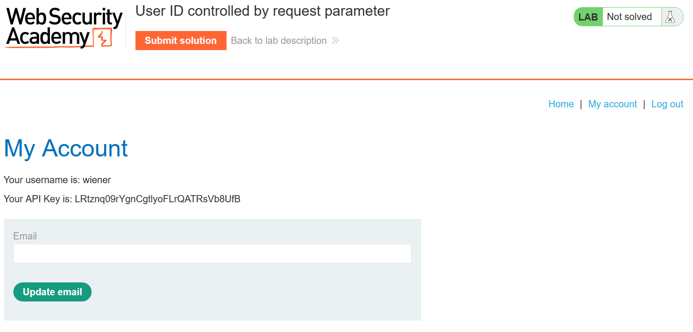
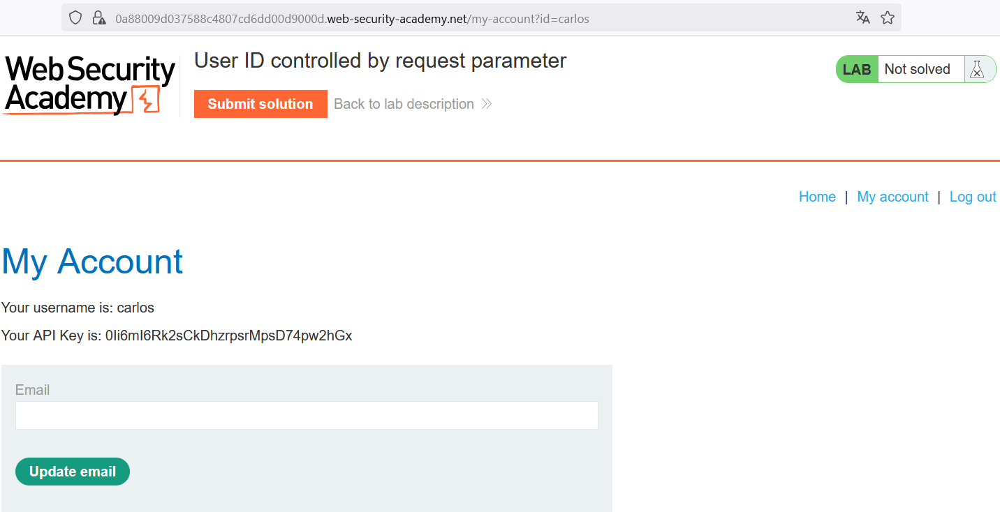
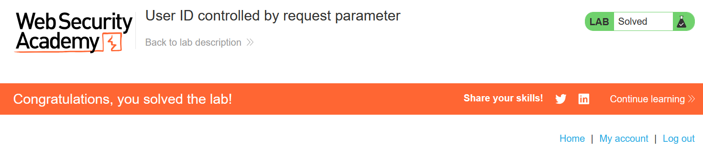

# Write-up: User ID controlled by request parameter 

### Tổng quan
Khai thác lỗ hổng leo thang đặc quyền ngang (horizontal privilege escalation) trên trang tài khoản người dùng, sửa tham số `id` trên URL để truy cập thông tin tài khoản `carlos`, lấy API key và submit để hoàn thành lab.

### Mục tiêu
- Thu thập API key của tài khoản `carlos` và submit giải pháp.

### Công cụ sử dụng
- Burp Suite Community
- Firefox Browser

### Quy trình khai thác
1. **Thu thập thông tin (Reconnaissance)**
- Đăng nhập với tài khoản `wiener`:`peter`:
    - Truy cập trang tài khoản người dùng, quan sát URL chứa tham số `id=wiener` (`/my-account?id=wiener`)
      - Trang hiển thị thông tin tài khoản của `wiener`:
            

- Sửa tham số id=wiener thành `id=carlos` trong URL:
    - **Kết quả**: Trang hiển thị thông tin tài khoản `carlos`, bao gồm API key:
        `API Key: 0Ii6mI6Rk2sCkDhzrpsrMpsD74pw2hGx`
        

- **Giải thích**: Ứng dụng không kiểm tra quyền truy cập khi thay đổi tham số id, cho phép người dùng `wiener` xem thông tin của `carlos`.

2. **Khai thác (Exploitation)**
- Ghi lại API key của carlos: `0Ii6mI6Rk2sCkDhzrpsrMpsD74pw2hGx`.
- Submit solution và hoàn thành lab:
    

### Bài học rút ra
- Hiểu cách khai thác lỗ hổng leo thang đặc quyền ngang do thiếu kiểm tra quyền truy cập trên tham số `id`.
- Nhận thức tầm quan trọng của việc kiểm tra quyền truy cập người dùng phía server để ngăn chặn truy cập trái phép.

### Tài liệu tham khảo
- PortSwigger: Access control vulnerabilities

### Kết luận
Lab này cung cấp kinh nghiệm thực tiễn trong việc khai thác lỗ hổng kiểm soát quyền truy cập dựa trên tham số URL, thu thập API key và hoàn thành mục tiêu. Xem portfolio đầy đủ tại https://github.com/Furu2805/Lab_PortSwigger.

*Viết bởi Toàn Lương, Tháng 6/2025.*