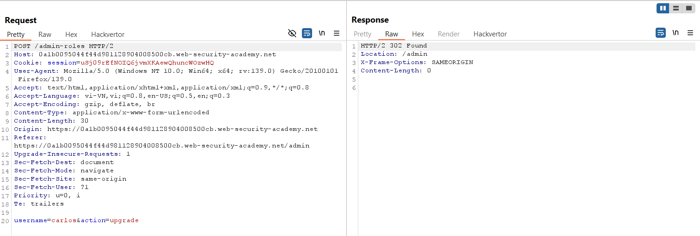
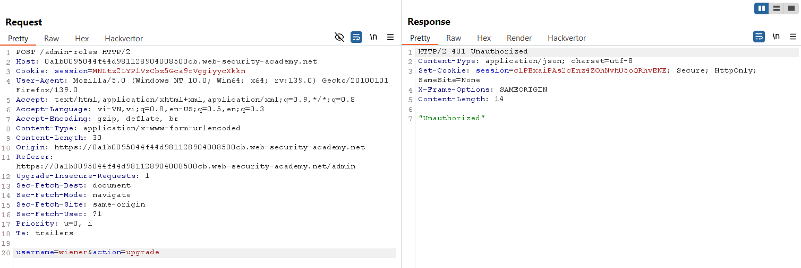
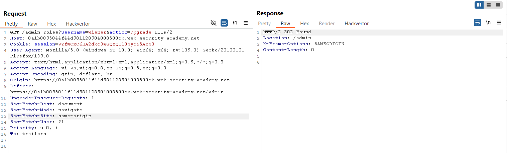
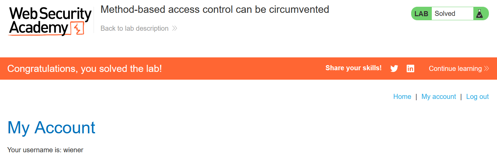

# Write-up: Method-based access control can be circumvented

### Tổng quan
Khai thác lỗ hổng kiểm soát truy cập trong quy trình đa bước, sử dụng tài khoản admin để xác định cơ chế nâng quyền, sau đó dùng tài khoản `wiener` để giả mạo cookie session, thay đổi phương thức HTTP từ POST sang GET để bypass kiểm soát truy cập và nâng quyền thành admin.

### Mục tiêu
- Nâng quyền tài khoản `wiener` thành `admin`.

### Công cụ sử dụng
- Burp Suite Community
- Firefox Browser

### Quy trình khai thác
1. **Thu thập thông tin (Reconnaissance)**
- Đăng nhập với tài khoản `administrator`:`admin`:
- Truy cập admin panel (`/admin`) và sử dụng chức năng nâng quyền tài khoản `carlos`:
    - Phản hồi xác nhận nâng quyền thành công:
        

    - **Quan sát**: Yêu cầu POST đến `/admin/upgrade` yêu cầu quyền admin, nhưng có thể tồn tại bước không kiểm tra quyền đầy đủ.

- Đăng nhập lại với tài khoản `wiener`:`peter`:
    - Ghi lại cookie session của wiener:
        

2. **Khai thác (Exploitation)**
- Trong Burp Repeater, gửi lại yêu cầu nâng quyền từ tài khoản admin, nhưng thay cookie session bằng cookie của `wiener` và sửa `username=carlos` thành `username=wiener`:
    - Phản hồi trả về lỗi `"Unauthorized"`:

- Trong Burp Repeater, chuyển phương thức yêu cầu từ POST sang GET, giữ nguyên cookie và tham số:
    - **Kết quả**: Tài khoản wiener được nâng quyền thành admin và hoàn thành lab:
        
        
    - **Giải thích**: Quy trình nâng quyền bao gồm nhiều bước, nhưng bước xử lý yêu cầu GET không kiểm tra quyền admin, dẫn đến lỗ hổng leo thang đặc quyền dọc
    
### Bài học rút ra
- Hiểu cách khai thác lỗ hổng kiểm soát truy cập trong quy trình đa bước do thiếu kiểm tra quyền trên một bước.
- Nhận thức tầm quan trọng của việc áp dụng kiểm tra quyền truy cập nhất quán trên mọi phương thức HTTP và bước xử lý.

### Tài liệu tham khảo
- PortSwigger: Access control vulnerabilities

### Kết luận
Lab này cung cấp kinh nghiệm thực tiễn trong việc khai thác lỗ hổng kiểm soát truy cập trong quy trình đa bước, sử dụng Burp Repeater để thay đổi phương thức HTTP và nâng quyền admin. Xem portfolio đầy đủ tại https://github.com/Furu2805/Lab_PortSwigger.

*Viết bởi Toàn Lương, Tháng 6/2025.*